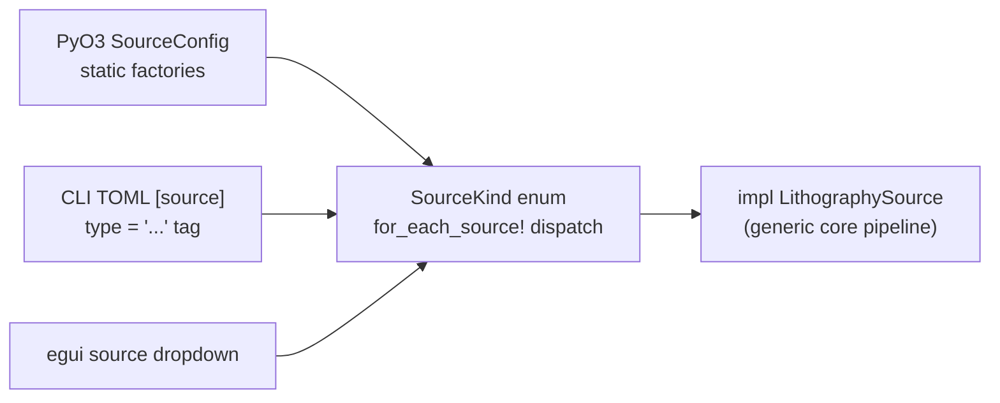

# Illumination Sources

**Status:** ✅ Implemented — the `LithographySource` trait, type-erased dispatch, and all nine concrete families are in code; per-family fidelity varies (badges in the table below mirror [../capability-matrix.md](../capability-matrix.md)).

## Overview

Every simulation in highuvlith starts at a light source, and the whole imaging
pipeline is generic over one trait: [`LithographySource`](../../crates/highuvlith-core/src/source.rs).
A source influences results **only** through the trait surface — its wavelength,
spectral weights, pupil intensity map, bandwidth, photon density, and the
pulse/coherence metadata consumed by the stochastic module. Nothing else about a
source (plasma dynamics, accelerator layout, gas cell pressure) reaches the
aerial-image engine. That narrow contract is what lets a 157 nm excimer laser and
a 13.5 nm XFEL run through the identical Hopkins TCC/SOCS code path.

## The `LithographySource` trait contract

Defined in [`crates/highuvlith-core/src/source.rs`](../../crates/highuvlith-core/src/source.rs);
the trait is `Send + Sync` and the pipeline takes `impl LithographySource`, so no
dynamic dispatch is needed inside the core.

| Method | Required / default | Consumed by |
|--------|--------------------|-------------|
| `wavelength_nm() -> f64` | **required** | TCC pupil scaling (NA/λ cutoff), photon energy/density derivations, every downstream stage |
| `bandwidth_pm() -> f64` | **required** | Sets the ±2.5 FWHM span each family feeds to `spectral_weights` (hence the chromatic focus-shift span — the aerial engine itself only reads the weights); reporting/display |
| `intensity_at(fx_norm, fy_norm) -> f64` | **required** | Pupil sampling when the TCC matrix is built |
| `spectral_weights() -> Vec<(f64, f64)>` | **required** | Per-sample weights in the polychromatic imaging loop (must sum to 1) |
| `photon_energy_ev() -> f64` | default: `1239.84193 / λ` | Reporting; photochemistry bookkeeping |
| `photon_density_per_mj_cm2() -> f64` | default: `10 / E_photon[J] × 1e-18` (photons/nm² at 1 mJ/cm²) | Shot-noise photon counts via `StochasticParams::from_source` (**live**) |
| `pulse_energy_j() -> Option<f64>` | default: `None` | `average_power_w()` arithmetic (**live**) |
| `rep_rate_hz() -> Option<f64>` | default: `None` | `average_power_w()` arithmetic (**live**) |
| `pulse_duration_s() -> Option<f64>` | default: `None` | Exposed metadata (PyO3 getter `pulse_duration_fs`); no time-domain physics consumes it yet |
| `average_power_w() -> Option<f64>` | default: `E_pulse × f_rep` when both known | Throughput reporting (**live arithmetic**; CW sources like SSMB override directly) |
| `transverse_coherence() -> f64` | default: `0.0` | `sigma_from_coherence` at construction of the high-coherence families; reported through PyO3 |
| `shot_to_shot_rms() -> f64` | default: `0.0` | `StochasticParams::from_source` → Gamma-distributed dose jitter in the LER/LWR Monte Carlo (**live**) |

### What the pipeline honestly does with these

- **Scalar diffraction only.** The aerial engine has no polarization or vector
  high-NA model; a `MAX_PUPIL_SAMPLES` guard (20 000 points,
  [`aerial.rs`](../../crates/highuvlith-core/src/aerial.rs)) rejects pupil grids
  that get too dense at short wavelengths rather than silently mis-sampling.
- **Polychromatic imaging is narrow-band.** `compute_polychromatic` shifts focus
  per spectral sample with the TCC built at the center wavelength — accurate for
  Δλ/λ ≪ 1, **not** for wide combs. The HHG full-comb mode is therefore spectral
  bookkeeping (dose, photon energy, depth-dose), not honest imaging; the
  monochromatized single-harmonic mode is the default.
- **Pulse metadata is live arithmetic, not pulse physics.** Pulse energy × rep
  rate → average power, and `shot_to_shot_rms` → dose jitter are computed;
  time-domain pulse structure and polarization are modeled nowhere
  (documented-inert).

## Type erasure: `SourceKind` and `for_each_source!`

The PyO3, CLI, and GUI layers cannot be generic over a trait, so they carry the
serde-tagged enum `SourceKind` with one variant per family. The TOML/JSON
discriminator is `type = "vuv" | "lpa_fel" | "lpp" | "synchrotron" | "hhg" |
"xfel" | "ics" | "ssmb" | "entangled"` (matching `kind_label()`).

Dispatch is kept one line per method by the `for_each_source!` macro, which
applies the same expression to whichever concrete source the enum holds. Adding
a family costs one enum variant + one macro arm + one `kind_label` arm + a
`From<NewSource> for SourceKind` impl; every dispatched method then picks the
new family up automatically. Helper accessors on `SourceKind`:
`sigma_outer()` (conventional/annular/Gaussian pupils only), `kind_label()`,
`spectral_samples()`, and `illumination()`.

## Coherence → pupil fill: `sigma_from_coherence`

High-coherence sources fill only a small core of the pupil. The bridge from a
transverse coherence fraction ζ to a partial-coherence pupil σ is the
Gaussian–Schell mode-count heuristic implemented in `sigma_from_coherence`:

$$
\sigma_{\text{pupil}} \;=\; \operatorname{clamp}\!\left(\frac{\sigma_{\text{core}}}{\sqrt{\zeta}},\;\sigma_{\text{core}},\;1\right),
\qquad \zeta \le 0 \;\Rightarrow\; \sigma_{\text{pupil}} = 1
$$

Rationale: a beam with coherence fraction ζ carries roughly M ≈ 1/ζ transverse
modes, and far-field divergence (hence pupil fill) grows as √M. This is
**approximate by design** — a bookkeeping bridge to partial-coherence imaging,
not a rigorous coherent-mode decomposition, and the code says so. The resulting
pupil is the graded `IlluminationShape::CoherentGaussian`,
`I(ρ) = exp(−ρ²/2σ²)` for ρ ≤ 1 — the first non-binary fill in the framework.

The new families (synchrotron undulator, HHG, XFEL, ICS, SSMB) construct their
default pupils via `sigma_from_coherence(ζ, 0.05)`. **Exception:**
`LpaFelSource` *reports* its coherence (0.85–0.9) through the trait but its
default pupil is still `Conventional { sigma }` for back-compat with existing
configs — opt into `CoherentGaussian` explicitly if you want the graded fill.

## Source family comparison

Badges use the taxonomy defined in [../capability-matrix.md](../capability-matrix.md).

| Family | `type` tag | λ (nm) | Class | Transverse coherence | Rep rate / power scale | Status | Page |
|--------|-----------|--------|-------|----------------------|------------------------|--------|------|
| VUV excimer | `vuv` | 157.63 (F₂), 126.0 (Ar₂) | Discharge-pumped molecular/excimer laser | ~0 (multimode) | 1–4 kHz, mJ pulses → 5–40 W avg | ✅ Implemented | [vuv-excimer.md](./vuv-excimer.md) |
| LPA-FEL | `lpa_fel` | 20–30 target (420 demo) | Laser-wakefield accelerator + undulator FEL | 0.85–0.9 (reported) | 1 kHz, µJ pulses → mW avg | 🔶 Simplified | [lpa-fel.md](./lpa-fel.md) |
| LPP | `lpp` | 13.5 (Sn), 6.7 (Gd), 6.5 (Tb) | Laser-produced plasma, mirror-band selected | 0 (incoherent plasma) | 10–50 kHz droplets; ~69 W in-band at wafer (Sn preset) | ✅ Implemented | [lpp.md](./lpp.md) |
| Synchrotron | `synchrotron` | **derived**: 13.5 undulator preset; 0.2 BM (E_c = 6.23 keV) | Storage-ring bending magnet / undulator | 0.2 undulator, ~0 BM | Quasi-CW (MHz bunches); flux ∝ ring current | ✅ Implemented | [synchrotron.md](./synchrotron.md) |
| HHG | `hhg` | 29.6 (Ar q=27), 13.56 (Ne q=59) | Table-top odd-harmonic upconversion of a fs driver | 0.9 (laser-like) | 10–100 kHz, nJ pulses → ~mW | ✅/🔶 (full comb) | [hhg.md](./hhg.md) |
| XFEL | `xfel` | 13.5 **set-point** (gap-tunable) | Linac-driven FEL, SASE / self-seeded | 0.85 SASE / 0.95 seeded | 50 Hz–1 kHz, 50–100 µJ → ~0.1 W | ✅ Implemented | [xfel.md](./xfel.md) |
| ICS | `ics` | **derived**: 13.5 preset (~1.7 MeV e⁻) | Laser–electron inverse-Compton backscatter | 0.5 | 10 kHz, nJ pulses | 🧪 Theoretical | [inverse-compton.md](./inverse-compton.md) |
| SSMB | `ssmb` | 13.5 (= 1053 nm / harmonic 78) | Steady-state-microbunching storage ring | 0.8 (projected) | CW, 1 kW projected | 🧪 Theoretical | [ssmb.md](./ssmb.md) |
| Entangled | `entangled` | 157.63 physical (λ/N effective) | SPDC NOON-state interferometric | 1.0 | ~MHz pair rate (documentary) | 🧪 Theoretical | [entangled-photon.md](./entangled-photon.md) |

Notes on the wavelength column:

- `SynchrotronSource` and `IcsSource` **derive** wavelength from machine
  parameters (undulator resonance; Compton kinematics) — it is not a free
  number. The CLI cross-checks an explicitly configured `wavelength_nm` against
  the derived undulator value and rejects disagreement beyond 5 %.
- `XfelSource.wavelength_nm` is a **set-point**: real XFELs tune wavelength on
  request via gap-tunable undulators, so storing it is the honest model.
- `LpaFelSource.electron_energy_mev` is documentary — its wavelength is *not*
  derived from the resonance condition (see [lpa-fel.md](./lpa-fel.md)).

## Adding a source family

New file in `source_models/`, implement the trait (reuse the shared
`evaluate_illumination` / `evaluate_spectral_weights` helpers), add the
`SourceKind` variant + `for_each_source!` arm + `kind_label` arm + `From` impl,
then wire the PyO3 factory and the CLI `type = "<name>"` match arm. The full
recipe with test requirements is in [../extending.md](../extending.md) and
`CLAUDE.md`.
