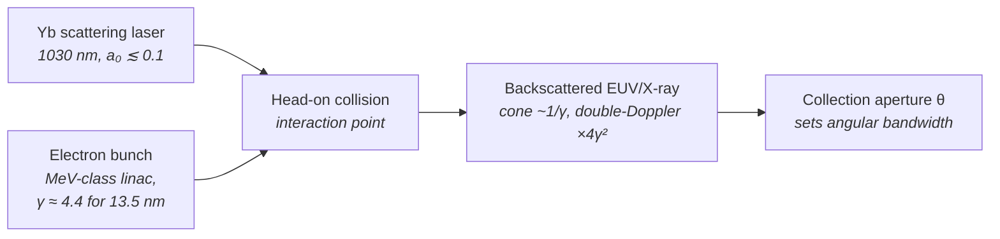

# Inverse Compton Scattering (ICS)

**Status:** 🧪 Theoretical — the Compton kinematics are exact and the wavelength is derived from machine parameters, but ICS as a *lithography* source is a parameterized concept: the bandwidth model is an approximation and flux at wafer-relevant dose rates has never been demonstrated.

## Overview

Inverse Compton scattering collides a laser pulse head-on with a relativistic electron bunch; each scattered photon is upshifted by the double-Doppler factor $\sim 4\gamma^2$. The selling point for lithography is compactness: because the upshift is quadratic in $\gamma$, only **MeV-class** electrons are needed to convert an optical photon to EUV — about 1.7 MeV to reach 13.5 nm from a 1030 nm Yb laser. That is a benchtop accelerator, versus hundreds of MeV for an FEL or a storage ring at the same wavelength.

The catch is flux. Demonstrated compact ICS machines produce useful brightness for imaging and metrology in the hard X-ray, but their average power is microwatts — many orders of magnitude below the ~100 W-class in-band power a scanner needs. `IcsSource` therefore models the kinematics honestly (wavelength *derived* from electron energy, laser wavelength, and laser strength) and carries the flux numbers so the shortfall is visible in the output, not hidden.

Implementation: [source_models/ics.rs](../../crates/highuvlith-core/src/source_models/ics.rs), shared formulas in [source_models/physics.rs](../../crates/highuvlith-core/src/source_models/physics.rs).

## Generation physics



For a head-on collision, observed at angle $\theta$ from the electron direction:

$$
\lambda_X = \lambda_L\,\frac{1 + a_0^2/2 + \gamma^2\theta^2}{4\gamma^2}
$$

where $a_0$ is the normalized laser vector potential ($a_0 \ll 1$: linear Compton; larger $a_0$ redshifts the line through the $1 + a_0^2/2$ term) and $\gamma = 1 + E_\text{kin}/m_ec^2$. The `for_wavelength` constructor inverts the on-axis relation — the honest "derived" direction, machine parameters follow from the target:

$$
\gamma = \sqrt{\frac{\lambda_L\,(1 + a_0^2/2)}{4\,\lambda_X}}
\;\;\Rightarrow\;\;
\gamma \approx 4.37,\ E \approx 1.72\ \text{MeV} \quad (1030\ \text{nm} \to 13.5\ \text{nm})
$$

The relative bandwidth is modeled as a quadrature sum of the collection-angle spread and the electron energy spread (laser bandwidth neglected) — a documented approximation, not a full spectral-angular integral:

$$
\frac{\Delta\lambda}{\lambda} = \sqrt{\left(\frac{\gamma^2\theta^2}{1 + a_0^2/2}\right)^2 + \left(2\,\frac{\Delta E}{E}\right)^2}
$$

## Real-machine parameters

No EUV ICS lithography source exists; the machines below are hard X-ray ICS facilities that anchor the concept, plus the model's EUV design point.

| Machine / concept | Electron energy | Photon output | Average flux / power | Citation |
|---|---|---|---|---|
| Lyncean Compact Light Source | ~25–45 MeV storage ring | 8–35 keV X-ray | ~10¹¹ ph/s (µW-class) | Eggl et al., *J. Synchrotron Rad.* **23**, 1496 (2016) |
| ThomX (Orsay) | 50–70 MeV | 40–90 keV | ~10¹¹–10¹³ ph/s design | Variola et al., ThomX TDR (2014) |
| Compact XFEL/ICS concepts | tens of MeV | keV-class | design studies | Graves et al., *PRAB* **17**, 120701 (2014) |
| **Model preset `compact_euv_13nm5`** | **1.72 MeV (derived)** | **13.5 nm** | **1 nJ × 10 kHz = 10 µW** | this module |

**Flux reality check (live arithmetic):** the preset's `pulse_energy_nj × rep_rate_hz` gives 10 µW average power — roughly seven orders of magnitude below the ~100 W-class in-band power of a production [Sn LPP source](./lpp.md). Treat every ICS dose-rate output as a research projection.

## Simulation model

`IcsSource` implements `LithographySource`:

- **Derived wavelength** — `wavelength_nm()` calls `physics::ics_wavelength_nm(laser_wavelength_nm, gamma(), laser_a0, 0.0)` (on-axis). There is no stored output wavelength to fall out of sync with the machine parameters.
- **Constructors** — `IcsSource::for_wavelength(target, laser, a0)` solves for `electron_energy_mev` and rejects impossible upshifts (`laser_wavelength_nm <= target`); `compact_euv_13nm5()` is `for_wavelength(13.5, 1030.0, 0.1)`.
- **Spectral model** — `bandwidth_pm()` applies the quadrature model above; `spectral_weights()` samples a Gaussian line at `spectral_samples` (default 5) points. Narrow-band, so the per-sample focus-shift polychromatic model is honest here.
- **Pupil / coherence** — moderate transverse coherence (0.5 by default) is reported via `transverse_coherence()` and mapped to a `CoherentGaussian` pupil at construction using the approximate Gaussian-Schell heuristic `sigma_from_coherence(0.5, 0.05)` ≈ 0.071 (documented in `source.rs`).
- **Pulse metadata** — `pulse_energy_j()` and `rep_rate_hz()` feed the trait-default `average_power_w()` product. The stochastic module does **not** read them: `StochasticParams::from_source` consumes only `photon_density_per_mj_cm2()` and `shot_to_shot_rms()`, and ICS keeps the trait-default 0.0 jitter — so ICS contributes no shot-to-shot dose-jitter term to stochastic runs.

Assumptions: single-scattering, head-on geometry only; no nonlinear ponderomotive broadening beyond the $1+a_0^2/2$ shift; laser bandwidth neglected in the quadrature; electron beam emittance not modeled (its angular contribution is folded into the collection-angle term the user sets).

## Model coverage

| Field | Unit | Consumed by | Status |
|---|---|---|---|
| `electron_energy_mev` | MeV | `gamma()` → derived `wavelength_nm()` and bandwidth | live |
| `laser_wavelength_nm` | nm | wavelength derivation | live |
| `laser_a0` | — | nonlinear redshift + bandwidth normalization | live |
| `collection_half_angle_mrad` | mrad | angular term of `relative_bandwidth()` | live |
| `electron_energy_spread_rel` | — | energy term of `relative_bandwidth()` | live |
| `pulse_energy_nj` | nJ | `pulse_energy_j()` → average-power arithmetic | live |
| `rep_rate_hz` | Hz | `rep_rate_hz()` → average-power arithmetic | live |
| `transverse_coherence_fraction` | — | `transverse_coherence()`; sets pupil σ at construction | live |
| `spectral_samples` | count | spectral sampling density | live |
| `illumination` | enum | `intensity_at()` pupil fill | live |

## Usage

Python (factory from [py_config.rs](../../crates/highuvlith-py/src/py_config.rs)):

```python
import highuvlith as huv

src = huv.SourceConfig.ics(
    target_wavelength_nm=13.5,
    laser_wavelength_nm=1030.0,
    laser_a0=0.1,
)
print(src.wavelength_nm)   # 13.5 — derived, not stored
# Impossible upshift raises: laser must be longer than the target.
# huv.SourceConfig.ics(target_wavelength_nm=13.5, laser_wavelength_nm=10.0)
```

TOML (field names from [config.rs](../../crates/highuvlith-cli/src/config.rs); `wavelength_nm` is the *target*, the electron energy is derived from it):

```toml
[source]
type = "ics"
wavelength_nm = 13.5              # target; electron energy derived (~1.7 MeV)
laser_wavelength_nm = 1030.0
laser_a0 = 0.1
collection_half_angle_mrad = 1.0
electron_energy_spread_rel = 0.005
pulse_energy_nj = 1.0
rep_rate_hz = 10000.0
```

## Validation

Rust unit tests in [ics.rs](../../crates/highuvlith-core/src/source_models/ics.rs) and [physics.rs](../../crates/highuvlith-core/src/source_models/physics.rs):

- `test_wavelength_derived_from_kinematics` — 1030 nm + a₀ = 0.1 → exactly 13.5 nm, electron energy in the 1.5–2.0 MeV window.
- `test_ics_wavelength_fixture` (physics.rs) — pins $\lambda_L/4\gamma^2$ and both redshift directions (a₀ and θ).
- `test_bandwidth_monotone_in_collection_angle` — bandwidth grows with θ.
- `test_nonlinear_redshift` — larger a₀ lengthens the line at fixed electron energy.
- `test_invalid_targets_rejected` — non-positive targets and downshift geometries rejected.
- `test_weights_sum_to_one` — spectral normalization.

Python: `tests/python/test_sources.py::TestIcsSource` and the end-to-end imaging smoke test.

## References

1. G. A. Krafft and G. Priebe, "Compton sources of electromagnetic radiation," *Rev. Accel. Sci. Technol.* **3**, 147 (2010).
2. E. Eggl et al., "The Munich Compact Light Source," *J. Synchrotron Rad.* **23**, 1496 (2016).
3. W. S. Graves et al., "Compact x-ray source based on burst-mode inverse Compton scattering," *Phys. Rev. Accel. Beams* **17**, 120701 (2014).
4. Status taxonomy: [../capability-matrix.md](../capability-matrix.md). Compare: [SSMB](./ssmb.md) (the other compact-EUV accelerator concept in this framework).
