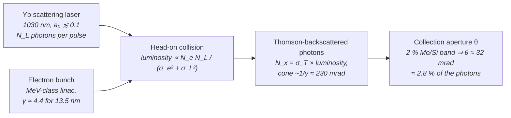

# Inverse Compton Scattering (ICS)

**Status:** 🧪 Theoretical — the Compton kinematics are exact and both the wavelength and (with collision parameters) the photon yield are derived from machine parameters, but even the model's aggressive design point (100 pC × 10 mJ collisions at 100 MHz) puts only ≈ 71 µW into the 2 % EUV band, about 3.5 million times short of a 250 W HVM source.

## Overview

Inverse Compton scattering collides a laser pulse head-on with a relativistic electron bunch; each scattered photon is upshifted by the double-Doppler factor $\sim 4\gamma^2$. The selling point for lithography is compactness: because the upshift is quadratic in $\gamma$, only **MeV-class** electrons are needed to convert an optical photon to EUV — about 1.73 MeV to reach 13.5 nm from a 1030 nm Yb laser. That is a benchtop accelerator, versus hundreds of MeV for an FEL or a storage ring at the same wavelength.

The catch is flux, and the model now derives it rather than storing it. The scattering probability per electron is the Thomson cross-section ($6.65\times10^{-29}$ m²) times the laser photon areal density, so even a 10 mJ laser pulse focused to 10 µm scatters only ≈ 3×10⁻³ photons per electron; and at MeV energies the $1/\gamma$ emission cone is ~230 mrad wide, so only a few percent of those photons land inside the 2 % reflectance band of Mo/Si mirrors. `IcsSource` keeps the kinematics exact, derives the yield from the collision luminosity when collision parameters are given, and reports the shortfall against HVM power as a derived quantity instead of hiding it.

Implementation: [source_models/ics.rs](../../crates/highuvlith-core/src/source_models/ics.rs), shared formulas in [source_models/physics.rs](../../crates/highuvlith-core/src/source_models/physics.rs).

## Generation physics



**Kinematics.** For a head-on collision, observed at angle $\theta$ from the electron direction:

```math
\lambda_X = \lambda_L\,\frac{1 + a_0^2/2 + \gamma^2\theta^2}{4\gamma^2}
```

where $a_0$ is the normalized laser vector potential ($a_0 \ll 1$: linear Compton; larger $a_0$ redshifts the line through the $1 + a_0^2/2$ term) and $\gamma = 1 + E_\text{kin}/m_ec^2$. The `for_wavelength` constructor inverts the on-axis relation — the honest "derived" direction, machine parameters follow from the target:

```math
\gamma = \sqrt{\frac{\lambda_L\,(1 + a_0^2/2)}{4\,\lambda_X}}
\;\;\Rightarrow\;\;
\gamma = 4.378,\ E_\text{kin} = 1.726\ \text{MeV} \quad (1030\ \text{nm} \to 13.5\ \text{nm},\ a_0 = 0.1)
```

**Photon yield (Thomson luminosity).** For round Gaussian electron and laser beams colliding head-on, the number of photons scattered per collision into all angles is

```math
N_x = \sigma_T\,\frac{N_e\,N_L}{2\pi\,(\sigma_e^2 + \sigma_L^2)},
\qquad N_e = \frac{Q}{e},\quad N_L = \frac{E_L}{hc/\lambda_L}
```

Assumptions (stated in the code): linear Thomson regime ($a_0 \ll 1$, electron recoil negligible — the recoil parameter $4\gamma E_L/m_ec^2 \approx 4\times10^{-5}$), round Gaussian spots, head-on geometry with no crossing angle, and laser Rayleigh range / electron $\beta^*$ much longer than the pulse and bunch (no hourglass loss). Each real effect only lowers the yield.

**Collection fraction.** In the electron rest frame the azimuth-averaged scattering pattern of linearly polarized or unpolarized light is the dipole distribution $\tfrac{3}{16\pi}(1 + \cos^2\theta')$. A lab-frame cone of half-angle $\theta_c$ maps to the rest-frame cone $\cos\theta'_c = u$ through the exact aberration formula, so the collected fraction is

```math
f(\theta_c) = \frac{3}{8}\left[(1 - u) + \frac{1 - u^3}{3}\right],
\qquad u = \frac{\cos\theta_c - \beta}{1 - \beta\cos\theta_c}
```

(implemented in a cancellation-free form; the fixture was confirmed by direct lab-frame quadrature of the boosted pattern). For $\gamma \gg 1$ exactly half the photons fall inside $\theta = 1/\gamma$.

**In-band collection.** A photon at angle $\theta$ is red-shifted by $\gamma^2\theta^2/(1 + a_0^2/2)$ relative to the on-axis line, so staying inside a relative band $\mathrm{BW}$ requires

```math
\theta \le \theta_\text{bw} = \frac{\sqrt{\mathrm{BW}\,(1 + a_0^2/2)}}{\gamma}
\;=\; 32.4\ \text{mrad for BW = 2 \%},\ \gamma = 4.378
\;\Rightarrow\; f(\theta_\text{bw}) = 2.83\ \%
```

**Bandwidth.** The relative bandwidth is modeled as a quadrature sum of the collection-angle spread and the electron energy spread (laser bandwidth neglected) — a documented approximation (the angular term is really a one-sided red tail), not a full spectral-angular integral:

```math
\frac{\Delta\lambda}{\lambda} = \sqrt{\left(\frac{\gamma^2\theta^2}{1 + a_0^2/2}\right)^2 + \left(2\,\frac{\Delta E}{E}\right)^2}
```

## Real-machine parameters

No EUV ICS lithography source exists, and no production-scale EUV-lithography ICS proposal is known. Operating compact ICS machines are hard X-ray imaging sources delivering ~10¹⁰ photons/s (µW class); the model's EUV rows are design points.

| Machine / concept | Electron beam | Photon output | Average flux / power | Citation |
|---|---|---|---|---|
| Munich Compact Light Source (Lyncean-built compact storage ring + laser enhancement cavity, TU Munich) | compact storage ring | hard X-rays | 1–3×10¹⁰ photons/s (µW class) | Eggl et al., *J. Synchrotron Rad.* **23**, 1137–1142 (2016) |
| ThomX | compact storage ring | 45 keV | ~10¹⁰ photons/s (≈ 70 µW, derived) | ThomX |
| Waseda 6.7 nm ICS designs | — | 6.7 nm, per 2 % bandwidth | 1.28×10⁻⁵ W (100 kHz) to 1×10⁻³ W (100 MHz) — DESIGN | Sakaue et al., 2011 EUVL workshop |
| Burst-mode compact ICS concept | linac, tens of MeV | keV-class X-rays | design study | Graves et al., *Phys. Rev. ST Accel. Beams* **17**, 120701 (2014) |
| **`for_wavelength(13.5, 1030, 0.1)`** (legacy placeholder) | **1.726 MeV (derived)** | **13.5 nm** | **stored 1 nJ × 10 kHz = 10 µW** (not derived) | this module |
| **`compact_euv_13nm5()`** (aggressive design point) | **1.726 MeV, 100 pC at 100 MHz (10 mA)** | **13.5 nm, 2 % band** | **71 µW in band, DERIVED** from a 10 mJ / ~1 MW enhancement-cavity collision with 10 µm spots | this module |

**Flux reality check (derived).** The design point scatters $1.71\times10^6$ photons per collision; $4.84\times10^4$ of them (2.83 %) fall in the 2 % Mo/Si band, i.e. 0.712 pJ per collision and **71 µW** at 100 MHz — $3.5\times10^6$ times short of the 250 W in-band power at intermediate focus of a production [Sn LPP source](./lpp.md) (and further still from the 500 W–1 kW sources now shipping or demonstrated). Reaching it needs 10 mA of 1.73 MeV electrons (17.3 kW of beam power) and a megawatt of circulating laser power. In the dose-limited scanner model (`wafer_throughput`, EUV-like optics, 30 mJ/cm²) that is ≈ 2×10⁻⁴ wafers per hour — about 200 days per wafer.

The published anchors bracket this: operating Compton sources deliver ~10¹⁰ photons/s (µW class), and the Waseda 6.7 nm designs span 1.28×10⁻⁵ W at 100 kHz to 1×10⁻³ W at 100 MHz per 2 % bandwidth. The model's 71 µW at 100 MHz is ~14× below the Waseda 100 MHz design, which targets 6.7 nm with its own (unmodeled here) beam and laser assumptions — the same order of magnitude of shortfall either way: kW-class EUV from Compton scattering is not on any published roadmap.

## Simulation model

`IcsSource` implements `LithographySource`:

- **Derived wavelength** — `wavelength_nm()` calls `physics::ics_wavelength_nm(laser_wavelength_nm, gamma(), laser_a0, 0.0)` (on-axis). There is no stored output wavelength to fall out of sync with the machine parameters.
- **Derived photon yield (new)** — with an `IcsCollision { bunch_charge_pc, laser_pulse_energy_mj, electron_spot_um, laser_spot_um }` attached (`with_collision`, all values validated positive), `photons_per_collision()` evaluates the Thomson luminosity formula, `collected_fraction()` the exact collection fraction for `collection_half_angle_mrad`, and `pulse_energy_j()` returns *collected photons × on-axis photon energy* (a ≤ 2 % overestimate inside the band). `average_power_w()` = derived pulse energy × `rep_rate_hz`. Without a collision model the stored `pulse_energy_nj` is used, as before.
- **Constructors** — `IcsSource::for_wavelength(target, laser, a0)` solves for `electron_energy_mev`, rejects impossible upshifts (`laser_wavelength_nm <= target`), and keeps the **legacy stored behaviour** (1 mrad collection, 1 nJ, 10 kHz, no collision model). `compact_euv_13nm5()` is `for_wavelength(13.5, 1030.0, 0.1)` plus the aggressive design point: collection opened to the 2 % band (32.4 mrad), 100 MHz, and `IcsCollision::high_average_power_design()` (100 pC, 10 mJ, 10 µm, 10 µm).
- **Spectral model** — `bandwidth_pm()` applies the quadrature model; `spectral_weights()` samples a Gaussian line at `spectral_samples` (default 5) points.
- **Pupil / coherence** — moderate transverse coherence (0.5 by default) is reported via `transverse_coherence()` and mapped to a `CoherentGaussian` pupil at construction using the approximate Gaussian–Schell heuristic `sigma_from_coherence(0.5, 0.05)` ≈ 0.071 (documented in `source.rs`).
- **Stochastics** — `StochasticParams::from_source` consumes only `photon_density_per_mj_cm2()` and `shot_to_shot_rms()`; ICS keeps the trait-default 0.0 jitter, so it contributes no dose-jitter term.

> **Behaviour change (this release).** `compact_euv_13nm5()` now collects the whole 2 % band (half-angle 32.4 mrad instead of 1 mrad), so its relative bandwidth rises from ≈ 1.0 % (135 pm) to ≈ 2.24 % (302 pm) and polychromatic imaging samples a wider line; it runs at 100 MHz with the **derived** yield, so `average_power_w` changes from the stored 10 µW to the derived 71 µW. `for_wavelength()` and the Python `SourceConfig.ics()` factory without collision arguments are unchanged.

Assumptions: single scattering, head-on geometry only; no nonlinear ponderomotive broadening beyond the $1 + a_0^2/2$ shift (the stored `laser_a0` is not cross-checked against the laser pulse energy and spot size); laser bandwidth neglected; electron-beam emittance only enters through the spot size and the user-set collection angle; no electron recoil (Compton) correction.

## Derived quantities

`derived_quantities()` (Python: `SourceConfig.derived_quantities()` / `derived_quantity(name)`; CLI: printed by `highuvlith simulate`) reports, for the `compact_euv_13nm5()` design point:

| Name | Value | Unit | Meaning |
|---|---|---|---|
| `photon_energy` | 91.84 | eV | on-axis $hc/\lambda_X$ |
| `electron_gamma` | 4.378 | – | Lorentz factor derived from the target wavelength |
| `relative_bandwidth` | 0.0224 | – | quadrature bandwidth model |
| `collected_fraction` | 0.0283 | – | fraction of scattered photons inside the collection half-angle |
| `in_band_half_angle` | 32.4 | mrad | half-angle keeping the red shift inside the 2 % band |
| `in_band_fraction_max` | 0.0283 | – | largest fraction collectable inside the 2 % band |
| `photons_per_collision` | 1.713×10⁶ | photons | Thomson luminosity yield, all angles *(collision model only)* |
| `collected_photons_per_collision` | 4.84×10⁴ | photons | yield × collected fraction *(collision model only)* |
| `electron_beam_current` | 0.01 | A | bunch charge × collision rate *(collision model only)* |
| `electron_beam_power` | 1.73×10⁴ | W | kinetic energy × current — what the accelerator must supply *(collision model only)* |
| `laser_average_power` | 1×10⁶ | W | pulse energy × rate (circulating power of a cavity) *(collision model only)* |
| `average_power` | 7.12×10⁻⁵ | W | derived collected power (stored value without a collision model) |
| `photon_rate` | 4.84×10¹² | photons/s | average power / photon energy |
| `hvm_power_ratio` | 2.85×10⁻⁷ | – | average power / 250 W |
| `hvm_power_gap` | 3.51×10⁶ | – | factor short of 250 W |

The legacy `for_wavelength(13.5, 1030, 0.1)` source reports the kinematic rows, a 1 mrad `collected_fraction` of 2.8×10⁻⁵, and a stored 10 µW (gap 2.5×10⁷).

## Model coverage

| Field | Unit | Consumed by | Status |
|---|---|---|---|
| `electron_energy_mev` | MeV | `gamma()` → derived `wavelength_nm()`, bandwidth, collection fraction, beam power | live |
| `laser_wavelength_nm` | nm | wavelength derivation; laser photon count $N_L$ | live |
| `laser_a0` | — | nonlinear redshift, bandwidth normalization, in-band half-angle | live |
| `collection_half_angle_mrad` | mrad | angular bandwidth term; with a collision model also the collected fraction | live |
| `electron_energy_spread_rel` | — | energy term of `relative_bandwidth()` | live |
| `pulse_energy_nj` | nJ | `pulse_energy_j()` when no collision model is attached (legacy placeholder) | live (fallback) |
| `rep_rate_hz` | Hz | `average_power_w()`; beam current and laser power | live |
| `collision` (`IcsCollision`: `bunch_charge_pc`, `laser_pulse_energy_mj`, `electron_spot_um`, `laser_spot_um`) | pC, mJ, µm, µm | Thomson yield → `pulse_energy_j()` → `average_power_w()`; derived quantities | live (optional, new) |
| `transverse_coherence_fraction` | — | `transverse_coherence()`; sets pupil σ at construction | live |
| `spectral_samples` | count | spectral sampling density | live |
| `illumination` | enum | `intensity_at()` pupil fill | live |
| laser $a_0$ ↔ pulse energy / spot consistency | — | — | planned |

## Usage

Python (factories from [py_config.rs](../../crates/highuvlith-py/src/py_config.rs)):

<!-- verify-example -->
```python
import highuvlith as huv

src = huv.SourceConfig.ics_compact_euv_13nm5()    # derived yield, 2 % band, 100 MHz
print(src.wavelength_nm, src.electron_energy_mev) # 13.5, 1.726 — both from kinematics
print(src.average_power_w)                        # 7.12e-05 W in band
print(src.derived_quantity("hvm_power_gap"))      # ~3.5e6

# Custom collision: halving both spot sizes quadruples the yield (2.85e-04 W).
tight = huv.SourceConfig.ics(
    target_wavelength_nm=13.5, laser_wavelength_nm=1030.0, laser_a0=0.1,
    bunch_charge_pc=100.0, laser_pulse_energy_mj=10.0,
    electron_spot_um=5.0, laser_spot_um=5.0, rep_rate_hz=1e8,
)   # collection_half_angle_mrad defaults to the 2 % band when collision args are given

legacy = huv.SourceConfig.ics()                   # no collision args: stored 1 nJ x 10 kHz
print(src.wafer_throughput(dose_mj_cm2=30.0)["wafers_per_hour"])   # ~2e-4
# Impossible upshift raises: laser must be longer than the target.
# huv.SourceConfig.ics(target_wavelength_nm=13.5, laser_wavelength_nm=10.0)
```

??? success "Output"

    ```text
    13.5 1.7263038752939022
    7.122664399686821e-05
    3509922.4948881813
    0.0002053034988387549
    ```

TOML (field names from [config.rs](../../crates/highuvlith-cli/src/config.rs); `wavelength_nm` is the *target*, the electron energy is derived from it; `highuvlith simulate` prints the derived quantities):

```toml
[source]
type = "ics"
wavelength_nm = 13.5              # target; electron energy derived (~1.73 MeV)
laser_wavelength_nm = 1030.0
laser_a0 = 0.1
# Collision parameters -> derived photon yield (all optional, design-point defaults):
bunch_charge_pc = 100.0
laser_pulse_energy_mj = 10.0      # circulating pulse energy of an enhancement cavity
electron_spot_um = 10.0
laser_spot_um = 10.0
rep_rate_hz = 1.0e8
# collection_half_angle_mrad = 32.4   # default with collision fields: the 2 % band
# electron_energy_spread_rel = 0.005
# pulse_energy_nj = 1.0               # only used without collision fields
```

See `examples/sim_ics.toml` for the full design-point config.

## Validation

Rust unit tests in [ics.rs](../../crates/highuvlith-core/src/source_models/ics.rs):

- `test_wavelength_derived_from_kinematics` — 1030 nm + a₀ = 0.1 → exactly 13.5 nm, electron energy in the 1.5–2.0 MeV window.
- `test_derived_yield_fixture` — γ = 4.3783; 1.713×10⁶ photons/collision; 2.825 % collected; 0.712 pJ and 71.2 µW (scipy fixtures); gap in 3–4×10⁶; 10 mA and 17.3 kW of beam power.
- `test_old_constructor_keeps_stored_yield` — `for_wavelength` keeps the stored 10 µW and 1 mrad aperture.
- `test_yield_scaling` — doubling the laser energy doubles the power; doubling both spot sizes quarters it; a 1 mrad aperture collects ~1000× less than the full band.
- `test_bandwidth_monotone_in_collection_angle`, `test_nonlinear_redshift`, `test_weights_sum_to_one`.
- `test_invalid_targets_rejected` — non-positive targets, downshift geometries, and non-positive collision parameters rejected.

In [physics.rs](../../crates/highuvlith-core/src/source_models/physics.rs): `test_ics_wavelength_fixture` ($\lambda_L/4\gamma^2$ and both redshift directions), `test_thomson_yield_fixture` (1.713×10⁶, bilinear and $1/\sigma^2$ scaling), `test_thomson_collection_fraction_fixture` (32.38 mrad, 2.825 % — confirmed by lab-frame quadrature — 2.8×10⁻⁵ at 1 mrad, limits 0 and 1, half the photons inside $1/\gamma$).

CLI ([config.rs](../../crates/highuvlith-cli/src/config.rs)): `test_ics_electron_energy_cross_check`, `test_ics_ssmb_entangled_machine_fields` (collision fields → 71.2 µW), `test_legacy_family_tomls_unchanged_by_new_fields` (no collision fields → stored 10 µW), `test_family_example_tomls_validate`.

Python: `tests/python/test_sources_physics.py::TestIcs` and `::TestThroughput`, `tests/python/test_sources.py::TestIcsSource`, and the end-to-end imaging smoke test.

## References

1. G. A. Krafft and G. Priebe, "Compton sources of electromagnetic radiation," *Rev. Accel. Sci. Technol.* **3**, 147 (2010).
2. E. Eggl et al., *J. Synchrotron Rad.* **23**, 1137–1142 (2016) — Munich Compact Light Source performance.
3. W. S. Graves et al., "Compact x-ray source based on burst-mode inverse Compton scattering," *Phys. Rev. ST Accel. Beams* **17**, 120701 (2014).
4. Sakaue et al., 6.7 nm inverse-Compton source designs, 2011 International Workshop on EUV Lithography (euvlitho.com, 2011/P30).
5. Status taxonomy: [../capability-matrix.md](../capability-matrix.md). Compare: [SSMB](./ssmb.md) (the other compact-EUV accelerator concept in this framework), [Sn LPP](./lpp.md) (the 250 W benchmark).
