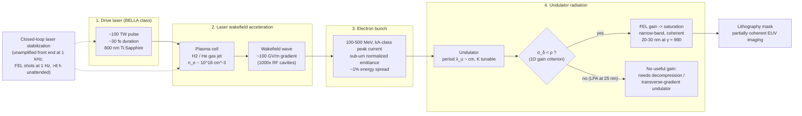

# LPA-FEL Source (Laser-Plasma Accelerator FEL; 420 nm demonstrated, 20–30 nm projected)

**Status:** 🔶 Simplified — the resonance wavelength, the 1D / Ming-Xie FEL physics (Pierce parameter, gain length, saturation, energy-spread criterion) and the SASE bandwidth 2ρλ are derived from the optional undulator and beam parameters, but the imaging wavelength remains a stored set-point (held to the resonance by a 5 % rule), the default pupil is still `Conventional` for back-compat, and the 25 nm / 500 MeV / 1 kHz preset is a design projection (the demonstrated anchor is BELLA's 420 nm lasing at 1 Hz).

## Overview

Laser-plasma driven free-electron lasers aim at narrow-band short-wavelength
radiation with a compact footprint by chaining two accelerator innovations:
laser-wakefield electron acceleration, then undulator-based radiation
generation. The demonstrated anchor is LBNL's BELLA (F. Kohrell et al.,
*Phys. Rev. Accel. Beams* **29**, 041301 (2026)): 100 MeV beams at **1 Hz**
lased (SASE) at 420 nm for more than 8 hours without operator input
(~15,000 shots); only the unamplified laser front end runs at 1 kHz, for
stabilization. (Some lay coverage reported "1,000 bunches per second" — that is
wrong; the FEL ran at 1 Hz.) Other LPA-FEL results: lasing at 27 nm with
≤150 nJ per shot at ≤1 Hz (Wang et al., *Nature* **595**, 516 (2021)), seeded
lasing at 269 nm (*Nat. Photon.* **17**, 150 (2023)), and gain above 1000 at
420 nm (*Phys. Rev. Lett.* **135**, 055001 (2025)). **No LPA-FEL has lased at
13.5 nm.** The preset this page centres on — ~500 MeV, 25 nm, 1 kHz — is a
**design projection** used as an EUV study point, not a published BELLA
specification.

That band sits in a long-standing gap between refractive VUV lithography and
Mo/Si multilayer-mirror EUV at 13.5 nm. At 25 nm, Mo/Si reflectance is still
adequate (though not peak), zone plates and multilayer Schwarzschilds both
remain viable, and many resist chemistries carry over from EUV research.
LPA-FELs are a candidate compact route into this regime outside large
synchrotron and linac facilities — which is why `LpaFelSource` exists as the
framework's bridge between `VuvSource` and the 13.5 nm families.

The model now also answers *whether the beam can lase at 25 nm*: with an
undulator and beam parameters attached, it derives the FEL gain physics and
shows that a percent-level LPA energy spread exceeds the Pierce parameter at
500 MeV — the central open problem of LPA-FELs.

## Generation physics



### Key equations

The on-axis undulator fundamental wavelength is

```math
\lambda_r \;=\; \frac{\lambda_u}{2\gamma^2}\left(1 + \frac{K^2}{2}\right),
\qquad \gamma = 1 + \frac{E_\mathrm{kin}}{m_ec^2},
\qquad K = \frac{eB_0\lambda_u}{2\pi m_ec} = 0.09337\,B_0[\mathrm{T}]\,\lambda_u[\mathrm{mm}]
```

Because λ scales as 1/γ², doubling the electron energy quarters the
wavelength — which is why the demonstrated 100 MeV FEL lases at ~420 nm while
the projected ~500 MeV study point lands near 25 nm (with a different
undulator K).

With a beam of peak current $I$, normalized emittance $\varepsilon_n$ and
average beta function $\beta$ (rms size $\sigma_x = \sqrt{\varepsilon_n\beta/\gamma}$),
standard 1D FEL theory gives the Pierce parameter, gain length, saturation
power and length (planar undulator, $[JJ] = J_0(\xi) - J_1(\xi)$,
$\xi = K^2/(4+2K^2)$, $I_A = 17045$ A, $k_u = 2\pi/\lambda_u$):

```math
\rho = \left[\frac{1}{16}\,\frac{I}{I_A}\,\frac{K^2[JJ]^2}{\gamma^3\sigma_x^2k_u^2}\right]^{1/3},
\qquad
L_{g} = \frac{\lambda_u}{4\pi\sqrt3\,\rho},
\qquad
P_\mathrm{sat} \approx \rho\,P_\mathrm{beam},\quad P_\mathrm{beam} = \frac{\gamma m_ec^2 I}{e},
\qquad
L_\mathrm{sat} \approx \frac{\lambda_u}{\rho}
```

Three-dimensional effects (diffraction, emittance, energy spread) lengthen the
gain length by the empirical Ming Xie fit (M. Xie, Proc. 1995 Particle
Accelerator Conference, PAC'95) — the 19 coefficients are listed on the
[XFEL page](./xfel.md#key-equations):

```math
L_{g,3D} = L_g\,(1+\Lambda(\eta_d,\eta_\varepsilon,\eta_\gamma)),
\qquad
P_\mathrm{sat,3D} \approx 1.6\,\rho\left(\frac{L_g}{L_{g,3D}}\right)^2 P_\mathrm{beam},
\qquad
\eta_\gamma = 4\pi\,\frac{L_g}{\lambda_u}\,\frac{\sigma_\gamma}{\gamma}
```

A SASE FEL at saturation has a relative bandwidth of order $2\rho$, so the model
takes the FWHM line width as $\Delta\lambda \approx 2\rho\lambda$ whenever an
undulator and a beam are attached.

Two dimensionless criteria decide whether the beam can lase:
**energy spread** $\sigma_\gamma/\gamma < \rho$ (above it the gain collapses:
$\sigma_\gamma/\gamma = \rho$ already gives $\eta_\gamma = 1/\sqrt3$ and
$\Lambda \approx 1$), and **emittance** $\varepsilon \lesssim \lambda/4\pi$ for a
transversely coherent mode.

## Real-machine parameters

| Property | BELLA LPA-FEL (demonstrated, 2026) | 25 nm preset (PROJECTION) | F₂ excimer (for scale) |
|----------|------------------------------------|---------------------------|------------------------|
| Wavelength | 420 nm (SASE) | 25 nm | 157.63 nm |
| Electron energy | 100 MeV | ~500 MeV | — |
| FEL repetition rate | **1 Hz** (laser front end 1 kHz) | 1 kHz (assumed) | 4 kHz |
| Continuous operation | > 8 h without operator input, ~15,000 shots | — | — |
| Pulse energy | not taken from the paper (baseline preset: 1 µJ, assumed) | 5 µJ (assumed) | ~10 mJ |
| Relative bandwidth Δλ/λ | SASE | 1.06×10⁻² = 2ρ, derived from the illustrative beam (266 pm) | ~7×10⁻⁶ |
| Photon energy | 2.95 eV | 49.6 eV | 7.9 eV |
| Shot-to-shot stability | feedback-stabilized (baseline preset: 5 %, assumed) | 3 % (assumed) | not modeled |

| Other LPA-FEL results | Wavelength | Notes |
|---|---|---|
| Wang et al., *Nature* **595**, 516 (2021) | 27 nm | ≤150 nJ per shot, ≤1 Hz (≈ 0.15 µW) |
| *Nat. Photon.* **17**, 150 (2023) | 269 nm | seeded LPA-FEL |
| *Phys. Rev. Lett.* **135**, 055001 (2025) | 420 nm | gain > 1000 |
| — | 13.5 nm | **none** |

Citations: Kohrell et al., *Phys. Rev. Accel. Beams* **29**, 041301 (2026) for
the demonstrated column; the 25 nm column is this model's projection, not a
published BELLA plan. General LWFA and FEL physics per Esarey et al. (2009) and
Huang & Kim (2007) — see References. The undulator and beam parameters used by
the presets below are **illustrative, LPA-class assumptions, not BELLA machine
specifications**, and the pulse energies / stabilities are assumptions.

## Simulation model

`LpaFelSource` in [`crates/highuvlith-core/src/source.rs`](../../crates/highuvlith-core/src/source.rs):

```rust
pub struct LpaFelSource {
    pub wavelength_nm: f64,               // 20-30 nm target regime (stored set-point)
    pub bandwidth_pm: f64,                // FWHM used without an FEL estimate; presets store their 2ρλ
    pub electron_energy_mev: f64,         // γ for the derived resonance / FEL physics
    pub rep_rate_hz: f64,                 // 1 Hz demonstrated; 1 kHz in the 25 nm projection
    pub pulse_energy_uj: f64,             // µJ-class FEL pulses (stored)
    pub pulse_duration_fs: f64,           // ~10 fs
    pub shot_to_shot_stability: f64,      // relative rms, e.g. 0.03
    pub transverse_coherence_fraction: f64, // 0.85-0.9 typical
    pub spectral_samples: usize,
    pub spectral_shape: SpectralShape,    // Gaussian default (seeded FEL)
    pub illumination: IlluminationShape,  // Conventional default (back-compat)
    #[serde(default)] pub undulator: Option<physics::UndulatorParams>,       // period_mm, k, num_periods
    #[serde(default)] pub electron_beam: Option<physics::ElectronBeamParams>, // peak_current_a, norm_emittance_um, energy_spread_rel, beta_m
    #[serde(default)] pub bandwidth_override_pm: Option<f64>, // explicit FWHM; always wins
}
```

The three machine-era fields are `#[serde(default)]`, so configs written before
they existed parse unchanged (and carry no machine and no override).

**Bandwidth.** `effective_bandwidth_pm()` — what `bandwidth_pm()` and the spectral
weights use — is `bandwidth_override_pm` if set; otherwise the SASE estimate
2ρλ whenever `undulator` and `electron_beam` give an FEL estimate; otherwise the
stored `bandwidth_pm` (0.1 % of λ from `new`). The `bandwidth_fwhm` derived
quantity reports the value together with which of the three it came from.

Factories:

- `bella_baseline_100mev()` — the demonstrated configuration: 420 nm, 100 MeV,
  **1 Hz** (**not** useful for EUV lithography); the 1 µJ pulse energy and 5 %
  jitter are ASSUMED placeholders (1 µJ × 1 Hz = 1 µW). Carries an illustrative
  20 mm × 200-period undulator whose K (1.118) reproduces 420 nm at 100 MeV;
  its derived bandwidth is 2ρλ ≈ 10.4 nm (2.5 %).
- `bella_target_25nm(sigma)` — the **design projection**: 25 nm, 500 MeV,
  1 kHz, 5 µJ, 3 % jitter, coherence 0.9 (all assumed), with the same
  illustrative undulator at K = 1.672 (resonant at 25 nm) and an
  illustrative LPA-class beam: 1 kA peak, 0.5 µm normalized emittance, 1 %
  energy spread, β = 1 m. Its bandwidth is the derived 2ρλ = 266 pm (1.06 %).
- `new(wavelength_nm, sigma)` — custom wavelength, **no** machine attached;
  bandwidth 0.1 % of λ (25 pm at 25 nm).
- `with_machine(undulator, Option<beam>)` — attaches machine parameters,
  validates them (positive period/K/periods/current/emittance/β, spread ≥ 0),
  and enforces the **5 % rule**: the derived resonance must agree with the
  stored `wavelength_nm` within 5 % (same rule the CLI applies to synchrotron
  undulators). `resonant_wavelength_nm()`, `check_resonance()` and
  `fel_estimate()` expose the derivation.

**How it satisfies `LithographySource`.** Spectral weights use the shared
`evaluate_spectral_weights` with a Gaussian default line over the effective
bandwidth (above); `intensity_at` uses
the shared `evaluate_illumination`. The pulse/coherence metadata methods flow
through the trait:

- `pulse_energy_j()` × `rep_rate_hz()` → `average_power_w()` — live arithmetic
  on the **stored** pulse energy (5 µJ × 1 kHz = 5 mW for the target preset).
- `shot_to_shot_rms()` → `StochasticParams::from_source` → Gamma-distributed
  dose jitter in the LER/LWR Monte Carlo — **live**: the preset's (assumed) 3 %
  stability figure actually widens the simulated linewidth distribution
  (`StochasticParams::from_source_multi_pulse` divides it by √N for exposures
  integrating N pulses).
- `transverse_coherence()` reports 0.85–0.9, but the **default pupil is still
  `Conventional { sigma }`**: the `sigma` argument of the factories (and the
  GUI's σ slider) is a top-hat radius, and switching the default to the graded
  `CoherentGaussian` would silently change the meaning of that argument.
  Opt in yourself with
  `IlluminationShape::CoherentGaussian { sigma: sigma_from_coherence(0.9, 0.05) }`
  to model the near-diffraction-limited fill used by the other coherent families.
- `derived_quantities()` — see below.

**Assumptions:** scalar imaging by default (vector imaging is available, see
[vector-imaging.md](../vector-imaging.md)). The narrow-band polychromatic path
shifts focus per spectral sample with the kernels built at the center
wavelength — an approximation at the percent-level SASE band of the presets
(the samples span ±2.5 FWHM, i.e. ±2.7 % of λ at 25 nm), so use
`compute_multiwavelength` (kernels rebuilt per sample) when the band matters.
2ρλ assumes the beam lases — when `energy_spread_over_rho` > 1 the real output
would be the broader, far weaker spontaneous line, which is not modeled. No
time-domain pulse structure. The **imaging wavelength is the stored
set-point** — the resonance is derived and cross-checked (5 %), not substituted.
The FEL estimates are 1D theory plus the Ming Xie fit for a flat-top slice;
start-up noise, slippage and LPA-specific effects (chirp, pointing jitter) are
not modeled. `SynchrotronSource` and `XfelSource` are the counterparts whose
wavelength / undulator K are derived outright.

## Derived quantities

Reported by `derived_quantities()` (Python `derived_quantities()` /
`derived_quantity(name)`, printed by `highuvlith simulate`). Informational —
never read by the imaging pipeline.

| Name | Unit | Meaning | `bella_target_25nm` |
|------|------|---------|---------------------|
| `photon_energy` | eV | hc/λ | 49.59 |
| `photons_per_pulse` | photons | stored pulse energy / photon energy | 6.29×10¹¹ |
| `average_power` | W | stored pulse energy × rep rate | 0.005 |
| `hvm_power_ratio` | — | average power / 250 W (13.5 nm HVM benchmark at IF) | 2×10⁻⁵ |
| `electron_gamma` | — | 1 + E_kin/m_ec² | 979.5 |
| `bandwidth_fwhm` | pm | bandwidth in use: override, derived 2ρλ, or stored set-point (note says which) | 266 |
| `resonant_wavelength` | nm | λ_u(1+K²/2)/(2γ²) (needs `undulator`) | 25.0 |
| `resonance_mismatch` | — | (set-point − resonance)/resonance (\|·\| > 0.05 rejected) | ~0 |
| `undulator_field` | T | B₀ = 2πm_ecK/(eλ_u) | 0.896 |
| `undulator_length` | m | periods × period | 4.0 |
| `pierce_parameter_1d` | — | 1D ρ (needs `undulator` + `electron_beam`) | 5.32×10⁻³ |
| `beam_size_rms` | µm | √(ε_n β/γ) | 22.6 |
| `gain_length_1d` | m | λ_u/(4π√3 ρ) | 0.173 |
| `ming_xie_lambda` | — | 3D degradation Λ (≳ 5: no practical gain) | **48.6** |
| `gain_length_3d` | m | L_g(1+Λ) | 8.56 |
| `energy_spread_over_rho` | — | σ_γ/(γρ); must be < 1 | **1.88** |
| `emittance_over_photon_emittance` | — | ε/(λ/4π) | 0.257 |
| `beam_power_peak` | W | γm_ec²I/e | 5.0×10¹¹ |
| `saturation_power_1d` | W | ρ P_beam | 2.66×10⁹ |
| `saturation_power_3d` | W | 1.6 ρ (L_g/L_g3D)² P_beam | 1.73×10⁶ |
| `saturation_pulse_energy_3d` | J | P_sat,3D × pulse duration (flat top) | 1.7×10⁻⁸ |
| `saturation_length_3d` | m | (λ_u/ρ)(1+Λ) | **186** |
| `undulator_over_saturation_length` | — | ≥ 1: undulator reaches saturation | 0.021 |
| `sase_bandwidth_from_rho` | pm | 2ρλ | 266 |

**The energy-spread punchline.** For the illustrative 25 nm beam the 1 %
energy spread is **1.9 ρ**: the 1D gain criterion is violated, Ming Xie's Λ ≈ 49
stretches the 3D gain length to 8.6 m, and saturation would need ~186 m of
undulator instead of the 4 m provided — in practice, no useful gain. The same
beam at 100 MeV / 420 nm (the `bella_baseline_100mev` machine) has ρ ≈ 1.24×10⁻²,
σ_δ/ρ ≈ 0.80, Λ ≈ 6 and L_sat,3D ≈ 11 m: marginal but lasing-capable, consistent
with LPA-FELs having lased at 420 nm (with their own, better-characterized
beams). The Pierce parameter falls as the
electron energy rises (ρ ∝ γ^(−2/3)(K[JJ])^(2/3) at fixed normalized emittance,
β function and current), so a spread that is tolerable at 420 nm is fatal at
25 nm. Cutting the spread to 0.1 %
(`energy_spread_rel=1e-3`) restores the physics: σ_δ/ρ ≈ 0.19, Λ ≈ 0.45,
L_g,3D ≈ 0.25 m, L_sat,3D ≈ 5.5 m and a ~2 GW (≈ 20 µJ per 10 fs) saturation
estimate. This is exactly why LPA-FEL schemes rely on beam decompression /
energy-spread compensation or transverse-gradient undulators.

**Bandwidth follows the beam (behaviour change).** Earlier versions stored an
independent 25 pm (Δλ/λ = 10⁻³) for the 25 nm preset, ten times narrower than
the SASE estimate 2ρλ ≈ 266 pm of its own beam, and 420 pm for the 420 nm
preset (2ρλ ≈ 10.4 nm). Both presets now use the derived value. An explicit
`bandwidth_override_pm` (Python / TOML: `bandwidth_pm=`) pins any other line
width — e.g. a seeded or self-seeded FEL at Δλ/λ ~ 10⁻⁴.

## Model coverage

| Field | Unit | Consumed by | Status |
|-------|------|-------------|--------|
| `wavelength_nm` | nm | Hopkins TCC, resist exposure, photon-energy/density derivations; 5 % resonance cross-check | live |
| `bandwidth_pm` | pm FWHM | Polychromatic spectral sampling when there is no FEL estimate and no override | live (fallback) |
| `bandwidth_override_pm` | pm FWHM | Explicit line width; wins over the derived 2ρλ | live |
| `electron_energy_mev` | MeV | γ → derived resonance wavelength, 5 % rule, FEL estimate (derived quantities only; does **not** change the imaging wavelength) | live (derived quantities) |
| `rep_rate_hz` | Hz | `average_power_w()` = E_pulse × f_rep | live |
| `pulse_energy_uj` | µJ | `pulse_energy_j()` → `average_power_w()` (stored; not replaced by the saturation estimate) | live |
| `pulse_duration_fs` | fs | `pulse_duration_s()`; saturation pulse energy estimate; no time-domain imaging physics | live (derived quantities) |
| `shot_to_shot_stability` | fraction | `shot_to_shot_rms()` → `StochasticParams::from_source` → Gamma dose jitter (LER/LWR MC) | live |
| `transverse_coherence_fraction` | 0..1 | Reported via `transverse_coherence()` and PyO3; **not** coupled to the default pupil (Conventional back-compat) | stored (inert) |
| `spectral_samples` | count | Polychromatic sample count | live |
| `spectral_shape` | enum | Lorentzian / Gaussian / tabulated / sinc² line weighting | live |
| `illumination` | enum | Pupil `intensity_at` (shared with `VuvSource`, incl. `CoherentGaussian`) | live |
| `undulator` (`period_mm`, `k`, `num_periods`) | mm, —, count | derived resonance (5 % rule), undulator field/length, FEL estimate | live (derived quantities + validation) |
| `electron_beam` (`peak_current_a`, `norm_emittance_um`, `energy_spread_rel`, `beta_m`) | A, µm, —, m | ρ, gain lengths, Ming Xie, saturation, gain / emittance criteria | live (derived quantities) |
| Derived 2ρλ bandwidth | pm | `effective_bandwidth_pm()` → spectral sampling, `bandwidth_pm()` | live |
| FEL-derived pulse energy replacing the stored value | — | — | planned |

## Usage

Python ([factory names from `py_config.rs`](../../crates/highuvlith-py/src/py_config.rs)):

<!-- verify-example -->
```python
import highuvlith as huv

fel = huv.SourceConfig.lpa_fel_bella_25nm(sigma=0.7)   # 500 MeV target preset
print(fel.kind, fel.wavelength_nm)                     # lpa_fel 25.0
print(fel.average_power_w, fel.shot_to_shot_rms)       # 0.005 0.03
print(fel.bandwidth_pm)                                # ~266 pm = 2 rho lambda
print(fel.derived_quantity("energy_spread_over_rho"))  # ~1.88  (> 1: no gain)
print(fel.derived_quantity("saturation_length_3d"))    # ~186 m vs a 4 m undulator

# Custom machine: the undulator K must put the resonance within 5 % of the
# set-point (K = 1.6724 at 20 mm and 500 MeV resonates at 25 nm), otherwise
# ValueError. Missing beam fields take the illustrative LPA defaults
# (1 kA, 0.5 um, 1 % spread, beta 1 m).
cool = huv.SourceConfig.lpa_fel(
    25.0, sigma=0.6, electron_energy_mev=500.0,
    undulator_period_mm=20.0, undulator_k=1.6724, num_periods=200,
    peak_current_a=1000.0, norm_emittance_um=0.5,
    energy_spread_rel=1e-3, beta_m=1.0,
)
print(cool.derived_quantity("energy_spread_over_rho"))  # ~0.19
print(cool.derived_quantity("saturation_pulse_energy_3d"))  # ~2e-5 J
seeded = huv.SourceConfig.lpa_fel(25.0, bandwidth_pm=2.5)  # explicit line width wins

tp = fel.wafer_throughput(dose_mj_cm2=30.0)   # simplified dose-limited model
print(tp["wafers_per_hour"])                  # ~0.014 at 5 mW
```

??? success "Output"

    ```text
    lpa_fel 25.0
    0.004999999999999999 0.03
    266.19678138326225
    1.8783097128440285
    186.32956548167294
    0.18782988155390987
    2.0177349281760917e-05
    0.014410940970689365
    ```

TOML ([field names from `highuvlith-cli/src/config.rs`](../../crates/highuvlith-cli/src/config.rs)):

```toml
[source]
type = "lpa_fel"
wavelength_nm = 25.0
sigma = 0.7
# bandwidth_pm = 2.5          # explicit override; omit it to derive 2ρλ from the beam
electron_energy_mev = 500.0   # sets γ for the derived resonance / FEL physics
pulse_duration_fs = 10.0
rep_rate_hz = 1000.0          # -> average power
pulse_energy_uj = 5.0         # -> average power
# Optional undulator (both required; resonance must be within 5 % of wavelength_nm):
period_mm = 20.0
undulator_k = 1.6724
num_periods = 200             # default 200
# Optional beam (missing fields default to 1000 A / 0.5 um / 0.01 / 1 m):
peak_current_a = 1000.0
norm_emittance_um = 0.5
electron_energy_spread_rel = 0.01
beta_m = 1.0
```

See `examples/sim_lpa_fel.toml` for the projected 25 nm config;
`highuvlith simulate` prints the derived quantities table above. Giving only
one of `period_mm` / `undulator_k` is a config error, and a K that misses the
set-point by more than 5 % is rejected with the derived resonance in the
message.

## Validation

`#[test]` functions pinning this model:

- `source.rs`: `test_lpa_fel_wavelength_in_target_range` (preset in 20–30 nm),
  `test_lpa_fel_photon_energy_at_25nm` (~49.6 eV),
  `test_lpa_fel_spectral_weights_sum_to_one`,
  `test_lpa_fel_narrow_bandwidth_finite` (seeded-regime 0.01 pm guard),
  `test_lpa_fel_new_default_bandwidth_is_sase_class`,
  `test_lpa_fel_bandwidth_follows_beam` (2ρλ = 266.2 pm for the 25 nm preset and
  ~10.4 nm for the 420 nm one, spectral span ±2.5 FWHM, ρ ∝ I^(1/3), override
  wins, undulator without beam falls back, pre-override TOML parses),
  `test_lpa_fel_invalid_sigma_rejected`,
  `test_pulse_metadata_live_through_trait` (5 µJ × 1 kHz → 5 mW; 10 fs;
  coherence 0.9; jitter 0.03 — through both the concrete type and `SourceKind`),
  `test_lpa_fel_machine_derivation` (resonance = 25 nm, K = 1.6724, ρ = 5.32×10⁻³
  and L_g = 0.173 m against scipy fixtures; σ_δ/ρ > 1.8 and Λ > 40 for the
  1 % beam; Λ < 5 once the spread is 0.1 %),
  `test_lpa_fel_resonance_five_percent_rule` (4 % accepted, 10 % rejected,
  non-physical K rejected), `test_new_presets_toml_roundtrip`,
  `test_every_family_reports_derived_quantities`,
  `test_source_kind_toml_roundtrip` (`type = "lpa_fel"` tag survives serde).
- `source_models/physics.rs`: `test_pierce_parameter_fixture_and_scaling`
  (ρ ∝ I^{1/3}, σ^{-2/3}), `test_ming_xie_fixture_and_limits` (fixture η's and
  Λ; Λ → 0 for an ideal beam; σ_δ = ρ gives η_γ = 1/√3, Λ = 1),
  `test_fel_estimate_saturation_consistency`,
  `test_undulator_k_inverse_resonance`, `test_undulator_harmonic_functions_fixture`.
- `stochastic.rs`: `test_from_source_pulls_dose_jitter` — the 3 % stability
  figure lands in `StochasticParams::dose_jitter_rms`;
  `test_multi_pulse_jitter_averages_down`.
- CLI `config.rs`: `test_lpa_fel_source_type_accepted`,
  `test_toml_lpa_fel_parsing`, `test_lpa_fel_undulator_resonance_rule`,
  `test_family_example_tomls_validate`.
- Python: `tests/python/test_sources_physics.py::TestLpaFel` (energy-spread
  criterion; factory undulator and 5 % rule; derived bandwidth and the explicit
  `bandwidth_pm` override).

## References

1. F. Kohrell et al., "Over 8 hours of continuous operation of a free-electron
   laser driven by a laser-plasma accelerator," *Phys. Rev. Accel. Beams*
   **29**, 041301 (published 7 April 2026), doi:10.1103/z2d3-bhyt — 100 MeV,
   1 Hz, SASE at 420 nm.
2. Wang et al., *Nature* **595**, 516 (2021) — LPA-FEL lasing at 27 nm.
3. Seeded LPA-FEL at 269 nm, *Nat. Photon.* **17**, 150 (2023).
4. E. Esarey, C. B. Schroeder, W. P. Leemans, "Physics of laser-driven
   plasma-based electron accelerators," *Rev. Mod. Phys.* **81**, 1229 (2009).
5. Z. Huang, K.-J. Kim, "Review of x-ray free-electron laser theory,"
   *Phys. Rev. ST Accel. Beams* **10**, 034801 (2007) — undulator resonance,
   1D Pierce parameter and FEL bandwidth scalings.
6. M. Xie, "Design optimization for an X-ray free electron laser driven by
   SLAC linac," *Proc. 1995 Particle Accelerator Conference* (PAC'95) — the 3D
   gain-length fit.
7. Related pages: [index.md](./index.md) (trait contract, coherence→σ
   heuristic), [xfel.md](./xfel.md) (linac-scale FEL counterpart, Ming Xie
   coefficients), [synchrotron.md](./synchrotron.md) (derived-wavelength
   undulator model).
