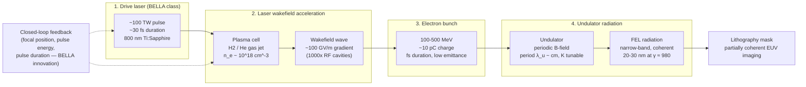

# LPA-FEL Source (Laser-Plasma Accelerator FEL, 20–30 nm)

**Status:** 🔶 Simplified — spectral line, pupil fill, average-power arithmetic, and shot-to-shot dose jitter are live; `electron_energy_mev` is documentary (wavelength is *not* derived from the resonance condition), and the reported coherence does not shape the default pupil (Conventional, for back-compat).

## Overview

Laser-plasma driven free-electron lasers produce narrow-band EUV radiation with
a compact footprint by chaining two accelerator innovations: laser-wakefield
electron acceleration, then undulator-based radiation generation. The BELLA
demonstration (Kohrell et al., *Phys. Rev. Accel. Beams*, April 16 2026)
produced 420 nm radiation at 1 kHz bunch rate, feedback-stabilized for over
eight continuous hours; the funded 500 MeV beam upgrade targets the 20–30 nm
EUV band.

That band sits in a long-standing gap between refractive VUV lithography and
Mo/Si multilayer-mirror EUV at 13.5 nm. At 25 nm, Mo/Si reflectance is still
adequate (though not peak), zone plates and multilayer Schwarzschilds both
remain viable, and many resist chemistries carry over from EUV research.
LPA-FEL is the first compact source that realistically reaches this regime
outside of large synchrotron facilities — which is why `LpaFelSource` exists
as the framework's bridge between `VuvSource` and the 13.5 nm families.

## Generation physics



The on-axis undulator fundamental wavelength is

$$
\lambda_r \;=\; \frac{\lambda_u}{2\gamma^2}\left(1 + \frac{K^2}{2}\right)
$$

where λ_u is the undulator period, γ = (E_kin / m_e c²) + 1 is the electron
Lorentz factor, and K = eB₀λ_u / (2π m_e c) is the dimensionless undulator
strength. For the BELLA target at E_kin = 500 MeV (γ ≈ 979), cm-scale
undulators with moderate K land the fundamental in the 20–30 nm EUV band.
Because wavelength scales as 1/γ², doubling electron energy quarters the
wavelength — which is exactly why the 100 MeV baseline demo runs at ~420 nm
while the 500 MeV upgrade targets ~25 nm.

## Real-machine parameters

| Property | LPA-FEL (target) | F₂ excimer | Comment |
|----------|------------------|------------|---------|
| Wavelength | 20–30 nm | 157.63 nm | ~6× resolution improvement at matched NA |
| Relative bandwidth Δλ/λ | ~10⁻³ (SASE), ~10⁻⁴ (seeded) | ~7×10⁻⁶ | FEL is narrower in *relative* terms |
| Pulse duration | ~10 fs | ~20 ns | ~10⁶× shorter — matters for shot-noise analysis |
| Pulse energy | µJ-class | mJ-class | ~10⁴× lower; throughput via high rep rate |
| Transverse coherence | near-diffraction-limited (≥0.85) | low (multi-mode) | Fewer pupil samples needed in SOCS |
| Rep rate | 1 kHz | 4 kHz | Comparable time scale; very different average power |
| Photon energy | 41–62 eV | 7.9 eV | Different photochemistry regime |
| Stability | feedback-corrected, ~3 % | ~1 % (mature tech) | BELLA demonstrated 8+ hours closed-loop |

Citations: Kohrell et al., *Phys. Rev. Accel. Beams* (2026) for the demonstrated
column values (420 nm / 100 MeV / 1 kHz / 8 h / ~5 % jitter) and the 500 MeV
upgrade projections; general LWFA and FEL physics per Esarey et al. (2009) and
Huang & Kim (2007) — see References.

## Simulation model

`LpaFelSource` in [`crates/highuvlith-core/src/source.rs`](../../crates/highuvlith-core/src/source.rs):

```rust
pub struct LpaFelSource {
    pub wavelength_nm: f64,               // 20-30 nm target regime
    pub bandwidth_pm: f64,                // FWHM; 25 pm preset (Δλ/λ = 1e-3)
    pub electron_energy_mev: f64,         // documentary (see coverage table)
    pub rep_rate_hz: f64,                 // 1000 Hz BELLA architecture
    pub pulse_energy_uj: f64,             // µJ-class FEL pulses
    pub pulse_duration_fs: f64,           // ~10 fs
    pub shot_to_shot_stability: f64,      // relative rms, e.g. 0.03
    pub transverse_coherence_fraction: f64, // 0.85-0.9 typical
    pub spectral_samples: usize,
    pub spectral_shape: SpectralShape,    // Gaussian default (seeded FEL)
    pub illumination: IlluminationShape,  // Conventional default (back-compat)
}
```

Factories: `bella_baseline_100mev()` (420 nm reference fixture — **not** useful
for EUV lithography), `bella_target_25nm(sigma)` (25 nm, 500 MeV, 5 µJ, 3 %
jitter, coherence 0.9), and `new(wavelength_nm, sigma)` for custom wavelengths.

**How it satisfies `LithographySource`.** Spectral weights use the shared
`evaluate_spectral_weights` with a Gaussian default line (appropriate for
seeded FEL output); `intensity_at` uses the shared `evaluate_illumination`.
The pulse/coherence metadata methods are all overridden and flow through the
trait:

- `pulse_energy_j()` × `rep_rate_hz()` → `average_power_w()` — live arithmetic
  (5 µJ × 1 kHz = 5 mW for the target preset).
- `shot_to_shot_rms()` → `StochasticParams::from_source` → Gamma-distributed
  dose jitter in the LER/LWR Monte Carlo — **live**: the 3 % BELLA stability
  number actually widens the simulated linewidth distribution.
- `transverse_coherence()` reports 0.85–0.9, but the **default pupil is still
  `Conventional { sigma }`** for back-compat with existing configs. Unlike the
  newer families (HHG, XFEL, ICS, SSMB, synchrotron undulator), the factory
  does not apply `sigma_from_coherence`; set
  `IlluminationShape::CoherentGaussian { sigma: sigma_from_coherence(0.9, 0.05) }`
  yourself to model the near-diffraction-limited fill.

**Assumptions:** scalar imaging; polychromatic loop shifts focus per spectral
sample with the TCC built at the center wavelength (honest at Δλ/λ = 10⁻³);
no time-domain pulse structure; the fs pulse duration and the electron-beam
parameters do not enter any computation. `electron_energy_mev` is stored
verbatim — the wavelength is a free input, *not* derived from the resonance
formula above. `SynchrotronSource` is the live-physics counterpart that does
derive λ from machine parameters.

## Model coverage

| Field | Unit | Consumed by | Status |
|-------|------|-------------|--------|
| `wavelength_nm` | nm | Hopkins TCC, resist exposure, photon-energy/density derivations | live |
| `bandwidth_pm` | pm FWHM | Polychromatic spectral sampling | live |
| `electron_energy_mev` | MeV | Nothing — documentary; resonance-derived λ planned (see `SynchrotronSource` for the live version) | stored (inert) |
| `rep_rate_hz` | Hz | `average_power_w()` = E_pulse × f_rep | live |
| `pulse_energy_uj` | µJ | `pulse_energy_j()` → `average_power_w()` | live |
| `pulse_duration_fs` | fs | Exposed via `pulse_duration_s()` and the PyO3 `pulse_duration_fs` getter; no time-domain physics consumes it | stored (inert) |
| `shot_to_shot_stability` | fraction | `shot_to_shot_rms()` → `StochasticParams::from_source` → Gamma dose jitter (LER/LWR MC) | live |
| `transverse_coherence_fraction` | 0..1 | Reported via `transverse_coherence()` and PyO3; **not** coupled to the default pupil (Conventional back-compat) | stored (inert) |
| `spectral_samples` | count | Polychromatic sample count | live |
| `spectral_shape` | enum | Lorentzian / Gaussian / tabulated line weighting | live |
| `illumination` | enum | Pupil `intensity_at` (shared with `VuvSource`, incl. `CoherentGaussian`) | live |

## Usage

Python ([factory names from `py_config.rs`](../../crates/highuvlith-py/src/py_config.rs)):

```python
import highuvlith as huv

fel = huv.SourceConfig.lpa_fel_bella_25nm(sigma=0.7)   # 500 MeV target preset
fel_22nm = huv.SourceConfig.lpa_fel(wavelength_nm=22.0, sigma=0.6,
                                    electron_energy_mev=520.0,
                                    bandwidth_pm=10.0,
                                    pulse_duration_fs=8.0,
                                    rep_rate_hz=1000.0)
print(fel.kind, fel.wavelength_nm)                     # lpa_fel 25.0
print(fel.average_power_w, fel.shot_to_shot_rms)       # 0.005 0.03
print(fel.transverse_coherence_fraction)               # 0.9 (reported)
```

TOML ([field names from `highuvlith-cli/src/config.rs`](../../crates/highuvlith-cli/src/config.rs)):

```toml
[source]
type = "lpa_fel"
wavelength_nm = 25.0
sigma = 0.7
bandwidth_pm = 25.0
electron_energy_mev = 500.0   # documentary
pulse_duration_fs = 10.0      # documentary
rep_rate_hz = 1000.0          # -> average power
pulse_energy_uj = 5.0         # -> average power
```

See `examples/sim_lpa_fel.toml` for the full BELLA target config.

## Validation

`#[test]` functions pinning this model:

- `source.rs`: `test_lpa_fel_wavelength_in_target_range` (preset in 20–30 nm),
  `test_lpa_fel_photon_energy_at_25nm` (~49.6 eV),
  `test_lpa_fel_spectral_weights_sum_to_one`,
  `test_lpa_fel_narrow_bandwidth_finite` (seeded-regime 0.01 pm guard),
  `test_lpa_fel_invalid_sigma_rejected`,
  `test_pulse_metadata_live_through_trait` (5 µJ × 1 kHz → 5 mW; 10 fs;
  coherence 0.9; jitter 0.03 — through both the concrete type and `SourceKind`),
  `test_source_kind_toml_roundtrip` (`type = "lpa_fel"` tag survives serde).
- `stochastic.rs`: `test_from_source_pulls_dose_jitter` — the 3 % stability
  figure lands in `StochasticParams::dose_jitter_rms`.
- CLI `config.rs`: `test_lpa_fel_source_type_accepted`,
  `test_toml_lpa_fel_parsing`.

## References

1. Kohrell et al., "kHz laser-plasma accelerator driven free-electron laser
   with 8-hour feedback-stabilized operation," *Physical Review Accelerators
   and Beams* (April 16, 2026). Lay coverage:
   [phys.org article](https://phys.org/news/2026-04-laser-plasma-free-electron-hours.html).
2. E. Esarey, C. B. Schroeder, W. P. Leemans, "Physics of laser-driven
   plasma-based electron accelerators," *Rev. Mod. Phys.* **81**, 1229 (2009).
3. Z. Huang, K.-J. Kim, "Review of x-ray free-electron laser theory,"
   *Phys. Rev. ST Accel. Beams* **10**, 034801 (2007) — undulator resonance
   and FEL bandwidth scalings.
4. Related pages: [index.md](./index.md) (trait contract, coherence→σ
   heuristic), [xfel.md](./xfel.md) (linac-scale FEL counterpart),
   [synchrotron.md](./synchrotron.md) (derived-wavelength undulator model).
