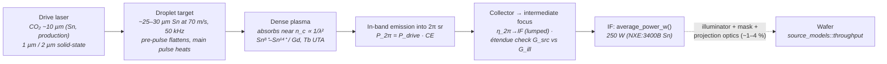

# Laser-Produced Plasma: Sn 13.5 nm EUV and Gd/Tb 6.7/6.5 nm Beyond-EUV

**Status:** ✅ Implemented — the in-band spectrum, pupil fill, and the drive-power → conversion-efficiency → intermediate-focus power chain are computed and tested against the published NXE:3400B source parameters (21.5 kW CO₂, 6 % CE, 50 kHz → 250 W at IF); 🔶 the drive-laser conversion-efficiency defaults (the 2 µm value is a projection), the Sn-calibrated collection efficiency and the étendue check are simplified, the Gd/Tb in-band powers are projections, and plasma dynamics and debris are out of scope.

## Overview

Laser-produced plasma (LPP) is the light source of production EUV lithography. In ASML's description, tin droplets of around 25 µm diameter leave a generator at 70 m/s; each is flattened by a low-intensity pre-pulse and then hit by the main pulse of a CO₂ laser (~10 µm), 50,000 times per second (Versolato's review quotes ~30 µm droplets — the sources differ). The plasma emits unresolved transition arrays (UTAs) of Sn⁸⁺–Sn¹⁴⁺ into the 2 % band around 13.5 nm that Mo/Si multilayer mirrors reflect [1]. ASML quotes a conversion efficiency (CE) from drive power to in-band radiation into 2π sr of more than 5.5 %; the NXE:3400B source ran at 6 % with a 21.5 kW CO₂ drive at 50 kHz, delivering **250 W in-band at the intermediate focus (IF)** — the hand-off point between the source and the scanner's illuminator — about 5 mJ per pulse [2].

Getting there took two decades: source power was "stuck in the watt range for several years", and Cymer passed 10 W only in 2013, with pre-pulse conditioning. The 250 W NXE:3400B source supports ≥125 wafers/hour at 20 mJ/cm² by specification (140 wph was measured at 246 W in 2018, and 250 W-class operation is reported at > 140 wph [3]). Sources have kept climbing: the NXE:3800E ships with a "500W EUV Source" (ASML Investor Day, November 2024 [4]), ~600 W sources are reported shipping (Reuters, February 2026), 740 W has been demonstrated (2024 [4]), and a 1 kW source was demonstrated in April 2025 (ASML Annual Report 2025 [5]); the stated roadmap is 1.5–2 kW. The HVM requirement band for charts is therefore **~250 W → ~1 kW at IF**. Each 13.5 nm photon carries 91.84 eV versus 6.42 eV at 193 nm — 14.3× fewer photons per mJ/cm², which is what makes source power and stochastics so tightly coupled in EUV.

The same architecture extrapolates to "beyond-EUV" (BEUV) at 6.x nm: gadolinium and terbium plasmas emit UTAs near 6.775 nm (Gd) and 6.515 nm (Tb) [6], matched to La/B-based multilayer mirrors that peak at 6.63–6.65 nm, just longward of the boron K absorption edge (188 eV = 6.595 nm). The 6.7 nm Gd preset therefore sits slightly off the mirror peak. The usable band collapses to ~0.6 % for a full mirror column (≈ 40 pm), and the best peer-reviewed CE inside that band is **0.54–0.8 %** (2011–2015 literature, e.g. 0.54 % by Higashiguchi et al. [7] — the often-quoted 1.8 % is the same measurement expressed in a 2 % band). **No watt-level in-band 6.x nm source has been demonstrated**, so the Gd/Tb powers in this model are projections, and BEUV remains a research target rather than a product. (Russia's separate 11.2 nm program uses a Xe plasma source with Ru/Be mirrors; a widely quoted "3.6 kW light source" figure for it is the drive-laser power.)

`LppSource` in [source_models/lpp.rs](../../crates/highuvlith-core/src/source_models/lpp.rs) models both regimes behind one struct, selected by the `LppFuel` discriminator (`Sn`, `Gd`, `Tb`). It also carries the drive-laser technology (`LppDriveLaser`) and the source/collector geometry for an étendue check (`LppGeometry`), and reports everything it derives through `derived_quantities()`.

## Generation physics



The plasma emits broadband UTA radiation; the **multilayer mirror train, not the plasma, defines the usable band**. In-band power at intermediate focus follows the live power chain:

```math
P_\text{2π} = P_\text{drive}\,\mathrm{CE}, \qquad
P_\text{IF} = P_\text{2π}\;\eta_{2\pi\to\text{IF}}\;f_\text{étendue}
```

where $\eta_{2\pi\to\text{IF}}$ (the `transport_efficiency` field) lumps collector solid angle, collector reflectance, and debris / buffer-gas / spectral-purity losses, and $f_\text{étendue}$ is the étendue-limited usable fraction (below). Per-droplet in-band energy at IF is $E_\text{pulse} = P_\text{IF}/f_\text{rep}$. For the NXE:3400B chain: 21.5 kW × 6 % = 1290 W into 2π sr; the presets use $\eta_{2\pi\to\text{IF}} = 250/1290 \approx 0.194$, **calibrated** so this chain lands on the published 250 W at IF (5 mJ per pulse at 50 kHz).

Photon energy sets dose statistics downstream:

```math
E_\gamma = \frac{hc}{\lambda} = 91.84\ \text{eV at } 13.5\ \text{nm}, \qquad 185\ \text{eV at } 6.7\ \text{nm}
```

### Drive laser and critical density

A laser of wavelength $\lambda_L$ cannot propagate beyond the plasma critical density and deposits its energy near it:

```math
n_c = \frac{\varepsilon_0 m_e \omega_L^2}{e^2} = \frac{1.115\times10^{21}}{\lambda_L^2[\mu\text{m}]}\ \text{cm}^{-3}
```

| Drive laser (`LppDriveLaser`) | λ_L | $n_c$ (cm⁻³) | Default Sn CE (2π sr, 2 % band) | Provenance | Sn preset at 21.5 kW → IF |
|---|---|---|---|---|---|
| `Co2` (with pre-pulse) | 10.6 µm | 9.92 × 10¹⁸ | 6 % | reported (NXE:3400B source [2]; ASML quotes > 5.5 %) | 250 W |
| `SolidState1um` (Nd:YAG / Yb class) | 1.064 µm | 9.85 × 10²⁰ | 3 % | reported, laboratory ("few-percent class") | 125 W |
| `Thulium2um` | 2.0 µm | 2.79 × 10²⁰ | 4.5 % | **projection** — laboratory values reported so far are lower | 187.5 W |

The ~100× lower critical density of CO₂ light means the energy is deposited in a lower-density, optically thinner plasma, so less of the Sn UTA is lost to opacity broadening — the standard explanation for why CO₂-driven Sn plasmas reach the highest in-band conversion efficiencies (see the Versolato review [1]). Solid-state drivers (1 µm today, 2 µm as a research direction) trade some CE for the much higher electrical efficiency of solid-state lasers. In the model the drive laser **only** sets the CE default at construction (via `LppSource::sn_with_drive_laser`, at the same 21.5 kW) and the reported critical density; plasma physics itself is not simulated. The CE values are order-of-magnitude defaults — override `conversion_efficiency` with your own data.

### Étendue

Étendue (area × solid angle) is conserved through an optical system, so the illuminator can only accept light from a source whose étendue fits its budget. For a small, isotropic emitting region of diameter $d$ collected over a solid angle $\Omega$:

```math
G_\text{src} = \frac{\pi d^2}{4}\,\Omega, \qquad f_\text{étendue} = \min\!\left(1,\ \frac{G_\text{ill}}{G_\text{src}}\right)
```

The fraction assumes uniform phase-space density. With the assumed NXE-like geometry (`LppGeometry::nxe_like()`: $d$ = 200 µm, $\Omega$ = 5 sr, $G_\text{ill}$ = 3.3 mm²·sr — a commonly quoted EUV-illuminator budget, but scanner-specific: it depends on NA, field size and pupil fill), $G_\text{src} = 0.157$ mm²·sr, a **margin of 21**, so the LPP loses nothing. A DPP-like 1 mm emitter would have $G_\text{src} = 3.93$ mm²·sr and keep only **84 %** of its collected power — étendue is one of the reasons larger discharge-produced plasmas are harder to use.

## Real-machine parameters

**Sn 13.5 nm source power (in-band, at IF unless noted)**

| Source / milestone | Power | Status | Source |
|---|---|---|---|
| Cymer LPP with pre-pulse | passed 10 W (2013) | demonstrated | history accounts; power had been "stuck in the watt range for several years" |
| NXE:3400B source | 250 W; 21.5 kW CO₂, CE 6 %, 50 kHz, ~5 mJ/pulse | production (end-2017) | Fomenkov, 2017 EUV Source Workshop [2] |
| NXE:3400B throughput | ≥125 wph at 20 mJ/cm² (spec, 96 shots); 140 wph measured at 246 W (2018); > 140 wph at 250 W | production | ASML spec; workshop data; Miyazaki & Yen [3] |
| NXE:3800E source | 500 W | production | ASML Investor Day, 14 Nov 2024 [4] |
| Industrial source | ~600 W (plane not stated) | reported shipping | Reuters, 23 Feb 2026 |
| Research source | 740 W | demonstrated (2024) | ASML Investor Day 2024 [4] |
| 1 kW source (~100 kHz, two-burst droplet shaping) | 1000 W | demonstrated (April 2025) | ASML Annual Report 2025, p. 31 [5] |
| Roadmap | 1.5–2 kW | projected | ASML statements (Reuters 2026) |

**BEUV 6.x nm (conversion efficiency in the La/B band)**

| Measurement | CE | Bandwidth | Source |
|---|---|---|---|
| Gd plasma, Higashiguchi et al. (2011) | 0.54 % (= 1.8 % in 2 %) | 0.6 % | APL 99, 191502 [7] |
| Gd plasma, Cummins et al. (2012) | 0.4 % | 0.6 % | as reported in the 2011–2015 literature |
| CO₂-laser-driven Gd plasma (2013) | 0.7 % | 0.6 % | Opt. Express 21, 31837 [8] |
| Yoshida et al. (2014) | 0.8 % (best in the 0.6 % band, per O'Sullivan's 2015 review) | 0.6 % | as reported |
| Otsuka et al. (2010), 1064 nm drive | 1.3 % | not stated | APL 97, 111503 [9] |
| Endo, kW-class BEUV source concept | 1 kW at IF with CE 1.5 %, 160 kW CO₂ | 0.6 % | **projected design** (2012 EUVL workshop) |

| Parameter | Sn 13.5 nm (production) | Gd 6.7 nm (model preset) | Tb 6.5 nm (model preset) |
|---|---|---|---|
| Drive laser | 21.5 kW CO₂ (NXE:3400B) | 10 kW solid-state, 1 µm (assumed) | 10 kW solid-state, 1 µm (assumed) |
| Conversion efficiency (in-band, 2π sr) | 6 % | 0.7 % | 0.6 % |
| Mirror band (FWHM) | 2 % ≈ 270 pm (Mo/Si) | ~0.6 % ≈ 40 pm (La/B) | ~39 pm (La/B) |
| In-band power at IF | 250 W | 13.6 W — **projection** | 11.6 W — **projection** |
| Repetition rate | 50 kHz | 10 kHz (assumed) | 10 kHz (assumed) |
| Photon energy | 91.8 eV | 185 eV | 191 eV |

## Simulation model

`LppSource` (in [lpp.rs](../../crates/highuvlith-core/src/source_models/lpp.rs)) implements `LithographySource`:

- **Wavelength / bandwidth** — `wavelength_nm()` returns the in-band center (13.5 / 6.7 / 6.5 nm per fuel preset); `bandwidth_pm()` is the *mirror-selected* FWHM (270 / 40 / 39 pm). The plasma UTA structure is not modeled; the in-band spectrum is a Gaussian within the mirror band.
- **Spectral model** — `spectral_weights()` samples the Gaussian line at `spectral_samples` (default 5) points via the shared `evaluate_spectral_weights` helper; weights sum to 1. The narrow-band path (`compute_polychromatic`) shifts focus per sample with the kernels built at the center wavelength — an approximation for these 0.6–2 % bands; `compute_multiwavelength` (CLI `[imaging] spectrum = "per_wavelength"`) rebuilds the kernels at every sample.
- **Pupil model** — plasma emission is spatially incoherent: `transverse_coherence()` keeps the trait default 0.0, and the default pupil is `Conventional { sigma: 0.9 }` (large disk fill). Constructors reject σ outside (0, 1] via `validate_sigma`.
- **Power chain (live)** — `in_band_emission_w() = drive_laser_power_w × conversion_efficiency` (2π sr); `in_band_power_w() = in_band_emission_w() × transport_efficiency × etendue_limited_fraction()` is the in-band power **at IF**; `average_power_w()` reports it and `pulse_energy_j()` divides by `rep_rate_hz`. For the Sn preset: 21.5 kW × 6 % = 1290 W into 2π sr, × 250/1290 → **250 W at IF**, 5 mJ per droplet, 1.70 × 10¹⁹ photons/s.
- **Drive laser** — `drive_laser: Option<LppDriveLaser>`. `sn_with_drive_laser(sigma, laser)` builds the Sn preset at the same 21.5 kW with the laser's CE default (CO₂ → 250 W, 2 µm projection → 187.5 W, 1 µm → 125 W at IF). `None` (configs written before the field existed) omits the laser-specific derived quantities.
- **Étendue** — `geometry: Option<LppGeometry>`; with a geometry the étendue-limited fraction multiplies the IF power. `None` applies no étendue limit.
- **Presets** — `LppSource::sn_13nm5(sigma)` (= `sn_with_drive_laser(sigma, Co2)`), `sn_13nm5_500w(sigma)`, `gd_6nm7(sigma)`, `tb_6nm5(sigma)`; all carry `LppGeometry::nxe_like()`, the Gd/Tb presets a 1 µm solid-state drive laser. The Gd/Tb presets use the Sn-calibrated collection efficiency, which is optimistic (La/B collectors reflect less than Mo/Si), and their `in_band_power_at_if` derived quantity is labelled **PROJECTION**. `sn_13nm5_500w` is the NXE:3800E class: **500 W at IF** is the source power ASML states for that scanner [4]; nothing else about its drive chain is sourced here, so the preset reaches 500 W by an **assumed** doubling of the NXE:3400B drive (43 kW CO₂ at the same 6 % CE, collection and 50 kHz → 10 mJ per droplet at IF).

### Behaviour change: power is quoted at intermediate focus (NXE:3400B chain)

The first versions of this model documented `transport_efficiency` as a "collector-to-wafer" factor (preset 0.05) and reported **68.75 W "at the wafer"** (25 kW × 5.5 % × 0.05) for the Sn preset — which contradicted the ~250 W *at IF* the same page quoted and would double-count optics losses in any throughput estimate. `average_power_w()` now follows the convention of every other source family and of the industry: **usable power delivered into the illuminator, i.e. in-band at IF**. The redefinition happened in two steps:

1. `transport_efficiency` became "in-band emission (2π sr) → IF", with a lumped 0.18 (25 kW × 5.5 % × 0.18 = 247.5 W);
2. the Sn preset now uses the published NXE:3400B chain instead of rounded numbers: **21.5 kW, 6 % CE, η = 250/1290 ≈ 0.194 → 250 W at IF**.

Consequences:

- Gd/Tb presets report **13.6 W / 11.6 W at IF** (they were 3.5 / 3.0 W "at the wafer" originally, 12.6 / 10.8 W after step 1) — projections, as above.
- A TOML that sets only `transport_efficiency = 0.05` on the Sn preset now gives 21.5 kW × 6 % × 0.05 = **64.5 W** (at IF); a fully serialized legacy source that also stores 25 kW and 5.5 % still gives 68.75 W (pinned by the CLI test `test_legacy_family_tomls_unchanged_by_new_fields` and by `test_legacy_toml_without_new_fields_parses`).

### From IF to the wafer: the throughput model

Wafer-side losses belong to the dose-limited throughput model in [`source_models::throughput`](../../crates/highuvlith-core/src/source_models/throughput.rs) (🔶 simplified: one optics transmission factor, dose-limited scan speed, two lumped overheads; the scanner numbers are illustrative assumptions, not vendor data). An NXE scanner has six projection mirrors, at least two condenser/illuminator mirrors and a reflective mask; at ~70 % per reflection only a few percent — roughly **1–4 %** — of the IF power reaches the wafer (a dozen reflections at 70 % leaves ≈ 1.4 %; 0.7¹⁰ ≈ 2.8 %). The EUV-like defaults (`ThroughputParams::euv_hvm_like`: 10 Mo/Si mirrors at R = 0.70 and a mask at 0.65 → 1.84 %, 300 mm wafer, 26 × 33 mm fields, 2 mm slit, 0.1 s per-field and 10 s per-wafer overheads, no stage-speed cap) give, for the 250 W Sn preset:

| Quantity | 20 mJ/cm² | 30 mJ/cm² |
|---|---|---|
| Power at the wafer | 250 W × 0.70¹⁰ × 0.65 = **4.59 W** | 4.59 W |
| Fields per wafer | 84 (field centres on a 300 mm wafer) | 84 |
| Dose-limited scan speed | 883 mm/s | 588 mm/s |
| Time per wafer | 3.3 s scanning + 8.4 s field + 10 s wafer overhead = 21.7 s | 5.0 + 8.4 + 10 = 23.4 s |
| Throughput | **≈ 166 wph** | **≈ 154 wph** |
| Pulses per exposure point | 50 kHz × 2 mm / 883 mm/s ≈ 113 | ≈ 170 |
| Photons per (16 nm)² | 3480 → 1.7 % Poisson noise | 5219 → 1.4 % |

For comparison, the NXE:3400B specification is ≥125 wph and the NXE:3400C ≥170 wph at 20 mJ/cm². The NXE:3400B specification counts 96 exposure fields (shots); with `fields_per_wafer=96` the model gives ≈ 154 wph at 20 mJ/cm². The default overheads are illustrative and cap the model near 196 wph however much power is supplied (3600 s / (84 × 0.1 s + 10 s)), whereas the NXE:3800E reaches ≥220 wph at 30 mJ/cm² with its 500 W source — faster stages, not modeled here.

For BEUV, `ThroughputParams::beuv_la_b_like` keeps the geometry but uses the record La/B multilayer reflectance (64.1 % at 6.65 nm) for all ten mirrors and the mask: 0.641¹¹ ≈ **0.75 %** of the IF power reaches the wafer (vs ≈ 1.8–2 % at 13.5 nm), and the column bandwidth shrinks from ~2 % to ~0.6 %. The 13.6 W Gd projection through that column delivers 0.10 W to the wafer, ≈ 15 wph at 30 mJ/cm² (≈ 1530 pulses per point at 10 kHz).

The same model ranks every family (`SourceConfig.wafer_throughput(...)` in Python). The pulses-per-point figure is what `StochasticParams::from_source_multi_pulse` expects for multi-pulse dose averaging; for LPP it has no effect today because pulse-to-pulse energy jitter is not modeled (`shot_to_shot_rms()` = 0).

## Derived quantities

`LppSource::derived_quantities()` (Python: `SourceConfig.derived_quantities()` / `derived_quantity(name)`; also printed by `highuvlith simulate`). Values for the presets:

| Name | Unit | Meaning | Sn (CO₂) | Sn (2 µm, projected CE) | Gd 6.7 nm | Tb 6.5 nm |
|---|---|---|---|---|---|---|
| `photon_energy` | eV | hc/λ | 91.84 | 91.84 | 185.05 | 190.75 |
| `in_band_emission_2pi` | W | P_drive × CE | 1290 | 967.5 | 70 | 60 |
| `drive_laser_wavelength` | µm | drive laser | 10.6 | 2.0 | 1.064 | 1.064 |
| `critical_density` | cm⁻³ | ε₀mₑω²/e² | 9.92e18 | 2.79e20 | 9.85e20 | 9.85e20 |
| `conversion_efficiency_default` | – | Sn CE default for the laser (+ provenance) | 0.06 (reported) | 0.045 (projection) | — | — |
| `source_etendue` | mm²·sr | πd²/4 · Ω | 0.157 | 0.157 | 0.157 | 0.157 |
| `etendue_margin` | – | G_ill / G_src | 21.0 | 21.0 | 21.0 | 21.0 |
| `etendue_limited_fraction` | – | min(1, G_ill/G_src) | 1 | 1 | 1 | 1 |
| `in_band_power_at_if` | W | = `average_power_w()` (Gd/Tb labelled PROJECTION) | 250 | 187.5 | 13.57 | 11.63 |
| `pulse_energy_at_if` | J | per droplet | 5.0e-3 | 3.75e-3 | 1.36e-3 | 1.16e-3 |
| `photon_rate_at_if` | photons/s | in-band at IF | 1.70e19 | 1.27e19 | 4.58e17 | 3.80e17 |
| `drive_watts_per_if_watt` | – | P_drive / P_IF | 86 | 115 | 737 | 860 |
| `hvm_power_ratio` | – | P_IF / 250 W | 1.00 | 0.75 | 0.054 | 0.047 |

(The 1 µm-driven Sn variant: CE 3 %, 645 W into 2π sr, 125 W at IF, ratio 0.50.)

## Model coverage

| Field | Unit | Consumed by | Status |
|---|---|---|---|
| `fuel` | enum (`Sn`/`Gd`/`Tb`) | preset selection at construction; gates the Sn CE-default report and the Gd/Tb projection label | stored (construction-time) |
| `wavelength_nm` | nm | TCC/aerial imaging, photon energy, photon density | live |
| `bandwidth_pm` | pm | `spectral_weights()` → polychromatic focus shifts | live |
| `drive_laser_power_w` | W | `in_band_emission_w()` → `in_band_power_w()` → `average_power_w()` | live |
| `conversion_efficiency` | — | `in_band_emission_w()` | live |
| `transport_efficiency` | — | in-band 2π sr → IF in `in_band_power_w()` (meaning changed, see above) | live |
| `rep_rate_hz` | Hz | `pulse_energy_j()`; pulses per exposure point in the throughput model | live |
| `spectral_samples` | count | spectral sampling density | live |
| `spectral_shape` | enum | line shape in `spectral_weights()` | live |
| `illumination` | enum | `intensity_at()` pupil fill | live |
| `drive_laser` | `Option<LppDriveLaser>` | Sn CE default at construction; drive wavelength and critical density in `derived_quantities()` | live (construction-time + derived quantities) |
| `geometry` | `Option<LppGeometry>` | étendue-limited fraction → `in_band_power_w()`; étendue derived quantities | live |
| pulse-to-pulse energy jitter | — | trait default `shot_to_shot_rms()` = 0 | not modeled |
| plasma hydrodynamics, UTA opacity, debris, collector degradation | — | — | not modeled (out of scope) |

## Usage

Python (factories from [py_config.rs](../../crates/highuvlith-py/src/py_config.rs)):

<!-- verify-example -->
```python
import highuvlith as huv

src = huv.SourceConfig.lpp_sn_13nm5(sigma=0.9)               # NXE:3400B chain, CO2 drive
print(src.average_power_w)                                    # 250.0 — in-band W at IF
print(src.derived_quantity("etendue_margin"))                 # 21.0
tm = huv.SourceConfig.lpp_sn_13nm5(drive_laser="thulium_2um") # projected 4.5 % CE
print(tm.average_power_w)                                     # 187.5
e = huv.SourceConfig.lpp_sn_13nm5_500w()                      # NXE:3800E class: 500 W at IF
gd = huv.SourceConfig.lpp_gd_6nm7()                           # 13.6 W at IF (projection)
tb = huv.SourceConfig.lpp_tb_6nm5()                           # 11.6 W at IF (projection)

r = src.wafer_throughput(dose_mj_cm2=30.0, cd_nm=16.0)        # simplified scanner model
print(r["power_at_wafer_w"], r["wafers_per_hour"], r["pulses_per_point"])  # 4.59, ~154, ~170

# BEUV through record La/B mirrors (0.641 per reflection, 11 reflections):
rg = gd.wafer_throughput(dose_mj_cm2=30.0, optics_transmission=0.641**10, mask_efficiency=0.641)
print(rg["wafers_per_hour"])                                  # ~15

optics = huv.OpticsConfig.euv_nxe()                          # NA 0.33 EUV projection pupil
mask = huv.MaskConfig.line_space(cd_nm=27.0, pitch_nm=81.0)
grid = mask.commensurate_grid(size=128, target_pixel_nm=2.0)  # whole periods in the field
engine = huv.SimulationEngine(src, optics, mask, grid=grid)
aerial = engine.compute_aerial_image(focus_nm=0.0)
```

??? success "Output"

    ```text
    250.00000000000003
    21.008452488130185
    187.5
    4.590222796249997 153.87353586508289 169.926392382789
    14.778737737794975
    ```

TOML (field names from [config.rs](../../crates/highuvlith-cli/src/config.rs); every field is optional and defaults to the fuel preset):

```toml
[source]
type = "lpp"
fuel = "sn"                        # "sn" | "gd" | "tb"
# preset = "nxe3800e"              # Sn only: 500 W at IF (default "nxe3400b", 250 W)
sigma = 0.9
drive_laser = "co2"                # "co2" | "solid_state_1um" ("1um") | "thulium_2um" ("2um")
drive_laser_power_w = 21500.0
conversion_efficiency = 0.06       # overrides the drive-laser default
transport_efficiency = 0.194       # in-band emission (2π sr) → intermediate focus
rep_rate_hz = 50000.0
source_diameter_um = 200.0         # étendue check (any of these three enables it)
collection_solid_angle_sr = 5.0
illuminator_etendue_mm2_sr = 3.3
# wavelength_nm / bandwidth_pm override the preset band if set
```

`highuvlith simulate --config examples/sim_lpp_sn.toml` prints the derived quantities above in a "Derived source physics" block (and includes them in the JSON output).

## Validation

Rust unit tests in [lpp.rs](../../crates/highuvlith-core/src/source_models/lpp.rs):

- `test_sn_preset_band_and_energy` — 13.5 nm ⇒ 91.84 eV; bandwidth is exactly the 2 % band.
- `test_power_chain_is_live` — 21.5 kW × 6 % = 1290 W into 2π sr; η = 250/1290; 250 W at IF; 5 mJ per droplet; photon rate 250 W / 91.84 eV; `hvm_power_ratio` = 1; the NXE:3800E-class preset gives 500 W, 10 mJ per droplet, ratio 2.
- `test_etendue_check` — G_src = 0.1571 mm²·sr, margin 21.008; a 1 mm source keeps 0.8403 of its power; no geometry ⇒ no limit.
- `test_drive_laser_options` — CE ordering sets the IF-power ordering; critical densities for CO₂ and 1.064 µm.
- `test_beuv_presets_in_band` — Gd at 6.7 nm (184–186 eV, 70 W × 250/1290 = 13.57 W at IF, note labelled PROJECTION), Tb at 6.5 nm (11.63 W).
- `test_spectral_weights_sum_to_one`, `test_incoherent_plasma`, `test_invalid_sigma_rejected`.
- `test_legacy_toml_without_new_fields_parses` — a source serialized before `drive_laser` / `geometry` existed still parses (68.75 W with its legacy 25 kW / 5.5 % / 0.05 values).

Shared physics and throughput: `physics.rs::test_plasma_critical_density_fixture` (1.1149 × 10²¹ cm⁻³ at 1 µm, 9.922 × 10¹⁸ at 10.6 µm, 1/λ² scaling); `throughput.rs::test_field_count_300mm`, `test_euv_hvm_like_fixture`, `test_beuv_column_transmission` (0.641¹¹ = 0.75 %; the EUV column inside 1–4 %; ~166 wph at 250 W and 20 mJ/cm²), `test_throughput_scaling_limits`, `test_photons_per_square_fixture`, `test_throughput_through_trait`.

CLI ([config.rs](../../crates/highuvlith-cli/src/config.rs)): `test_lpp_nxe3800e_preset`, `test_lpp_drive_laser_and_etendue_fields`, `test_legacy_family_tomls_unchanged_by_new_fields` (64.5 W for a legacy 0.05 factor on the NXE:3400B preset), `test_family_example_tomls_validate`.

Python: `tests/python/test_sources.py::TestLppSource`, `tests/python/test_sources_physics.py::TestLpp` (`test_power_at_intermediate_focus`, `test_drive_laser_options`, `test_tb_preset`) and `TestThroughput`, plus the end-to-end imaging smoke test at NA 0.33.

## References

1. O. O. Versolato, "Physics of laser-driven tin plasma sources of EUV radiation for nanolithography," *Plasma Sources Sci. Technol.* **28**, 083001 (2019), doi:10.1088/1361-6595/ab3302.
2. I. Fomenkov, NXE:3400B source parameters (250 W at IF, 50 kHz, 21.5 kW CO₂, CE 6 %), 2017 Source Workshop, https://www.euvlitho.com/2017/S1.pdf; see also I. Fomenkov et al., "Light sources for high-volume manufacturing EUV lithography," *Adv. Opt. Technol.* **6**, 173 (2017), doi:10.1515/aot-2017-0029.
3. Miyazaki & Yen (2019), doi:10.2494/photopolymer.32.195 — 250 W-class sources at >140 wph, 20 mJ/cm².
4. ASML Investor Day, 14 November 2024 (SEC exhibit 99.4): NXE:3800E "500W EUV Source"; 740 W demonstrated.
5. ASML Annual Report 2025, p. 31 — 1 kW EUV source demonstrated (April 2025).
6. Gd/Tb emission optima (6.775 nm / 6.515 nm), doi:10.1063/1.3506520.
7. T. Higashiguchi et al., *Appl. Phys. Lett.* **99**, 191502 (2011), doi:10.1063/1.3660275 — 0.54 % CE in the 0.6 % band (1.8 % in 2 %).
8. CO₂-laser-driven Gd plasma, 0.7 % CE in the 0.6 % band, *Opt. Express* **21**, 31837 (2013).
9. T. Otsuka et al., "Rare-earth plasma extreme ultraviolet sources at 6.5–6.7 nm," *Appl. Phys. Lett.* **97**, 111503 (2010) — 1.3 % CE with a 1064 nm drive, bandwidth not stated.
10. Capability ledger: [../capability-matrix.md](../capability-matrix.md). Related sources: [inverse Compton](./inverse-compton.md), [SSMB](./ssmb.md), [XFEL](./xfel.md) (the ERL-FEL design point is the kW-class alternative).
