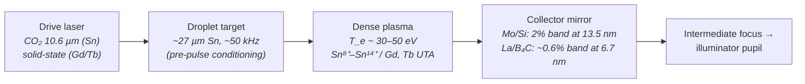

# Laser-Produced Plasma: Sn 13.5 nm EUV and Gd/Tb 6.7/6.5 nm Beyond-EUV

**Status:** ✅ Implemented — in-band spectrum, pupil fill, and the drive-power → conversion-efficiency → transport power chain are computed and tested against the NXE-class parameter set; plasma dynamics, debris, and étendue are explicitly out of scope.

## Overview

Laser-produced plasma (LPP) is the light source of production EUV lithography. Every ASML NXE/EXE scanner exposes wafers with 13.5 nm radiation from a tin plasma: a multi-ten-kilowatt CO₂ laser vaporizes ~27 µm Sn droplets at ~50 kHz, and the resulting plasma emits an unresolved transition array (UTA) of Sn⁸⁺–Sn¹⁴⁺ line radiation centered on 13.5 nm — the 2% band that Mo/Si multilayer mirrors reflect. State-of-the-art conversion efficiency (CE) from drive power to in-band 2π sr radiation is ~5.5%, giving ~250 W of in-band power at intermediate focus.

The same architecture extrapolates to "beyond-EUV" (BEUV) at 6.x nm: gadolinium and terbium plasmas emit UTAs at 6.7 and 6.5 nm respectively, matched to La/B₄C multilayer mirrors whose reflectance band sits just longward of the boron K absorption edge (188 eV ≈ 6.6 nm). The boron edge is what makes 6.x nm special — below the edge boron turns transparent enough to build a workable multilayer, but the usable band collapses to ~0.6% (≈40 pm) and demonstrated CE is roughly an order of magnitude lower (~0.5–0.8%), which is why BEUV remains a research target rather than a product.

`LppSource` in [source_models/lpp.rs](../../crates/highuvlith-core/src/source_models/lpp.rs) models both regimes behind one struct, selected by the `LppFuel` discriminator (`Sn`, `Gd`, `Tb`).

## Generation physics



The plasma emits broadband UTA radiation; the **multilayer mirror train, not the plasma, defines the usable band**. In-band power delivered to the wafer plane follows the live power chain:

$$
P_\text{wafer} = P_\text{drive} \times \mathrm{CE} \times \eta_\text{transport}
$$

Per-droplet in-band pulse energy at repetition rate $f$:

$$
E_\text{pulse} = \frac{P_\text{wafer}}{f}
$$

Photon energy sets dose statistics downstream:

$$
E_\gamma = \frac{hc}{\lambda} = 91.84\ \text{eV at } 13.5\ \text{nm}, \qquad 185\ \text{eV at } 6.7\ \text{nm}
$$

The boron K-edge fixes the BEUV band: La/B₄C reflectance peaks at $\lambda \gtrsim 6.6$ nm (just above the B K-edge at 188 eV) with FWHM $\Delta\lambda/\lambda \approx 0.6\%$, versus $2\%$ for Mo/Si at 13.5 nm.

## Real-machine parameters

| Parameter | Sn 13.5 nm (production) | Gd 6.7 nm (lab) | Tb 6.5 nm (lab) |
|---|---|---|---|
| Drive laser | ~25 kW CO₂ (10.6 µm), pre-pulse + main pulse | ~10 kW-class solid-state | ~10 kW-class solid-state |
| Conversion efficiency (in-band, 2π sr) | ~5.5% [1,2] | ~0.5–0.8% [3] | ~0.6% [3,4] |
| Mirror band (FWHM) | 2% ≈ 270 pm (Mo/Si) | ~0.6% ≈ 40 pm (La/B₄C) | ~39 pm (La/B₄C) |
| In-band power | ~250 W at IF (NXE-class) [2] | mW–W scale demonstrated | mW–W scale demonstrated |
| Repetition rate | ~50 kHz droplets | ~10 kHz (model preset) | ~10 kHz (model preset) |
| Photon energy | 91.8 eV | 185 eV | 191 eV |

Citations: [1] Versolato, *Plasma Sources Sci. Technol.* **28**, 083001 (2019). [2] Fomenkov et al., *Adv. Opt. Technol.* **6**, 173 (2017). [3] Otsuka et al., *Appl. Phys. Lett.* **97**, 111503 (2010). [4] Churilov et al., data on Gd/Tb UTA spectra near 6.7 nm.

## Simulation model

`LppSource` (in [lpp.rs](../../crates/highuvlith-core/src/source_models/lpp.rs)) implements `LithographySource`:

- **Wavelength / bandwidth** — `wavelength_nm()` returns the in-band center (13.5 / 6.7 / 6.5 nm per fuel preset); `bandwidth_pm()` is the *mirror-selected* FWHM (270 / 40 / 39 pm). The plasma UTA structure is not modeled; the in-band spectrum is a Gaussian within the mirror band.
- **Spectral model** — `spectral_weights()` samples the Gaussian line at `spectral_samples` (default 5) points via the shared `evaluate_spectral_weights` helper; weights sum to 1. Polychromatic imaging shifts focus per sample with the TCC built at the center wavelength — honest for these narrow (0.6–2%) bands.
- **Pupil model** — plasma emission is spatially incoherent: `transverse_coherence()` keeps the trait default 0.0, and the default pupil is `Conventional { sigma: 0.9 }` (large disk fill). Constructors reject σ outside (0, 1] via `validate_sigma`.
- **Power chain (live)** — `in_band_power_w() = drive_laser_power_w × conversion_efficiency × transport_efficiency`; `average_power_w()` reports it and `pulse_energy_j()` divides by `rep_rate_hz`. For the Sn preset: 25 kW × 0.055 × 0.05 = 68.75 W at the wafer plane, 1.375 mJ per droplet.
- **Presets** — `LppSource::sn_13nm5(sigma)`, `gd_6nm7(sigma)`, `tb_6nm5(sigma)`.

Assumptions and exclusions (stated, not hidden): no plasma hydrodynamics or UTA spectral structure (Gaussian proxy inside the mirror band); no debris mitigation, collector degradation, or étendue matching; aerial imaging downstream is scalar diffraction (see [capability matrix](../capability-matrix.md)); at 6.x nm on fine grids the `MAX_PUPIL_SAMPLES` guard in `aerial.rs` rejects pupil samplings that would be too dense rather than silently degrading.

## Model coverage

| Field | Unit | Consumed by | Status |
|---|---|---|---|
| `fuel` | enum (`Sn`/`Gd`/`Tb`) | preset selection at construction only | stored (inert) |
| `wavelength_nm` | nm | TCC/aerial imaging, photon energy, photon density | live |
| `bandwidth_pm` | pm | `spectral_weights()` → polychromatic focus shifts | live |
| `drive_laser_power_w` | W | `in_band_power_w()` → `average_power_w()` | live |
| `conversion_efficiency` | — | `in_band_power_w()` | live |
| `transport_efficiency` | — | `in_band_power_w()` | live |
| `rep_rate_hz` | Hz | `pulse_energy_j()` arithmetic | live |
| `spectral_samples` | count | spectral sampling density | live |
| `spectral_shape` | enum | line shape in `spectral_weights()` | live |
| `illumination` | enum | `intensity_at()` pupil fill | live |

## Usage

Python (factories from [py_config.rs](../../crates/highuvlith-py/src/py_config.rs); Tb is reachable via TOML/Rust):

```python
import highuvlith as huv

src = huv.SourceConfig.lpp_sn_13nm5(sigma=0.9)   # or .lpp_gd_6nm7()
optics = huv.OpticsConfig(numerical_aperture=0.33)  # reflective NA regime
mask = huv.MaskConfig.line_space(cd_nm=27.0, pitch_nm=81.0)
grid = huv.GridConfig(size=128, pixel_nm=2.0)

engine = huv.SimulationEngine(src, optics, mask, grid=grid)
aerial = engine.compute_aerial_image(focus_nm=0.0)
print(src.wavelength_nm, src.average_power_w)  # 13.5, 68.75
```

TOML (field names from [config.rs](../../crates/highuvlith-cli/src/config.rs); every field is optional and defaults to the fuel preset):

```toml
[source]
type = "lpp"
fuel = "sn"                    # "sn" | "gd" | "tb"
sigma = 0.9
drive_laser_power_w = 25000.0
conversion_efficiency = 0.055
transport_efficiency = 0.05
rep_rate_hz = 50000.0
# wavelength_nm / bandwidth_pm override the preset band if set
```

## Validation

Rust unit tests in [lpp.rs](../../crates/highuvlith-core/src/source_models/lpp.rs) pin the physics:

- `test_sn_preset_band_and_energy` — 13.5 nm ⇒ 91.84 eV; bandwidth is exactly the 2% band.
- `test_power_chain_is_live` — 25 kW × 0.055 × 0.05 = 68.75 W; per-droplet energy 1.375 mJ.
- `test_beuv_presets_in_band` — Gd at 6.7 nm (184–186 eV), Tb at 6.5 nm.
- `test_spectral_weights_sum_to_one` — normalization for Sn and Gd presets.
- `test_incoherent_plasma` — `transverse_coherence() == 0.0`.
- `test_invalid_sigma_rejected` — σ = 0 and σ = 1.5 rejected.

Python integration coverage lives in `tests/python/test_sources.py` (`TestLppSource`, plus the end-to-end imaging smoke test at NA 0.33).

## References

1. O. O. Versolato, "Physics of laser-driven tin plasma sources of EUV radiation for nanolithography," *Plasma Sources Sci. Technol.* **28**, 083001 (2019).
2. I. Fomenkov et al., "Light sources for high-volume manufacturing EUV lithography," *Adv. Opt. Technol.* **6**, 173 (2017).
3. T. Otsuka et al., "Rare-earth plasma extreme ultraviolet sources at 6.5–6.7 nm," *Appl. Phys. Lett.* **97**, 111503 (2010).
4. Capability ledger: [../capability-matrix.md](../capability-matrix.md). Related sources: [inverse Compton](./inverse-compton.md), [SSMB](./ssmb.md).
