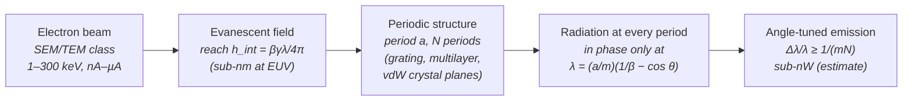

# Smith–Purcell Free-Electron Grating Radiation

**Status:** 🧪 Theoretical — Smith–Purcell emission has been demonstrated only down to ~230 nm, so the EUV preset is purely theoretical; the dispersion relation, tuning range, evanescent interaction height and line-width terms are exact kinematics (fixture-tested), but the emitted power is an explicitly labelled order-of-magnitude estimate with an assumed (optimistic) coupling efficiency — sub-nW, i.e. ≥ 10¹¹ below the 250 W HVM class.

## Overview

An electron moving past — or through — a periodic structure radiates at every period; the contributions add in phase only at the **Smith–Purcell wavelength**, which depends on the electron velocity, the period and the observation angle (Smith & Purcell, 1953). One device is therefore tunable by angle, beam energy or period, with no resonator and no population inversion. Pushing this "free-electron grating" into the EUV and soft-X-ray range with the modest (keV to 100-keV) beams of electron microscopes requires nanometre and sub-nanometre periods.

Measured anchors set the scale (hedged citations, author + year):

- **Smith–Purcell emission** has been demonstrated experimentally only down to **~230 nm** (Ye et al., 2019). No EUV Smith–Purcell emission has been measured: the 13.5 nm preset here is **purely theoretical**.
- At X-ray energies, free-electron emission from the atomic planes of **van-der-Waals crystals** has been reported at **~80 photons/s per nA** of beam current (Huang et al., 2023) — about 1.3×10⁻⁸ photons per electron.

The obstacle for lithography is power. The electron's field at the emitted frequency reaches only a fraction of a nanometre from its path at EUV wavelengths, beam currents of electron-microscope sources are nA–µA, and even an ideal, order-unity coupling yields only of order the fine-structure constant α photons per electron per period. `SmithPurcellSource` in [source_models/smith_purcell.rs](../../crates/highuvlith-core/src/source_models/smith_purcell.rs) makes the kinematics exact and the power gap explicit, and sets its estimate against the measured anchors.

## Generation physics



Smith–Purcell condition for diffraction order $m$ and observation angle $\theta$ from the electron direction ($\gamma = 1 + T/m_ec^2$, $\beta = \sqrt{1-\gamma^{-2}}$):

```math
\lambda = \frac{a}{m}\left(\frac{1}{\beta} - \cos\theta\right)
```

so the angular tuning range runs from $\tfrac{a}{m}(1/\beta - 1)$ (forward) to $\tfrac{a}{m}(1/\beta + 1)$ (backward), with slope $d\lambda/d\theta = \tfrac{a}{m}\sin\theta$. As $\beta \to 1$ at $\theta = 90°$, $\lambda \to a/m$.

**Evanescent coupling.** The electron's field component at frequency $\omega$ decays transversely as $\exp[-\omega x/(\beta\gamma c)]$, so the intensity radiated from a structure at impact height $h$ scales as $\exp(-h/h_\text{int})$ with

```math
h_\text{int} = \frac{\beta\gamma\lambda}{4\pi}
```

— 0.37 nm for 13.5 nm from 30 keV electrons. EUV Smith–Purcell emission from a beam passing *above* a grating is therefore exponentially suppressed (h = 5 nm costs a factor ~10⁻⁶); practical short-wavelength schemes traverse the structure instead.

**Line width** (quadrature of the finite number of periods, the collection angle $\Delta\theta$, and the electron energy spread):

```math
\frac{\Delta\lambda}{\lambda} = \sqrt{\left(\frac{1}{mN}\right)^2 + \left(\frac{\sin\theta\,\Delta\theta}{1/\beta - \cos\theta}\right)^2 + \left(\frac{1}{\beta^2\gamma^2}\,\frac{\gamma-1}{\gamma}\,\frac{\Delta T}{T}\,\frac{1/\beta}{1/\beta - \cos\theta}\right)^2}
```

**Power — an order-of-magnitude estimate, not a grating-efficiency calculation.** Photons per electron

```math
Y = \alpha\,\varepsilon\,N\,e^{-h/h_\text{int}}, \qquad P = \frac{I}{e}\,Y\,\frac{hc}{\lambda}
```

The scale of α photons per electron per period is what an order-unity coupling gives (the same α-scale yield per period as an undulator with K ~ 1, or per transition-radiation interface); $\varepsilon \le 1$ lumps the grating form factor, material absorption and beam overlap. The default $\varepsilon = 10^{-3}$ is an **optimistic assumption**: it gives ~4.6×10⁶ photons/s per nA, about 5×10⁴ times the measured van-der-Waals X-ray yield, and realistic EUV couplings are unknown. $\varepsilon = 1, h = 0$ is reported as the ideal-coupling value *of this estimate* (a heuristic scale, not a rigorous limit).

## Real-machine parameters

| Quantity | Typical range | Provenance |
|---|---|---|
| Electron energy | 1–30 keV (SEM), 60–300 keV (TEM) | instrument classes |
| Beam current | nA to µA | order of magnitude |
| Structure period | ≳ tens of nm (nanofabricated gratings); ~0.3 nm (crystal planes, e.g. graphite interlayer spacing 0.335 nm) | order of magnitude |
| Shortest demonstrated Smith–Purcell wavelength | ~230 nm | Ye et al. (2019) |
| vdW-crystal free-electron X-ray yield | ~80 photons/s per nA | Huang et al. (2023) |

Model preset `euv_13nm5` and a vdW-scale example (derived by the code; every power number is the order-of-magnitude estimate with the assumed ε = 10⁻³):

| Case | T | a | m, θ | λ | h_int | Δλ/λ | Photons/e⁻ | P at 10 nA | Ideal coupling (ε = 1) | Gap to 250 W |
|---|---|---|---|---|---|---|---|---|---|---|
| `euv_13nm5` | 30 keV (β = 0.328) | 4.433 nm (derived) | 1, 90° | 13.5 nm | 0.373 nm | 1.05 % | 7.3×10⁻⁴ | 0.67 nW | 0.67 µW | ×3.7×10¹¹ |
| `new(30, 0.335, 1, 90)` | 30 keV | 0.335 nm | 1, 90° | 1.020 nm (1.2 keV) | 0.028 nm | 1.05 % | 7.3×10⁻⁴ | 8.9 nW | 8.9 µW | ×2.8×10¹⁰ |

For comparison, the measured vdW anchor (~80 photons/s per nA) at the second row's photon energy and 10 nA corresponds to ≈0.16 pW — about 5×10⁴ below the model estimate and ~10¹⁵ below 250 W. The power estimates span sub-pW to nW depending on the coupling, i.e. **10¹¹–10¹⁵ below the HVM class**; even the ideal-coupling value (0.67 µW at 13.5 nm) is ~4×10⁸ below it.

## Simulation model

`SmithPurcellSource` implements `LithographySource`:

- **Derived wavelength** — `wavelength_nm()` evaluates the Smith–Purcell condition at `observation_angle_deg`; `wavelength_at_angle_nm(θ)`, `tuning_range_nm()` and `tuning_slope_nm_per_deg()` expose the angular tuning. `for_wavelength(target, T, m, θ)` inverts the relation for the period (the "derived" direction, like [ICS](./inverse-compton.md)); `euv_13nm5()` is `for_wavelength(13.5, 30 keV, 1, 90°)`.
- **Spectrum** — `bandwidth_pm()` applies the quadrature line width; `spectral_weights()` samples a Gaussian line (narrow, so the imaging path is formally usable — the model's point is the power, not the image).
- **Power** — `interaction_height_nm()`, `coupling_factor()`, `photons_per_electron()`, `photon_rate()`, `emitted_power_w()` (= `average_power_w()`), `ideal_coupling_power_w()`.
- **Derived quantities** — β, λ, photon energy, tuning range and slope, h_int, the evanescent factor, photons per electron, photon rate, **photon rate per nA** (its note carries the measured vdW and Smith–Purcell anchors), power estimate, ideal-coupling value, relative bandwidth, and the gap to 250 W.
- **Pupil** — a user choice (`Conventional { sigma: 0.7 }` by default); coherence is not modelled (`transverse_coherence() = 0`).

Not modelled: the grating-profile efficiency (van den Berg / surface-current theories), the angular emission pattern (the source is characterized at one angle), beam energy loss, scattering and absorption inside a penetrated structure, and the physics specific to crystal lattices (coherent bremsstrahlung / parametric X-ray radiation) beyond the shared kinematics.

## Model coverage

| Field | Unit | Consumed by | Status |
|---|---|---|---|
| `electron_energy_kev` | keV | β, γ → wavelength, h_int, line width | live |
| `grating_period_nm` | nm | wavelength, tuning | live |
| `diffraction_order` | — | wavelength, 1/(mN) width | live |
| `observation_angle_deg` | deg | wavelength, angular width | live |
| `num_periods` | count | 1/(mN) width, photon yield | live |
| `beam_current_na` | nA | photon rate, power | live |
| `impact_height_nm` | nm | evanescent factor exp(−h/h_int) | live |
| `coupling_efficiency` | — | photon yield (ASSUMED) | live |
| `collection_half_angle_mrad` | mrad | angular line-width term | live |
| `electron_energy_spread_rel` | — | energy-spread line-width term | live |
| `spectral_samples` | count | spectral sampling density | live |
| `illumination` | enum | `intensity_at()` pupil fill | live |
| grating-profile efficiency, angular pattern | — | — | planned |

## Usage

Python:

<!-- verify-example -->
```python
import highuvlith as huv

sp = huv.SourceConfig.smith_purcell()          # 13.5 nm from 30 keV electrons, period derived
print(sp.wavelength_nm, sp.average_power_w)    # 13.5, ~6.7e-10 W (estimate, assumed coupling)
vdw = huv.SourceConfig.smith_purcell(grating_period_nm=0.335)   # graphite-like lattice period
print(vdw.wavelength_nm)                       # 1.020 nm (1.2 keV)
dq = {name: value for name, value, *_ in sp.derived_quantities()}
print(dq["photon_rate_per_na"], dq["ideal_coupling_power_w"], dq["hvm_power_gap"])
```

??? success "Output"

    ```text
    13.5 6.701899032156572e-10
    1.020171450051999
    4554649.228082552 6.701899032156572e-07 373028598014.485
    ```

TOML ([examples/sim_smith_purcell.toml](../../examples/sim_smith_purcell.toml)); give either the target `wavelength_nm` (period derived) or `grating_period_nm` (wavelength derived and cross-checked against any given `wavelength_nm` within 5 %). The Python factory calls the target `target_wavelength_nm`, as the [ICS](./inverse-compton.md) factory does:

```toml
[source]
type                  = "smith_purcell"
wavelength_nm         = 13.5
electron_energy_kev   = 30.0
diffraction_order     = 1
observation_angle_deg = 90.0
num_periods           = 100
beam_current_na       = 10.0
# grating_period_nm   = 4.433
# impact_height_nm    = 0.0
# coupling_efficiency = 1e-3
```

## Validation

Rust unit tests in [smith_purcell.rs](../../crates/highuvlith-core/src/source_models/smith_purcell.rs), fixture numbers from an independent NumPy evaluation:

- `test_electron_kinematics_fixture` — γ, β at 30 and 100 keV.
- `test_dispersion_relation_fixture` — derived period 4.433078 nm; λ(45°) = 10.36534 nm; second order halves λ; the 0.335 nm lattice gives 1.020171 nm.
- `test_tuning_range_and_limits` — forward/backward limits, monotonic tuning, the β → 1 limit λ → a/m, slope.
- `test_interaction_height_and_evanescent_suppression` — h_int = 0.373484 nm; exp(−5/h_int) < 2×10⁻⁶.
- `test_power_estimate_fixture_and_hvm_gap` — 7.2974×10⁻⁴ photons/e⁻, 0.67019 nW, ideal coupling 0.67019 µW, gap 3.7303×10¹¹, 4.5546×10⁶ photons/s per nA (5.69×10⁴ × the vdW anchor), linearity in current and periods.
- `test_bandwidth_fixture` (1.05255 %), `test_validation`.

CLI: `test_smith_purcell_period_or_target`; Python: `tests/python/test_sources_new.py::TestSmithPurcell` and the imaging smoke test.

## References

1. S. J. Smith and E. M. Purcell, "Visible light from localized surface charges moving across a grating," *Phys. Rev.* **92**, 1069 (1953).
2. Measured anchors (hedged, author + year): Ye et al. (2019) — shortest demonstrated Smith–Purcell wavelength ~230 nm; Huang et al. (2023) — van-der-Waals-crystal free-electron X-rays, ~80 photons/s per nA.
3. Related pages: [inverse Compton](./inverse-compton.md) and [SSMB](./ssmb.md) (the other electron-beam concepts), [capability matrix](../capability-matrix.md).
