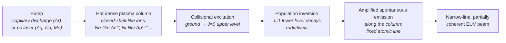

# Plasma Soft-X-Ray Lasers (Capillary Ne-like Ar 46.9 nm; Ni-like Ag / Cd / Mo)

**Status:** ✅ Implemented for the spectral physics (the lasing wavelengths are fixed atomic lines, and photon energy, photon number, coherence length and the interference limit are exact arithmetic on them) / 🔶 Simplified for the output parameters (the presets reproduce reported average powers, but pulse durations, linewidth and coherent fraction are order-of-magnitude assumptions, and the amplifier gain physics is not modelled).

## Overview

Plasma-based soft-X-ray lasers (SXRLs) are the table-top route to *laser* light — narrow-line, partially coherent, directional — at EUV and soft-X-ray wavelengths. In the collisional-excitation scheme, electron collisions in a hot, dense plasma column pump a J = 0 level of a closed-shell-like ion directly from its ground state; the J = 1 lower level empties radiatively, and spontaneous emission is amplified along the column. Because the transition is fixed by atomic structure, **the wavelength is set by the choice of ion**, not by a tunable machine parameter.

Two table-top pumping schemes are modelled:

- **Capillary discharge**, Ne-like Ar (46.9 nm): a fast, high-current pulse through an Ar-filled capillary compresses a long, uniform plasma column; ns pulses at few-Hz to ~10 Hz rates. The first table-top discharge-pumped soft-X-ray laser (Rocca et al., 1994).
- **Transient collisional excitation** (typically grazing-incidence pumped), Ni-like Ag (13.9 nm), Cd (13.2 nm), Mo (18.9 nm): a ps laser pulse heats a pre-formed plasma from a solid target; ps pulses at ~10 Hz, and ~100 Hz with diode-pumped drive lasers.

Their narrow lines and partial spatial coherence make them natural sources for interference-type lithography: table-top 46.9 nm capillary lasers have been used for EUV interferometric (Lloyd's-mirror) and Talbot-effect lithography demonstrations on nanoscale periodic patterns. Their reported average powers — from ≈1 µW to a few mW (table below) — are roughly **five to eight orders of magnitude** below the ~250 W HVM class, so they are pattern-demonstration and metrology sources, not production ones.

`SxrlSource` in [source_models/sxrl.rs](../../crates/highuvlith-core/src/source_models/sxrl.rs); the scheme is selected by `SxrlScheme`.

## Generation physics



| Scheme (`SxrlScheme`) | Ion | Transition | λ (nm) | Photon energy (eV) |
|---|---|---|---|---|
| `CapillaryNeLikeAr` | Ar⁸⁺ (Ne-like) | 3p ¹S₀ → 3s ¹P₁ | 46.9 | 26.44 |
| `NiLikeAg` | Ag¹⁹⁺ (Ni-like) | 4d ¹S₀ → 4p ¹P₁ | 13.9 | 89.20 |
| `NiLikeCd` | Cd²⁰⁺ (Ni-like) | 4d ¹S₀ → 4p ¹P₁ | 13.2 | 93.93 |
| `NiLikeMo` | Mo¹⁴⁺ (Ni-like) | 4d ¹S₀ → 4p ¹P₁ | 18.9 | 65.60 |

Photon bookkeeping, with $E_\gamma = hc/\lambda$:

```math
N_\gamma = \frac{E_\text{pulse}}{E_\gamma}, \qquad P = E_\text{pulse}\, f, \qquad P_\text{peak} = \frac{E_\text{pulse}}{\tau}
```

Temporal coherence length (order-unity line-shape factor omitted):

```math
l_c = \frac{\lambda^2}{\Delta\lambda} = \frac{\lambda}{\Delta\lambda/\lambda}
```

Two-beam interference period $p = \lambda/(2\sin\theta)$ gives the minimum half-pitch $\lambda/4$. The coherent fraction $\zeta$ maps to a mode count $M \approx 1/\zeta$ and to a Gaussian pupil fill through the shared `sigma_from_coherence` heuristic.

## Real-machine parameters

Reported average laser output (real-machine anchors):

| Laser | λ | Reported average output | Reference |
|---|---|---|---|
| Capillary-discharge Ne-like Ar (large amplifier) | 46.9 nm | 3.5 mW (0.88 mJ × 4 Hz) | Macchietto et al., *Opt. Lett.* **24**, 1115 (1999) |
| Desk-top capillary-discharge Ne-like Ar | 46.9 nm | 0.16 mW (13 µJ × 12 Hz) | Heinbuch et al., *Opt. Express* **13**, 4050 (2005) |
| Diode-pumped transient Ni-like Mo | 18.9 nm | ~0.1 mW at 100 Hz (~1 µJ) | Reagan et al., *Opt. Express* **21**, 28380 (2013) |
| Transient Ni-like Ag | 13.9 nm | ~0.1 mW | reported order of magnitude (not independently verified here) |
| Transient Ni-like Cd | 13.2 nm | ~1 µW | reported order of magnitude (not independently verified here) |
| Transient Ni-like Sn (no preset) | 11.9 nm | ~20 µW | reported order of magnitude (not independently verified here) |

Other device parameters, order of magnitude: capillary pulses ~1 ns, transient pulses ~ps; relative linewidth ~1e-4 class (assumption); partial spatial coherence that improves with plasma-column length (assumption: preset ζ = 0.3 / 0.2).

Model presets — pulse energy × repetition rate reproduce the anchors above (the Ar and Mo splits are the published ones; the Ag and Cd splits are assumptions matched to the reported orders of magnitude):

| Preset | λ | E_pulse | f | τ | P_avg | Photons/pulse | l_c | λ/4 | Gap to 250 W |
|---|---|---|---|---|---|---|---|---|---|
| `ar_46nm9` | 46.9 nm | 13 µJ | 12 Hz | 1.2 ns | 0.156 mW | 3.07×10¹² | 469 µm | 11.7 nm | ×1.6×10⁶ |
| `ag_13nm9` | 13.9 nm | 10 µJ | 10 Hz | 5 ps | 0.1 mW | 7.0×10¹¹ | 139 µm | 3.5 nm | ×2.5×10⁶ |
| `cd_13nm2` | 13.2 nm | 0.1 µJ | 10 Hz | 5 ps | 1 µW | 6.6×10⁹ | 132 µm | 3.3 nm | ×2.5×10⁸ |
| `mo_18nm9` | 18.9 nm | 1 µJ | 100 Hz | 5 ps | 0.1 mW | 9.5×10¹⁰ | 189 µm | 4.7 nm | ×2.5×10⁶ |

## Simulation model

`SxrlSource` implements `LithographySource`:

- **Wavelength** — `wavelength_nm()` returns the scheme's fixed line; there is no free wavelength field to drift out of sync. The CLI rejects a `wavelength_nm` that differs from the lasing line by more than 1 %.
- **Spectrum** — `bandwidth_pm() = rel_linewidth × λ`; `spectral_weights()` samples a Gaussian line (the true line shape is not modelled). The narrow line makes polychromatic imaging honest.
- **Pupil / coherence** — `transverse_coherence()` reports the coherent fraction; the default pupil is `CoherentGaussian { sigma = sigma_from_coherence(ζ, 0.05) }` (an approximate Gaussian-Schell bridge, documented in [source.rs](../../crates/highuvlith-core/src/source.rs)).
- **Pulse metadata** — `pulse_energy_j()`, `rep_rate_hz()`, `pulse_duration_s()` are live; `shot_to_shot_rms()` (default 10 %, assumed) feeds the stochastic dose-jitter term.
- **Derived quantities** — photon energy, photons per pulse, average power (its note carries the reported anchor for the scheme), peak power, coherence length, λ/4 interference limit, coherent mode count, and the gap to 250 W.
- **Presets** — `SxrlSource::ar_46nm9()`, `ag_13nm9()`, `cd_13nm2()`, `mo_18nm9()`, `preset(scheme)`, and `new(scheme, pulse_energy_uj, rep_rate_hz, pulse_duration_ps, coherence)`.

Not modelled: the gain, saturation and refraction physics of the amplifier (the output energy is an input), the beam profile, the line shape, and polarization.

## Model coverage

| Field | Unit | Consumed by | Status |
|---|---|---|---|
| `scheme` | enum | wavelength (fixed atomic line), photon energy, reported-power anchor | live |
| `rel_linewidth` | — | `bandwidth_pm()`, coherence length | live |
| `pulse_energy_uj` | µJ | `pulse_energy_j()`, photons per pulse, average power | live |
| `rep_rate_hz` | Hz | `rep_rate_hz()`, average power | live |
| `pulse_duration_ps` | ps | `pulse_duration_s()`, peak power | live |
| `transverse_coherence_fraction` | — | `transverse_coherence()`; pupil σ at construction | live |
| `shot_to_shot_rms` | — | `shot_to_shot_rms()` → stochastic dose jitter | live |
| `spectral_samples` | count | spectral sampling density | live |
| `illumination` | enum | `intensity_at()` pupil fill | live |
| gain / saturation model, beam profile, polarization | — | — | planned |

## Usage

Python:

<!-- verify-example -->
```python
import highuvlith as huv

ar = huv.SourceConfig.sxrl_ar_46nm9()                  # desk-top capillary Ne-like Ar, 46.9 nm
ag = huv.SourceConfig.sxrl_ag_13nm9()                  # transient Ni-like Ag, 13.9 nm
mo = huv.SourceConfig.sxrl(scheme="mo_18nm9", pulse_energy_uj=2.0)
print(ar.wavelength_nm, ar.bandwidth_pm, ar.average_power_w)   # 46.9, 4.69, 1.56e-4
dq = {name: value for name, value, *_ in ar.derived_quantities()}
print(dq["coherence_length_um"], dq["interference_min_half_pitch_nm"])   # 469.0, 11.725
```

??? success "Output"

    ```text
    46.9 4.6899999999999995 0.000156
    468.99999999999994 11.725
    ```

TOML ([examples/sim_sxrl.toml](../../examples/sim_sxrl.toml)):

```toml
[source]
type   = "sxrl"
scheme = "ag_13nm9"          # "ar_46nm9" | "ag_13nm9" | "cd_13nm2" | "mo_18nm9"
pulse_energy_uj   = 10.0
rep_rate_hz       = 10.0
pulse_duration_ps = 5.0
rel_linewidth     = 1e-4     # relative linewidth (the shared key rel_bandwidth is accepted too)
```

## Validation

Rust unit tests in [sxrl.rs](../../crates/highuvlith-core/src/source_models/sxrl.rs):

- `test_fixed_atomic_lines` — 46.9 / 13.9 / 13.2 / 18.9 nm and their photon energies.
- `test_photon_number_and_power_fixture` — 3.0693×10¹² photons per 13 µJ pulse at 46.9 nm; 0.156 mW; 10.8 kW peak; gap 1.60×10⁶; the Heinbuch anchor in the derived-quantity note; Mo preset 0.1 mW and 9.514×10¹⁰ photons/pulse; Cd preset 1 µW.
- `test_narrow_line_and_coherence_length` — 4.69 pm; 469 µm; halving the linewidth doubles l_c; λ/4 limits.
- `test_partial_coherence_sets_gaussian_pupil`, `test_spectral_weights_sum_to_one`, `test_validation_and_names`.

CLI: `test_sxrl_fixed_line_cross_check`, `test_lab_compact_key_names_aliases_and_fallbacks`; Python: `tests/python/test_sources_new.py::TestSxrl` and the imaging smoke test (Ag 13.9 nm and Ar 46.9 nm).

## References

1. J. J. Rocca et al., "Demonstration of a discharge pumped table-top soft-x-ray laser," *Phys. Rev. Lett.* **73**, 2192 (1994).
2. Macchietto et al., *Opt. Lett.* **24**, 1115 (1999) — 3.5 mW capillary-discharge Ne-like Ar laser (0.88 mJ × 4 Hz).
3. Heinbuch et al., *Opt. Express* **13**, 4050 (2005) — desk-top capillary-discharge laser, 0.16 mW (13 µJ × 12 Hz).
4. Reagan et al., *Opt. Express* **21**, 28380 (2013) — diode-pumped Ni-like Mo 18.9 nm laser, ~0.1 mW at 100 Hz.
5. Related pages: [HHG](./hhg.md) (the other table-top coherent EUV source), [interference / volumetric lithography](../processes/interference-volumetric.md), [capability matrix](../capability-matrix.md).
