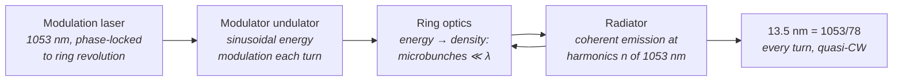

# Steady-State Microbunching (SSMB) Storage Ring

**Status:** 🧪 Theoretical — the modulation-to-target integer-harmonic consistency check is live and tested, but steady-state EUV operation at kW average power is a design projection; only single-pass microbunching at visible wavelengths has been demonstrated (Deng et al., Nature 590, 576 (2021)).

## Overview

Storage rings deliver enormous average electron current but radiate *incoherently* at short wavelengths, because their bunches (millimeters to centimeters) are vastly longer than the radiated wavelength. Free-electron lasers radiate *coherently* — microbunching at the light wavelength makes the emitted power scale as $N_e^2$ instead of $N_e$ — but linac-driven FELs waste the beam after one pass, capping average power.

Steady-state microbunching proposes to combine the two: a modulation laser, phase-locked to the ring, imprints and *sustains* microbunching on the stored beam so that **every turn** (MHz revolution frequency) radiates coherently at harmonics of the modulation wavelength. If it works at scale, projected kW-class average EUV power would remove the source-power bottleneck of EUV lithography — an order of magnitude beyond the ~250 W of production [Sn LPP sources](./lpp.md), with high transverse coherence as a bonus.

`SsmbSource` in [source_models/ssmb.rs](../../crates/highuvlith-core/src/source_models/ssmb.rs) parameterizes the Tsinghua-style EUV design point and enforces the one hard physical constraint the concept imposes: the radiated wavelength must be an integer harmonic of the modulation laser.

## Generation physics



The stored beam passes through the modulator every revolution; the ring lattice converts the sinusoidal energy modulation into density microbunching that is *re-formed each turn* rather than washed out — the "steady state." Radiation occurs at integer harmonics of the modulation wavelength:

$$
\lambda_r = \frac{\lambda_\text{mod}}{n}, \qquad n \in \mathbb{Z}^+ \qquad \left(\frac{1053\ \text{nm}}{78} = 13.5\ \text{nm}\right)
$$

Coherent enhancement is governed by the bunching factor at harmonic $n$,

$$
b_n = \left|\left\langle e^{\,i n k z}\right\rangle\right|, \qquad
P_\text{coh} \propto N_e^2\,|b_n|^2
$$

versus $P_\text{incoh} \propto N_e$ for an unbunched beam — the factor-of-$N_e$ gain (with $N_e \sim 10^9$–$10^{10}$ per microbunch train) is where the kW projection comes from, and also why maintaining $b_n$ at $n = 78$ turn after turn is the entire experimental challenge.

## Real-machine parameters

| Machine | Status | Ring energy | Laser | Output | Citation |
|---|---|---|---|---|---|
| MLS proof of principle (Tsinghua/PTB, Berlin) | **Demonstrated (single-pass)** | 250 MeV (Metrology Light Source) | 1064 nm, one-turn imprint | coherent visible radiation one turn after modulation | Deng et al., *Nature* **590**, 576 (2021) |
| Tsinghua SSMB-EUV design | **Projection** | ~400 MeV | 1053 nm, harmonic 78 | 13.5 nm, ~1 kW average (design) | Tang, Deng et al., SSMB-EUV design studies; concept: Ratner & Chao, *PRL* **105**, 154801 (2010) |

The 2021 experiment demonstrated the phase-space mechanism — microbunching survives one full revolution and radiates coherently — at visible wavelengths, in single-shot mode. Steady-state operation, EUV harmonics, and kW power all remain to be shown; the preset's `average_power_w = 1000` is a **projection**, reported as-is.

## Simulation model

`SsmbSource` implements `LithographySource`:

- **Harmonic consistency (live)** — `SsmbSource::new(ring_energy_mev, modulation_wavelength_nm, target_wavelength_nm, average_power_w)` rejects any target that is not an integer harmonic of the modulation wavelength within 0.2%. `1053/13.5 = 78` passes; `1053/13.9 = 75.75` is rejected at construction. `harmonic()` returns the integer.
- **Wavelength / spectrum** — `wavelength_nm()` returns the target; `bandwidth_pm()` is `rel_bandwidth × λ` with `rel_bandwidth = 1e-3` (narrow coherent harmonic); `spectral_weights()` samples a Gaussian at 5 points. Narrow-band, so the center-wavelength TCC polychromatic model is honest.
- **Quasi-CW power** — `average_power_w()` reports the projected power directly; `pulse_energy_j()` and `rep_rate_hz()` return `None` (no pulse structure), so no shot-to-shot jitter enters the stochastic module.
- **Coherence / pupil** — projected transverse coherence 0.8 is reported via `transverse_coherence()` and mapped at construction to a `CoherentGaussian` pupil via the approximate Gaussian-Schell heuristic `sigma_from_coherence(0.8, 0.05)` ≈ 0.056. The CLI `sigma` field is **not** consulted for this family.
- **Preset** — `euv_1kw_13nm5()`: 400 MeV ring, 1053 nm modulation, harmonic 78, 1 kW projected.

Not modeled: microbunching dynamics (bunching factor evolution, laser power requirements, lattice design), intra-beam scattering limits, and the actual coherent-power calculation — `average_power_w` is an input, not a derived quantity. That is deliberate: deriving kW from first principles would launder a projection into an implemented result.

### What the pipeline actually consumes

Like every family wrapped by `SourceKind::Ssmb`, the imaging pipeline reads only the trait surface: `wavelength_nm()`, `spectral_weights()`, `intensity_at()` (pupil), and `bandwidth_pm()`; the stochastic module reads `photon_density_per_mj_cm2()` and `shot_to_shot_rms()` via `StochasticParams::from_source`. For SSMB that means:

- 13.5 nm drives the TCC and photon-count statistics identically to any other 13.5 nm source — there is no "SSMB bonus" inside the imaging math beyond the narrow bandwidth and the coherent-Gaussian pupil.
- With no pulse structure and `shot_to_shot_rms()` at its 0.0 default, SSMB contributes **no dose-jitter term** to stochastic simulations — physically reasonable for a quasi-CW ring, but note it is an absence of a model, not a validated stability claim.

## Model coverage

| Field | Unit | Consumed by | Status |
|---|---|---|---|
| `ring_energy_mev` | MeV | nothing after construction (documentary) | stored (inert) |
| `modulation_wavelength_nm` | nm | harmonic consistency check at construction; `harmonic()` | live |
| `target_wavelength_nm` | nm | `wavelength_nm()` → imaging, photon energy | live |
| `average_power_w` | W | `average_power_w()` dose-rate metadata (projection) | live |
| `rel_bandwidth` | — | `bandwidth_pm()` → spectral weights | live |
| `transverse_coherence_fraction` | — | `transverse_coherence()`; sets pupil σ at construction | live |
| `spectral_samples` | count | spectral sampling density | live |
| `illumination` | enum | `intensity_at()` pupil fill | live |

## Usage

Python (factory from [py_config.rs](../../crates/highuvlith-py/src/py_config.rs)):

```python
import highuvlith as huv

src = huv.SourceConfig.ssmb_euv_13nm5()
print(src.wavelength_nm)       # 13.5  (harmonic 78 of 1053 nm)
print(src.average_power_w)     # 1000.0 — a PROJECTION, reported as configured
```

TOML (field names from [config.rs](../../crates/highuvlith-cli/src/config.rs)); a `wavelength_nm` that is not an integer harmonic of `modulation_wavelength_nm` is rejected before any simulation runs:

```toml
[source]
type = "ssmb"
ring_energy_mev = 400.0
modulation_wavelength_nm = 1053.0
wavelength_nm = 13.5           # must satisfy 1053 / 13.5 = 78 (integer, ±0.2%)
average_power_w = 1000.0       # design projection, passed through
```

## Validation

Rust unit tests in [ssmb.rs](../../crates/highuvlith-core/src/source_models/ssmb.rs):

- `test_harmonic_consistency_enforced` — 1053/13.5 = 78 accepted; 1053/13.9 = 75.75 rejected; non-positive targets rejected.
- `test_preset_is_78th_harmonic` — `harmonic() == 78`, wavelength 13.5 nm.
- `test_cw_power_passthrough` — 1000 W reported; `pulse_energy_j()` and `rep_rate_hz()` are `None` (CW).
- `test_weights_sum_to_one` — spectral normalization.

Python: `tests/python/test_sources.py::TestSsmbSource` and the end-to-end imaging smoke test at NA 0.33.

## References

1. D. F. Ratner and A. W. Chao, "Steady-state microbunching in a storage ring for generating coherent radiation," *Phys. Rev. Lett.* **105**, 154801 (2010) — the SSMB proposal.
2. X. Deng et al., "Experimental demonstration of the mechanism of steady-state microbunching," *Nature* **590**, 576 (2021) — Tsinghua/PTB proof of principle at the MLS.
3. C. Tang et al., SSMB-EUV design studies (Tsinghua SSMB task force reports).
4. Status taxonomy: [../capability-matrix.md](../capability-matrix.md). Compare: [inverse Compton](./inverse-compton.md) (compact but flux-starved), [Sn LPP](./lpp.md) (the production baseline SSMB aims to beat).
