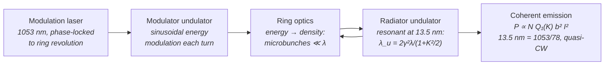

# Steady-State Microbunching (SSMB) Storage Ring

**Status:** 🧪 Theoretical — the integer-harmonic check and the first-principles coherent-emission power are live, but the 1 kW design point *requires* a bunching factor b ≈ 0.146 at harmonic 78 (≈ 4 nm rms microbunches sustained every turn in a 1 A stored beam), while only one-turn microbunching at the 1064 nm modulation wavelength has been demonstrated (Deng et al., *Nature* 590, 576 (2021); Kruschinski et al., *Commun. Phys.* 7, 160 (2024)).

## Overview

Storage rings deliver enormous average electron current but radiate *incoherently* at short wavelengths, because their bunches (millimeters to centimeters) are vastly longer than the radiated wavelength. Free-electron lasers radiate *coherently* — microbunching at the light wavelength makes the emitted power scale as $N_e^2$ instead of $N_e$ — but linac-driven FELs discard the beam after one pass, capping average power.

Steady-state microbunching proposes to combine the two: a modulation laser, phase-locked to the ring, imprints and *sustains* microbunching on the stored beam so that **every turn** (MHz revolution frequency) radiates coherently at harmonics of the modulation wavelength. If it works at scale, projected kW-class average EUV power would remove the source-power bottleneck of EUV lithography — several times the ~250 W of production [Sn LPP sources](./lpp.md), with high transverse coherence as a bonus.

`SsmbSource` in [source_models/ssmb.rs](../../crates/highuvlith-core/src/source_models/ssmb.rs) enforces the one hard constraint the concept imposes — the radiated wavelength must be an integer harmonic of the modulation laser — and, with its optional radiator description, **derives** the coherent power from beam current, bunching factor and radiator, so the quadratic sensitivity to the bunching factor is explicit rather than hidden inside a projected number.

## Generation physics



The stored beam passes through the modulator every revolution; the ring lattice converts the sinusoidal energy modulation into density microbunching that is *re-formed each turn* rather than washed out — the "steady state." Radiation occurs at integer harmonics of the modulation wavelength:

```math
\lambda_r = \frac{\lambda_\text{mod}}{n}, \qquad n \in \mathbb{Z}^+ \qquad \left(\frac{1053\ \text{nm}}{78} = 13.5\ \text{nm}\right)
```

and the radiator undulator must be resonant there, which fixes its period from the ring energy and its $K$:

```math
\lambda_u = \frac{2\gamma^2\lambda_r}{1 + K^2/2} = 7.27\ \text{mm} \quad (400\ \text{MeV},\ \gamma = 783.8,\ K = 1.6)
```

### Coherent power of a bunched beam (derived)

The field radiated by $N_e$ electrons at frequency $\omega$ is the single-electron field times $\sum_j e^{i\omega t_j}$, so the radiated energy scales as

```math
\Big|\sum_j e^{i\omega t_j}\Big|^2 = N_e + N_e(N_e - 1)\,|b(\omega)|^2,
\qquad b(\omega) = \big\langle e^{i\omega t_j}\big\rangle
```

— the incoherent term $\propto N_e$ plus the coherent term $\propto N_e^2|b|^2$. For a quasi-CW beam of duration $T$ bunched at $\omega_0$ with bunching factor $b$, $\int |b(\omega)|^2 d\omega = 2\pi|b|^2/T$, so the coherent term radiates the power $P = 2\pi (I/e)^2 |b|^2 dW_1/d\omega$. Using Kim's central-cone single-electron spectral density of a planar undulator at its line, $dW_1/d\omega = \pi\alpha N Q_1(K)\hbar$ (X-ray Data Booklet §2.1), and replacing $I^2$ by $\langle I^2\rangle = I_\text{avg}I_\text{pk}$ for a beam with time structure:

```math
P_\text{coh} = 2\pi^2\,\alpha\,\hbar\,N\,Q_1(K)\,|b|^2\,\frac{I_\text{avg}}{e}\,\frac{I_\text{pk}}{e}
\;\approx\; 592\ \text{W} \times N\,Q_1(K)\,|b|^2\,I_\text{avg}[\text{A}]\,I_\text{pk}[\text{A}]
```

with $Q_1(K) = K^2[J_0(\xi) - J_1(\xi)]^2/(1 + K^2/2)$, $\xi = K^2/(4 + 2K^2)$ ($Q_1 = 0.795$ at $K = 1.6$). Assumptions (stated in [`physics::coherent_undulator_power_w`](../../crates/highuvlith-core/src/source_models/physics.rs)): transversely coherent emission (beam size well below the radiation mode size), bunching constant along the radiator, no FEL gain or feedback on the bunching, and the radiator detuned for maximum angle-integrated emission — exactly at the on-axis resonance the angle-integrated spectral density, hence $P$, is **half** this value.

Relative to spontaneous emission of the same radiator and current (the central-cone power $\pi\alpha Q_1 (I/e) E_\text{ph}$), the enhancement is

```math
\frac{P_\text{coh}}{P_\text{inc}} = N\,|b|^2\,\frac{I_\text{pk}}{e}\,\frac{\lambda}{c}
```

— the number of electrons in one slippage length $N\lambda$ times $|b|^2$ (≈ 600 for the design point).

### What the bunching factor demands

For Gaussian microbunches of rms length $\sigma_z$, $b = \exp[-(k\sigma_z)^2/2]$ with $k = 2\pi/\lambda$. With the design-point radiator (1 A DC-like beam, $N = 100$, $K = 1.6$):

| Bunching factor $b$ at 13.5 nm | Coherent power | rms microbunch length | Enhancement over spontaneous |
|---|---|---|---|
| 0.01 | 4.7 W | 6.52 nm | 2.8 |
| 0.05 | 118 W | 5.26 nm | 70 |
| 0.073 | 250 W (HVM benchmark) | 4.92 nm | 149 |
| 0.1 | 470 W | 4.61 nm | 281 |
| **0.146** | **1000 W (design projection)** | **4.22 nm** | **597** |

Power scales as $b^2$, and $b$ depends exponentially on $\sigma_z$: shrinking the microbunches from 6.5 nm to 4.2 nm rms raises the power ~200×. Maintaining ~4 nm rms microbunches at harmonic 78 against quantum excitation and intra-beam scattering, turn after turn, is the entire experimental challenge.

## Real-machine parameters

| Machine | Status | Ring energy | Laser | Output | Citation |
|---|---|---|---|---|---|
| MLS proof of principle (Tsinghua/PTB, Berlin) | **Demonstrated (mechanism, one turn)** | Metrology Light Source | 1064 nm, one-turn imprint | coherent radiation at the 1064 nm modulation wavelength one turn after modulation | Deng et al., *Nature* **590**, 576 (2021) |
| Follow-up mechanism test at the MLS | **Demonstrated (mechanism, one turn)** | Metrology Light Source | 1064 nm | one-turn microbunching | Kruschinski et al., *Commun. Phys.* **7**, 160 (2024) |
| Tsinghua SSMB-EUV design | **Design** | ≥ 400 MeV, ≥ 1 A | — | ≥ 1 kW in a 2 % band at 13.5 nm | *Acta Phys. Sin.* **71**, 152901 (Tsinghua-led target > 1 kW per tool also presented at the 2018 EUVL Workshop) |
| SLAC SSMB design (Chao et al.) | **Design** | — | — | 1.12 kW per tool at 13.7 nm | IPAC2016, TUXB01, doi:10.18429/JACoW-IPAC2016-TUXB01 |
| Ratner & Chao sample parameter set | **Projection** | — | — | 4 kW at 13.5 nm | 2015 EUVL Workshop |
| This model's preset (`euv_1kw_13nm5`) | **Projection** | 400 MeV, 1 A | 1053 nm, harmonic 78 | 13.5 nm, 1 kW (b ≈ 0.146 required) | concept: Ratner & Chao, *PRL* **105**, 154801 (2010) |

Both experiments are one-turn **mechanism** tests at 1064 nm: microbunching survives one full revolution and radiates coherently at the modulation wavelength. Steady-state operation, EUV harmonics, and kW power all remain to be shown, and no SSMB facility approval has been found (a Xiong'an site discussion is not an approval). The preset sits in the Tsinghua design class (400 MeV, 1 A, 1 kW); it reports the 1 kW projection and shows, via the derived quantities, the bunching factor it implies.

## Simulation model

`SsmbSource` implements `LithographySource`:

- **Harmonic consistency (live)** — `SsmbSource::new(ring_energy_mev, modulation_wavelength_nm, target_wavelength_nm, average_power_w)` rejects any target that is not an integer harmonic of the modulation wavelength within 0.2 %. `1053/13.5 = 78` passes; `1053/13.9 = 75.75` is rejected at construction. `harmonic()` returns the integer.
- **Derived coherent power (new)** — `with_radiator(SsmbRadiator { average_current_a, peak_current_a, bunching_factor, num_periods, k })` attaches the beam/radiator (validated: positive currents/periods/K, $b \in [0, 1]$, peak ≥ average). `average_power_w()` then returns `coherent_power_w()` from the formula above; without a radiator it returns the stored projection `average_power_w`, as before. `SsmbSource::bunching_required(radiator, P)` inverts the formula.
- **Preset** — `euv_1kw_13nm5()`: 400 MeV ring, 1053 nm modulation, harmonic 78, 1 A DC-like beam ($I_\text{pk} = I_\text{avg}$), 100-period $K = 1.6$ radiator, and **$b$ set to the value the 1 kW projection requires** (0.1458). The derived power therefore reproduces the projection (1000 W); change $b$ and it moves as $b^2$. The value of $b$ is an assumption, not a demonstrated number.
- **Wavelength / spectrum** — `wavelength_nm()` returns the target; `bandwidth_pm()` is `rel_bandwidth × λ` with `rel_bandwidth = 1e-3`; `spectral_weights()` samples a Gaussian at 5 points.
- **Quasi-CW** — `pulse_energy_j()` and `rep_rate_hz()` return `None` (no pulse structure), so no shot-to-shot jitter enters the stochastic module.
- **Coherence / pupil** — projected transverse coherence 0.8 is reported via `transverse_coherence()` and mapped at construction to a `CoherentGaussian` pupil via the approximate Gaussian–Schell heuristic `sigma_from_coherence(0.8, 0.05)` ≈ 0.056. The CLI `sigma` field is **not** consulted for this family.

**Not modeled — and why the derivation is still honest.** The microbunching dynamics themselves (modulation-laser power, the longitudinal-strong-focusing lattice, quantum excitation and intra-beam scattering that set the achievable $\sigma_z$, radiator FEL gain) are absent. The model does not claim any $b$ is achievable: it derives the power that a *given* $b$ radiates. Deriving kW is therefore not a claim that SSMB reaches kW — it turns the projection into its explicit requirement ($b \approx 0.146$, 4.2 nm rms microbunches, every turn), which is exactly the number an experiment has to beat.

### What the pipeline actually consumes

Like every family wrapped by `SourceKind::Ssmb`, the imaging pipeline reads only the trait surface: `wavelength_nm()`, `spectral_weights()`, `intensity_at()` (pupil), and `bandwidth_pm()`; the stochastic module reads `photon_density_per_mj_cm2()` and `shot_to_shot_rms()` via `StochasticParams::from_source`; the throughput model reads `average_power_w()`. For SSMB that means:

- 13.5 nm drives the TCC and photon-count statistics identically to any other 13.5 nm source — there is no "SSMB bonus" inside the imaging math beyond the narrow bandwidth and the coherent-Gaussian pupil.
- With no pulse structure and `shot_to_shot_rms()` at its 0.0 default, SSMB contributes **no dose-jitter term** to stochastic simulations — physically reasonable for a quasi-CW ring, but an absence of a model, not a validated stability claim.
- In the dose-limited scanner model the 1 kW design point gives ≈ 183 wafers/hour at 30 mJ/cm² with EUV-like optics — already overhead-limited (the ceiling is ≈ 196 wafers/hour).

## Derived quantities

`derived_quantities()` (Python: `derived_quantities()` / `derived_quantity(name)`; CLI: printed by `highuvlith simulate`) for the `euv_1kw_13nm5()` design point:

| Name | Value | Unit | Meaning |
|---|---|---|---|
| `photon_energy` | 91.84 | eV | $hc/\lambda$ |
| `harmonic_number` | 78 | – | modulation / target wavelength |
| `electron_gamma` | 783.8 | – | ring Lorentz factor |
| `radiator_period` | 7.27 | mm | resonant radiator period $2\gamma^2\lambda/(1 + K^2/2)$ *(radiator only)* |
| `radiator_length` | 0.727 | m | periods × period *(radiator only)* |
| `bunching_factor` | 0.1458 | – | $\lvert b_{78}\rvert$ — ASSUMED, must be sustained every turn *(radiator only)* |
| `microbunch_rms_length` | 4.22 | nm | Gaussian $\sigma_z$ giving this $b$ *(radiator only)* |
| `coherent_power` | 1000 | W | derived coherent power (= `average_power_w`) *(radiator only)* |
| `power_at_full_bunching` | 4.70×10⁴ | W | coherent power at $b = 1$; $P$ = this × $b^2$ *(radiator only)* |
| `incoherent_power` | 1.67 | W | spontaneous central-cone power of the same radiator and current *(radiator only)* |
| `coherent_enhancement` | 597 | – | $P_\text{coh}/P_\text{inc} = N\lvert b\rvert^2 (I_\text{pk}/e)\lambda/c$ *(radiator only)* |
| `bunching_for_projection` | 0.1458 | – | $b$ needed to reach the stored projection *(radiator only)* |
| `bunching_for_hvm` | 0.0729 | – | $b$ needed for 250 W *(radiator only)* |
| `projected_power` | 1000 | W | stored design projection |
| `photon_rate` | 6.80×10¹⁹ | photons/s | average power / photon energy |
| `hvm_power_ratio` | 4.0 | – | average power / 250 W |

## Model coverage

| Field | Unit | Consumed by | Status |
|---|---|---|---|
| `ring_energy_mev` | MeV | ring γ → derived radiator period (derived quantities); does not enter the power formula | live (derived quantities) |
| `modulation_wavelength_nm` | nm | harmonic consistency check at construction; `harmonic()` | live |
| `target_wavelength_nm` | nm | `wavelength_nm()` → imaging, photon energy; radiator resonance; microbunch length | live |
| `average_power_w` | W | `average_power_w()` when no radiator is attached; reference for `bunching_for_projection` (projection) | live (fallback) |
| `radiator` (`SsmbRadiator`: `average_current_a`, `peak_current_a`, `bunching_factor`, `num_periods`, `k`) | A, A, –, –, – | derived coherent power → `average_power_w()`; derived quantities | live (optional, new) |
| `rel_bandwidth` | — | `bandwidth_pm()` → spectral weights | live |
| `transverse_coherence_fraction` | — | `transverse_coherence()`; sets pupil σ at construction | live |
| `spectral_samples` | count | spectral sampling density | live |
| `illumination` | enum | `intensity_at()` pupil fill | live |
| microbunching dynamics (laser power, lattice, IBS / quantum-excitation limits on σ_z) | — | — | planned |

## Usage

Python (factories from [py_config.rs](../../crates/highuvlith-py/src/py_config.rs)):

<!-- verify-example -->
```python
import highuvlith as huv

src = huv.SourceConfig.ssmb_euv_13nm5()
print(src.wavelength_nm)                              # 13.5 (harmonic 78 of 1053 nm)
print(src.average_power_w)                            # 1000.0 — DERIVED with b set to what 1 kW requires
print(src.derived_quantity("bunching_factor"))        # 0.146
print(src.derived_quantity("microbunch_rms_length"))  # 4.22 nm

weaker = huv.SourceConfig.ssmb(bunching_factor=0.1)   # 470 W: P scales as b^2
bunched = huv.SourceConfig.ssmb(average_current_a=0.5, peak_current_a=5.0,
                                bunching_factor=0.1)  # <I^2> = I_avg * I_pk
projection_only = huv.SourceConfig.ssmb(average_power_w=750.0)  # no radiator: stored 750 W
print(src.wafer_throughput(dose_mj_cm2=30.0)["wafers_per_hour"])  # ~183 (overhead-limited)
```

??? success "Output"

    ```text
    13.5
    999.9999999999999
    0.14579969715569271
    4.216412461474229
    183.21581326160737
    ```

TOML (field names from [config.rs](../../crates/highuvlith-cli/src/config.rs)); a `wavelength_nm` that is not an integer harmonic of `modulation_wavelength_nm` is rejected before any simulation runs, and `highuvlith simulate` prints the derived quantities:

```toml
[source]
type = "ssmb"
ring_energy_mev = 400.0
modulation_wavelength_nm = 1053.0
wavelength_nm = 13.5           # must satisfy 1053 / 13.5 = 78 (integer, ±0.2%)
average_power_w = 1000.0       # projection (used directly without radiator fields)
average_current_a = 1.0        # radiator fields -> derived coherent power
radiator_periods = 100
radiator_k = 1.6
# peak_current_a = 1.0         # defaults to the average (DC-like fill)
# bunching_factor = 0.1        # omit: the b the projection requires (0.146)
```

See `examples/sim_ssmb.toml`.

## Validation

Rust unit tests in [ssmb.rs](../../crates/highuvlith-core/src/source_models/ssmb.rs):

- `test_harmonic_consistency_enforced` — 1053/13.5 = 78 accepted; 1053/13.9 = 75.75 rejected; non-positive targets rejected.
- `test_preset_is_78th_harmonic` — `harmonic() == 78`, wavelength 13.5 nm.
- `test_cw_power_passthrough` — the preset's derived power equals the 1 kW projection; `pulse_energy_j()` / `rep_rate_hz()` are `None`; without a radiator the stored projection is reported.
- `test_derived_coherent_power_fixture` — $b$ = 0.14580 for 1 kW, $\sigma_z$ = 4.216 nm, radiator period 7.275 mm, $b = 0.1$ → 470.4 W (scipy fixtures), enhancement = $N\lvert b\rvert^2(I/e)\lambda/c$.
- `test_radiator_validation` — $b > 1$ and peak < average current rejected.
- `test_weights_sum_to_one` — spectral normalization.

In [physics.rs](../../crates/highuvlith-core/src/source_models/physics.rs): `test_coherent_undulator_power_fixture` (591.77 W per $N Q_1 \lvert b\rvert^2 I^2$, 470.42 W fixture, quadratic in $b$ and in $I$), `test_microbunch_form_factor_round_trip` (4.61 nm ↔ $b = 0.1$ at 13.5 nm), `test_undulator_harmonic_functions_fixture` ($Q_1(1.6) = 0.7949$ from scipy Bessel functions).

CLI ([config.rs](../../crates/highuvlith-cli/src/config.rs)): `test_ics_ssmb_entangled_machine_fields` (`bunching_factor = 0.1` → 470.4 W), `test_legacy_family_tomls_unchanged_by_new_fields` (no radiator fields → stored 1000 W), `test_family_example_tomls_validate`.

Python: `tests/python/test_sources_physics.py::TestSsmb` (1 kW, $b$ = 0.1458, 4.216 nm, $b^2$ scaling, stored projection without radiator), `tests/python/test_sources.py::TestSsmbSource`, and the end-to-end imaging smoke test at NA 0.33.

## References

1. D. F. Ratner and A. W. Chao, "Steady-state microbunching in a storage ring for generating coherent radiation," *Phys. Rev. Lett.* **105**, 154801 (2010) — the SSMB proposal.
2. X. Deng et al., "Experimental demonstration of the mechanism of steady-state microbunching," *Nature* **590**, 576 (2021) — Tsinghua/PTB proof of principle at the MLS.
3. K.-J. Kim, "Characteristics of synchrotron radiation," X-ray Data Booklet §2.1 — central-cone undulator flux ($\pi\alpha N Q_n$) used for the single-electron spectral density.
4. Kruschinski et al., *Commun. Phys.* **7**, 160 (2024) — second one-turn SSMB mechanism test at 1064 nm.
5. Tsinghua SSMB-EUV design (≥ 400 MeV, ≥ 1 A, ≥ 1 kW in a 2 % band), *Acta Phys. Sin.* **71**, 152901; SLAC design, 1.12 kW per tool, IPAC2016 TUXB01. The preset matches the Tsinghua class; its 1053 nm / harmonic-78 / 100-period K = 1.6 radiator numbers are this model's own choices, not a quoted design. No such machine exists.
6. Status taxonomy: [../capability-matrix.md](../capability-matrix.md). Compare: [inverse Compton](./inverse-compton.md) (compact but flux-starved), [Sn LPP](./lpp.md) (the production baseline SSMB aims to beat), [XFEL](./xfel.md) (the ERL-FEL design point, another kW-class projection).
