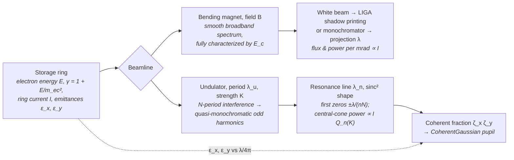

# Synchrotron (Bending Magnet / Undulator)

**Status:** ✅ Implemented — wavelength, the sinc² undulator line, harmonic content, absolute undulator/bending-magnet flux and power are *derived* from machine parameters and fixture-tested; 🔶 the emittance-derived coherent fraction uses the matched-beta convolution (an upper bound) and flux values are filament-beam figures (see the [capability matrix](../capability-matrix.md#light-sources)).

## Overview

Storage-ring synchrotron radiation spans VUV to hard X-ray with high average power
and sub-percent stability, which is why it anchors two very different lithographic
roles: **bending-magnet white beam** is the canonical exposure source for LIGA deep
X-ray lithography (mm-thick PMMA, aspect ratios > 50), and **undulator beamlines**
provide the quasi-monochromatic, partially coherent EUV used for actinic mask
metrology and resist studies (e.g. the PTB beamlines at BESSY II).

`SynchrotronSource` is highuvlith's **live-physics showcase**: the wavelength is
**computed from electron energy, undulator period, K, and harmonic**, the line shape is
the true on-axis sinc², the absolute flux and power follow from the stored ring current,
and — when ring emittances are given — the transverse coherent fraction is derived too.
Change the machine and the light changes. The flip side is also derived: a single
compact-ring undulator delivers **0.23 W** in its usable line, three orders of
magnitude below a 250 W production EUV source.

## Generation physics



### Bending magnet

The spectrum is universal once scaled by the critical energy (half the radiated power
above it, half below):

```math
E_c\,[\mathrm{keV}] = 0.665\, E^2\,[\mathrm{GeV^2}]\, B\,[\mathrm{T}]
```

```math
S(y) = G_1(y) = y \int_y^{\infty} K_{5/3}(x)\,dx, \qquad y = E/E_c
```

$S(y)$ peaks near $y \approx 0.29$ (value ≈ 0.92) and integrates to
$8\pi/(9\sqrt{3}) \approx 1.61$ over $y$. highuvlith evaluates the $K_{5/3}$ integral with
the Kostroun exponential-sum algorithm (Kostroun, *Nucl. Instrum. Methods* **172**, 371
(1980)):

```math
\int_y^{\infty} K_\nu(t)\,dt \approx h\left[\frac{e^{-y}}{2} + \sum_{r\ge1} \frac{e^{-y\cosh(rh)}\cosh(\nu r h)}{\cosh(rh)}\right]
```

([`physics::bm_universal_flux`](../../crates/highuvlith-core/src/source_models/physics.rs)).
**Accuracy fix:** this page used to claim ~10⁻¹⁰ accuracy for the step $h = 0.5$; checked
against 30-digit mpmath quadrature it was only ~10⁻⁸ near the peak and 7 × 10⁻⁴ at
$y = 10$. The step is now $h = 0.25$: relative error below 10⁻¹⁴ for $0.01 \le y \le 3$
and ~3 × 10⁻¹² at $y = 10$. The change moves LIGA spectra by < 10⁻⁷ for $y \le 1$ and
< 10⁻⁶ at $y = 3$.

The **absolute** flux per mrad of horizontal angle (integrated over the vertical angle)
and the radiated power per mrad are (K.-J. Kim, X-ray Data Booklet §2.1):

```math
\frac{d\dot F}{d\theta} = \frac{\sqrt3}{2\pi}\,\alpha\,\gamma\,\frac{\Delta\omega}{\omega}\,\frac{I}{e}\,G_1(y)
= 2.457\times10^{13}\,E[\mathrm{GeV}]\,I[\mathrm{A}]\,G_1(y)\ \ \text{photons/s/mrad/0.1\%BW}
```

```math
\frac{dP}{d\theta} = \frac{e\,\gamma^4\,I}{6\pi\varepsilon_0\,\rho}\ \text{per rad}, \qquad \rho = \frac{p}{eB}
```

(the energy loss per turn $U_0 = e^2\gamma^4/(3\varepsilon_0\rho)$ — 88.46 keV at 1 GeV and
ρ = 1 m — times $I/e$, spread over 2π).

### Undulator

On-axis interference over $N$ periods produces odd harmonics at the resonance wavelength

```math
\lambda_n = \frac{\lambda_u}{2 n \gamma^2}\left(1 + \frac{K^2}{2}\right), \qquad K = \frac{e B_0 \lambda_u}{2\pi m_e c} = 0.09337\, B_0\,[\mathrm{T}]\, \lambda_u\,[\mathrm{mm}]
```

with the **natural (filament-beam, on-axis) line shape**

```math
I(\lambda) \propto \mathrm{sinc}^2\!\left(\pi n N \frac{\Delta\lambda}{\lambda}\right):
\qquad \text{first zeros at } \frac{\Delta\lambda}{\lambda} = \pm\frac{1}{nN},
\qquad \mathrm{FWHM} = \frac{0.8859}{nN}
```

(the side lobes carry ~10 % of the line energy). The harmonic strengths use the
planar-undulator Bessel factor `[JJ]` (Kim's notation):

```math
\xi = \frac{nK^2}{4 + 2K^2}, \qquad [JJ]_n = J_{(n-1)/2}(\xi) - J_{(n+1)/2}(\xi)
```

```math
F_n(K) = \frac{n^2K^2}{(1 + K^2/2)^2}\,[JJ]_n^2, \qquad Q_n(K) = \left(1 + \frac{K^2}{2}\right)\frac{F_n(K)}{n}
```

with $J_m$ evaluated by `physics::bessel_j` (power series for $|x| \le 12$, Miller backward
recurrence above). Even harmonics vanish on axis. From these (K.-J. Kim, X-ray Data
Booklet §2.1):

| Quantity | Formula | Engineering units |
|---|---|---|
| Central-cone flux | $\pi\alpha N Q_n(K) \frac{\Delta\omega}{\omega} \frac{I}{e}$ | $1.431\times10^{14} N Q_n I[\mathrm{A}]$ photons/s/0.1%BW |
| On-axis angular flux density | $\alpha N^2\gamma^2 F_n(K) \frac{\Delta\omega}{\omega} \frac{I}{e}$ | $1.744\times10^{14} N^2 E^2[\mathrm{GeV}] I[\mathrm{A}] F_n$ photons/s/mrad²/0.1%BW |
| Central-cone power in the natural line | $\pi\alpha Q_n(K) \frac{I}{e} E_{\gamma,1}$ | the flux × the natural width $1/(nN)$ — $N$ cancels |
| Total power (all harmonics, all angles) | $\dfrac{e^3\gamma^2B_0^2 L I}{12\pi\varepsilon_0 m_e^2c^2}$ | $632.7 E^2[\mathrm{GeV}] B_0^2[\mathrm{T}] L[\mathrm{m}] I[\mathrm{A}]$ W |

For $n = 1$ the central-cone power is identical to Attwood's
$\frac{\pi e \gamma^2 I}{\varepsilon_0 \lambda_u}\frac{K^2}{(1+K^2/2)^2}[JJ]^2$ (D. Attwood,
*Soft X-Rays and Extreme Ultraviolet Radiation*, 1999).

### Coherent fraction and energy spread

An electron beam of geometric emittance $\varepsilon$ convolved with the single-electron
photon emittance $\varepsilon_r = \lambda/4\pi$ (Kim's convention), with optimally matched
beta functions, has a transversely coherent fraction per plane

```math
\zeta_{x,y} = \frac{\lambda/4\pi}{\varepsilon_{x,y} + \lambda/4\pi}, \qquad \zeta = \zeta_x\,\zeta_y
```

— the smooth form of the textbook ratio $(\lambda/4\pi)/\varepsilon$ for $\varepsilon \gg \lambda/4\pi$,
tending to 1 for a zero-emittance beam. Real lattices are not perfectly matched, so it is
an **upper bound**; conventions using $\lambda/2\pi$ give up to 2× larger fractions in the
incoherent limit. The ring energy spread broadens the line homogeneously by
$\sim 2n\sigma_E$; the derived ratio $2n\sigma_E / (1/nN)$ tells whether the natural
sinc² line survives (≪ 1).

## Real-machine parameters

| Machine | E (GeV) | Field / undulator | Output | Lithographic role | Citation |
|---------|---------|-------------------|--------|-------------------|----------|
| KARA (ex-ANKA), KIT | 2.5 | 1.5 T bend | E_c ≈ 6.2 keV white beam | LIGA deep X-ray beamlines (LITHO 1/2/3) | Saile et al. (eds.), *LIGA and its Applications* (Wiley-VCH, 2009) |
| BESSY II (PTB), Berlin | 1.7 | undulator + mono | 13.5 nm, ~0.1 % bw | EUV radiometry, mask/optics metrology | Scholze et al., *Proc. SPIE* (2001) |
| ALS, Berkeley | 1.9 | undulator | 13.5 nm coherent fraction | EUV actinic inspection & interference lithography heritage | Naulleau et al. (1999) |
| PSI SLS, XIL-II beamline | — | undulator | 13.48 nm; 3×10¹⁵ ph/s/cm² in a 4 % band at 0.3 A on a 5 × 5 mm² spot ≈ 44 mW/cm², ≈ 11 mW delivered (derived) | EUV interference lithography | PSI SLS XIL beamline page (https://www.psi.ch/en/sls/xil) |
| Compact EUV ring (model preset) | 0.538 | λ_u = 20 mm, K = 1, N = 100 | 13.5 nm; 0.232 W central-cone line power at 200 mA; ζ ≈ 0.089 | study point for ring-based EUV illumination | derived on this page |

The XIL-II figure is power *delivered to the sample* after the beamline optics — a measured anchor for what a production undulator beamline delivers onto a 5 × 5 mm² exposure area at 13.5 nm (~10 mW), against the model preset's 0.232 W central-cone line power *at the source*.

## Simulation model

[`SynchrotronSource`](../../crates/highuvlith-core/src/source_models/synchrotron.rs)
holds a `SynchrotronBeamline` enum (`BendingMagnet { electron_energy_gev, field_t,
selected_wavelength_nm, mono_bandwidth_pm }` or `Undulator { electron_energy_gev,
period_mm, k, num_periods, harmonic }`) plus `ring_current_ma`, `spectral_samples`,
`illumination`, `transverse_coherence_fraction`, and the optional
`ring_beam: Option<StorageRingBeam>` (`emittance_x_nm_rad`, `emittance_y_nm_rad`,
`energy_spread_rel`).

- **Wavelength is DERIVED (undulator):** `wavelength_nm()` computes $\gamma$ from the ring
  energy and evaluates the resonance formula via `physics::undulator_resonance_nm`. The
  constructor rejects even/zero harmonics (on-axis emission is odd-only) and non-positive
  machine parameters. For bending magnets, the monochromator-selected wavelength is used
  when the source feeds the *projection* pipeline; LIGA ignores it and takes the white beam.
- **CLI 5 % cross-check:** if a TOML config gives both machine parameters *and* an
  explicit `wavelength_nm`, [`config.rs`](../../crates/highuvlith-cli/src/config.rs)
  compares it against the derived resonance value and rejects the config when they
  disagree by more than 5 % — the resonance condition, not the config, owns the
  wavelength.
- **Line shape (live):** `spectral_weights()` samples `SpectralShape::SincSquared` for
  undulators and `bandwidth_pm()` reports its FWHM, $0.8859 \lambda/(nN)$. Behaviour
  change: this used to be a Gaussian of FWHM $\lambda/(nN)$ — the compact preset's
  bandwidth moves from 135 pm to **119.65 pm**. Bending magnets keep a Gaussian
  monochromator passband of `mono_bandwidth_pm`.
- **Absolute flux and power (live):** `ring_current_ma` (previously documentary) now sets
  the central-cone flux and power. For undulators `average_power_w()` returns the
  central-cone power of the selected harmonic in its natural line (the usable
  quasi-monochromatic output; previously `None`). For bending magnets it stays `None` —
  the usable power depends on the beamline's horizontal acceptance, so the per-mrad
  figures are reported as derived quantities instead.
- **Coherence and pupil:** with `ring_beam` set (via `with_ring_beam`), an undulator's
  `transverse_coherence()` is the derived $\zeta_x\zeta_y$ at the emitted wavelength and
  the `CoherentGaussian` pupil is rebuilt from it with the Gaussian–Schell heuristic
  `sigma_from_coherence` (approximate, documented). Without emittances the stored legacy
  constant 0.2 is used. `compact_euv_undulator()` now carries the illustrative
  compact-ring beam (`StorageRingBeam::compact_ring()`: ε_x = 10 nm·rad, ε_y = 0.1 nm·rad,
  σ_E = 5 × 10⁻⁴ — assumed values of the right order, not a specific machine), so its
  coherence changes **0.2 → 0.0888** and its pupil σ **0.112 → 0.168**;
  `SynchrotronSource::undulator(...)` (and the Python `synchrotron_undulator()` without
  emittances) keep 0.2. Bending magnets stay incoherent (`Conventional`, σ = 0.8,
  coherence 0). The engine's memory guard (`LithographyError::PupilSamplingTooDense`, raised when the factorized TCC matrix would exceed ~1 GiB; see [pipeline.md](../pipeline.md)) applies.
- **Quasi-CW:** storage rings run at MHz bunch rates with sub-percent stability, so pulse
  metadata stays `None` and `shot_to_shot_rms()` is 0 — no stochastic dose jitter,
  correctly. The flux formulas are filament-beam values: emittance and energy spread are
  reported (coherent fraction, broadening ratio) but not folded into the flux.

### LIGA coupling

The deep X-ray depth-dose module
([../processes/liga-deep-xray.md](../processes/liga-deep-xray.md)) couples through
`XraySpectrum::from_synchrotron` in
[`deep_xray.rs`](../../crates/highuvlith-core/src/deep_xray.rs), which reads
`critical_energy_kev()` (Some for bending magnets, None for undulators) and then
samples $S(E/E_c)$ via `physics::bm_universal_flux` — the white-beam spectral shape that
LIGA's 1:1 proximity shadow printing integrates over depth. The source's own
`bm_spectral_flux(photon_energy_kev)` evaluates the same $S(E/E_c)$ for direct callers,
and `bm_flux_per_mrad(photon_energy_kev)` gives the **absolute** flux from the ring
current (photons/s/mrad/0.1%BW). The `SynchrotronSource` / `SynchrotronBeamline` fields the
LIGA module reads are unchanged; only the optional `ring_beam` field was added (struct
literals must now set `ring_beam: None`).

### Presets

**`liga_bending_magnet()`** — 2.5 GeV, 1.5 T, 200 mA (KIT/ANKA-class):

```math
E_c = 0.665 \cdot 2.5^2 \cdot 1.5 = 6.234\ \mathrm{keV} \quad (\lambda_c = 0.199\ \mathrm{nm}),
\qquad \rho = 5.56\ \mathrm{m}, \qquad \frac{dP}{d\theta} = 19.8\ \mathrm{W/mrad}
```

and $8.04\times10^{12}$ photons/s/mrad/0.1%BW at the 0.2 nm monochromator setting
($y = 0.994$).

**`compact_euv_undulator()`** — 538 MeV, λ_u = 20 mm, K = 1, N = 100, n = 1, 200 mA:

```math
\gamma = 1 + \tfrac{538}{0.511} = 1053.8, \qquad \lambda_1 = \frac{2\times10^7\ \mathrm{nm} \cdot 1.5}{2 \cdot 1053.8^2} = 13.51\ \mathrm{nm}, \qquad \mathrm{FWHM} = \frac{0.8859}{100}\,\lambda_1 = 119.65\ \mathrm{pm}
```

$B_0 = 0.535$ T; $F_1(1) = 0.368$, $Q_1(1) = 0.552$; central-cone flux
$1.58\times10^{15}$ photons/s/0.1%BW, i.e. $1.58\times10^{16}$ photons/s ≈ **0.232 W** in the
line, out of **21.0 W** radiated in total (1.1 %). Third and fifth harmonics carry 16 % and
3 % of the fundamental's central-cone flux per 0.1 % BW at K = 1.

## Derived quantities

`SynchrotronSource::derived_quantities()` (Python: `SourceConfig.derived_quantities()` /
`derived_quantity(name)`; printed by `highuvlith simulate`).

**Undulator** (values for `compact_euv_undulator()`):

| Name | Unit | Meaning | Value |
|---|---|---|---|
| `photon_energy` | eV | hc/λ | 91.80 |
| `electron_gamma` | – | 1 + E_kin/m_ec² | 1053.8 |
| `undulator_field` | T | B₀ = 2π m_e c K/(e λ_u) | 0.535 |
| `natural_bandwidth_first_zero` | – | 1/(nN) | 0.01 |
| `harmonic_factor_fn` | – | F_n(K) | 0.368 |
| `harmonic_factor_qn` | – | Q_n(K) | 0.552 |
| `harmonic3_over_1` / `harmonic5_over_1` | – | central-cone flux of n = 3 / 5 relative to n = 1 | 0.162 / 0.0299 |
| `central_cone_flux` | photons/s/0.1%BW | πα N Q_n I/e | 1.58e15 |
| `on_axis_flux_density` | photons/s/mrad²/0.1%BW | α N² γ² F_n I/e | 3.72e16 |
| `central_cone_power` | W | = `average_power_w()` | 0.232 |
| `photon_rate` | photons/s | central-cone photons in the line | 1.58e16 |
| `total_undulator_power` | W | all harmonics, all angles | 21.04 |
| `line_power_fraction` | – | central-cone / total | 0.011 |
| `hvm_power_ratio` | – | line power / 250 W | 9.3e-4 |
| `coherent_fraction_x` / `_y` | – | per-plane ζ (with `ring_beam`) | 0.0971 / 0.915 |
| `coherent_fraction` | – | ζ_x ζ_y = `transverse_coherence()` | 0.0888 |
| `coherent_power` | W | line power × ζ | 0.0206 |
| `energy_spread_broadening_ratio` | – | 2nσ_E / (1/nN) | 0.1 |

**Bending magnet** (values for `liga_bending_magnet()`):

| Name | Unit | Meaning | Value |
|---|---|---|---|
| `photon_energy` | eV | at the mono selection | 6199 |
| `critical_energy` | keV | 0.665 E² B | 6.234 |
| `critical_wavelength` | nm | hc/E_c | 0.1989 |
| `bending_radius` | m | p/(eB) | 5.56 |
| `power_per_mrad` | W/mrad | e γ⁴ I/(6π ε₀ ρ), all energies | 19.80 |
| `flux_per_mrad_at_selection` | photons/s/mrad/0.1%BW | at the mono wavelength | 8.04e12 |
| `mono_photon_rate_per_mrad` | photons/s/mrad | flux × (mono bandwidth / 0.1 %) | 8.04e12 |
| `mono_power_per_mrad` | W/mrad | monochromatized power | 7.98e-3 |

## Model coverage

| Field | Unit | Consumed by | Status |
|-------|------|-------------|--------|
| `BendingMagnet.electron_energy_gev` | GeV | $E_c$ → `critical_energy_kev()` → LIGA via `XraySpectrum::from_synchrotron`; γ for flux/power per mrad | live |
| `BendingMagnet.field_t` | T | $E_c$; bending radius → power per mrad | live |
| `BendingMagnet.selected_wavelength_nm` | nm | `wavelength_nm()` for projection imaging; flux at selection | live |
| `BendingMagnet.mono_bandwidth_pm` | pm | `bandwidth_pm()` → spectral weights; mono photon rate | live |
| `Undulator.electron_energy_gev` | GeV | γ → derived resonance wavelength, flux density, total power | live |
| `Undulator.period_mm` | mm | resonance wavelength; B₀; total power | live |
| `Undulator.k` | — | resonance factor $(1 + K^2/2)$; F_n / Q_n → flux and power | live |
| `Undulator.num_periods` | — | sinc² line width $0.8859/(nN)$; central-cone flux; length | live |
| `Undulator.harmonic` | — | resonance $/n$, line width, odd-only guard, F_n / Q_n | live |
| `ring_current_ma` | mA | central-cone flux and power → `average_power_w()`; BM flux / power per mrad | live |
| `spectral_samples` | — | wavelength sample count | live |
| `illumination` | — | `intensity_at()` pupil weighting in the TCC | live |
| `transverse_coherence_fraction` | — | pupil σ at construction; reported via the trait when `ring_beam` is `None` | live (construction-time) |
| `ring_beam` (`emittance_x_nm_rad`, `emittance_y_nm_rad`, `energy_spread_rel`) | nm·rad, – | derived coherent fraction → `transverse_coherence()` and pupil (undulators); broadening ratio | live |
| sinc² undulator line shape | — | `SpectralShape::SincSquared` in `spectral_weights()` | live |
| emittance / energy-spread broadening of the flux and line | — | reported only, not folded into flux or line shape | planned |

## Usage

Python (factories in [`py_config.rs`](../../crates/highuvlith-py/src/py_config.rs)):

<!-- verify-example -->
```python
from highuvlith import SourceConfig

# Undulator: wavelength, line, flux and (with emittances) coherence all DERIVED.
src = SourceConfig.synchrotron_undulator(
    electron_energy_gev=0.538, period_mm=20.0, k=1.0, num_periods=100, harmonic=1,
    ring_current_ma=200.0, emittance_x_nm_rad=10.0, emittance_y_nm_rad=0.1,
    energy_spread_rel=5e-4,
)
print(src.wavelength_nm)                      # 13.51 — computed, not configured
print(src.bandwidth_pm)                       # 119.65 — sinc^2 FWHM 0.886 % of lambda
print(src.average_power_w)                    # 0.232 W — central-cone line power
print(src.transverse_coherence_fraction)      # 0.0888 — (lambda/4pi)/(eps+lambda/4pi) per plane
print(src.derived_quantity("total_undulator_power"))  # 21.0 W

legacy = SourceConfig.synchrotron_undulator() # no emittances: stored coherence 0.2
compact = SourceConfig.synchrotron_compact_euv()      # the Rust preset (derived coherence)

# LIGA-class bending magnet (2.5 GeV, 1.5 T, E_c = 6.23 keV).
liga = SourceConfig.synchrotron_liga_bending_magnet()
print(liga.derived_quantity("power_per_mrad"))        # 19.8 W/mrad
print(liga.average_power_w)                           # None (acceptance-dependent)
```

??? success "Output"

    ```text
    13.506478089298371
    119.65293602198264
    0.23237165499845203
    0.08878917637574746
    21.044539286759278
    19.79742854470186
    None
    ```

TOML (`[source]` fields from [`config.rs`](../../crates/highuvlith-cli/src/config.rs)):

```toml
[source]
type = "synchrotron"
beamline = "undulator"        # default "undulator"; or "bending_magnet"
electron_energy_gev = 0.538   # default 0.538
period_mm = 20.0              # default 20.0
undulator_k = 1.0             # default 1.0
num_periods = 100             # default 100
harmonic = 1                  # default 1; odd only
ring_current_ma = 200.0       # sets the absolute flux / power
emittance_x_nm_rad = 10.0     # either emittance enables the derived coherence
emittance_y_nm_rad = 0.1
electron_energy_spread_rel = 5.0e-4
# wavelength_nm = 13.5        # optional: cross-checked against the derived
                              # resonance value; >5% disagreement is an error

# Bending-magnet variant:
# beamline = "bending_magnet"
# electron_energy_gev = 2.5
# field_t = 1.5
# wavelength_nm = 0.2         # monochromator selection (projection use only)
# bandwidth_pm = 0.2
```

`highuvlith simulate --config examples/sim_synchrotron.toml` prints the derived quantities
in a "Derived source physics" block (and includes them in the JSON output).

## Validation

In [`synchrotron.rs`](../../crates/highuvlith-core/src/source_models/synchrotron.rs):
`test_undulator_wavelength_is_derived` (13.5 nm from 538 MeV; doubling energy
quarters λ), `test_undulator_natural_bandwidth` (FWHM = 0.8859 %, 119.65 pm; first zero at
1/(nN)), `test_undulator_line_is_sinc_squared` (≈ 0 at the first zero, half maximum at
±FWHM/2), `test_even_harmonic_rejected`, `test_liga_bending_magnet_critical_energy`,
`test_bending_magnet_absolute_flux_and_power` (19.797 W/mrad; 8.036 × 10¹² at 0.2 nm; linear
in current), `test_undulator_absolute_power` (0.2324 W central cone, 21.04 W total,
Q₃/Q₁ = 0.1623), `test_emittance_derived_coherence` (0.08879, pupil σ 0.1678, legacy 0.2
without a beam, broadening ratio 0.1), `test_undulator_has_no_bm_spectrum`,
`test_spectral_weights_sum_to_one`, `test_undulator_coherent_gaussian_pupil`,
`test_legacy_toml_without_ring_beam_parses`.

In [`physics.rs`](../../crates/highuvlith-core/src/source_models/physics.rs) (fixtures from
independent scipy/mpmath calculations): `test_undulator_resonance_fixture`,
`test_undulator_resonance_scales_inverse_gamma_squared`, `test_undulator_k_fixture`,
`test_undulator_k_inverse_resonance`, `test_bessel_series_branch_fixtures`,
`test_bessel_miller_branch_fixtures`, `test_undulator_harmonic_functions_fixture`,
`test_undulator_weak_field_limits` (F₁ → K², F₃ ∝ K⁶), `test_kim_flux_constants`
(1.4309 × 10¹⁴, 1.7443 × 10¹⁴, 2.4571 × 10¹³), `test_compact_undulator_power_fixture`
(632.69 W per GeV² T² m A), `test_bending_magnet_power_fixture` (U₀ = 88.46 keV at 1 GeV,
ρ = 1 m), `test_critical_energy_fixture`, `test_bm_universal_flux_peak`,
`test_bm_universal_flux_asymptotes` ($S \to 2.1495 y^{1/3}$), `test_bm_universal_flux_mpmath_fixtures`,
`test_coherent_fraction_fixture_and_limits`. In
[`source.rs`](../../crates/highuvlith-core/src/source.rs): `test_sinc_squared_line_shape`.

CLI: `test_synchrotron_source_type_accepted`, `test_undulator_derived_wavelength_cross_check`,
`test_synchrotron_emittance_fields`, `test_legacy_family_tomls_unchanged_by_new_fields`,
`test_family_example_tomls_validate`. Python: `tests/python/test_sources.py::TestSynchrotronSource`,
`tests/python/test_sources_physics.py::TestSynchrotron` (`test_emittance_derives_coherence`,
`test_absolute_flux_and_sinc2_line`, `test_bending_magnet_power_per_mrad`).

## References

1. V. O. Kostroun, "Simple numerical evaluation of modified Bessel functions of fractional order," *Nucl. Instrum. Methods* **172**, 371 (1980).
2. K.-J. Kim, "Characteristics of synchrotron radiation," *AIP Conf. Proc.* **184**, 565 (1989).
3. K.-J. Kim, "Characteristics of synchrotron radiation," X-ray Data Booklet (Lawrence Berkeley National Laboratory), section 2.1.
4. D. Attwood, *Soft X-Rays and Extreme Ultraviolet Radiation: Principles and Applications* (Cambridge University Press, 1999).
5. J. A. Clarke, *The Science and Technology of Undulators and Wigglers* (Oxford Univ. Press, 2004).
6. V. Saile et al. (eds.), *LIGA and its Applications*, Advanced Micro & Nanosystems vol. 7 (Wiley-VCH, 2009).
7. F. Scholze et al., PTB EUV radiometry at BESSY II, *Proc. SPIE* (2001).
8. P. Naulleau et al., EUV interferometry at the Advanced Light Source (1999).
