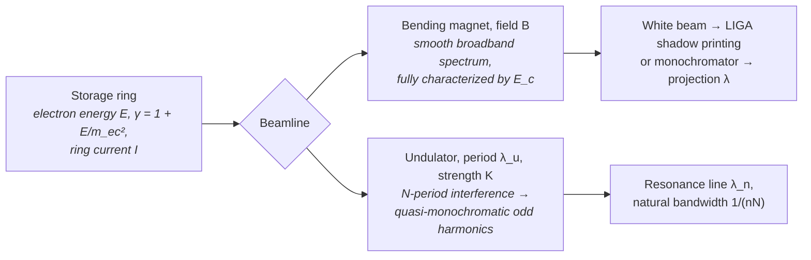

# Synchrotron (Bending Magnet / Undulator)

**Status:** ✅ Implemented — wavelength is *derived* from machine parameters and the physics is fixture-tested; the one documented simplification is a Gaussian undulator line in place of the true sinc² (see [../capability-matrix.md](../capability-matrix.md)).

## Overview

Storage-ring synchrotron radiation spans VUV to hard X-ray with high average power
and sub-percent stability, which is why it anchors two very different lithographic
roles: **bending-magnet white beam** is the canonical exposure source for LIGA deep
X-ray lithography (mm-thick PMMA, aspect ratios > 50), and **undulator beamlines**
provide the quasi-monochromatic, partially coherent EUV used for actinic mask
metrology and resist studies (e.g. the PTB beamlines at BESSY II).

`SynchrotronSource` is highuvlith's **live-physics showcase**: unlike `LpaFelSource`
(where electron energy is documentary) and `XfelSource` (where wavelength is a
set-point), here the wavelength is **computed from electron energy, undulator period,
K, and harmonic** — change the machine and the light changes.

## Generation physics



**Bending magnet.** The spectrum is universal once scaled by the critical energy
(half the radiated power above it, half below):

$$E_c\,[\mathrm{keV}] = 0.665\, E^2\,[\mathrm{GeV^2}]\, B\,[\mathrm{T}]$$

$$S(y) = y \int_y^{\infty} K_{5/3}(x)\,dx, \qquad y = E/E_c$$

$S(y)$ peaks near $y \approx 0.29$ (value ≈ 0.92) and integrates to
$8\pi/(9\sqrt{3}) \approx 1.61$ over $y$.
highuvlith evaluates the $K_{5/3}$ integral with the Kostroun exponential-sum
algorithm (Kostroun, *Nucl. Instrum. Methods* **172**, 371 (1980)):

$$\int_y^{\infty} K_\nu(t)\,dt \approx h\left[\frac{e^{-y}}{2} + \sum_{r\ge1} \frac{e^{-y\cosh(rh)}\cosh(\nu r h)}{\cosh(rh)}\right]$$

which converges double-exponentially; $h = 0.5$ gives ~10⁻¹⁰ accuracy
([`physics::bm_universal_flux`](../../crates/highuvlith-core/src/source_models/physics.rs)).

**Undulator.** On-axis interference over $N$ periods produces odd harmonics at the
resonance wavelength:

$$\lambda_n = \frac{\lambda_u}{2 n \gamma^2}\left(1 + \frac{K^2}{2}\right), \qquad K = 0.09337\, B_0\,[\mathrm{T}]\, \lambda_u\,[\mathrm{mm}]$$

with natural (Fourier-limited) relative bandwidth

$$\frac{\Delta\lambda}{\lambda} = \frac{1}{nN}.$$

## Real-machine parameters

| Machine | E (GeV) | Field / undulator | Output | Lithographic role | Citation |
|---------|---------|-------------------|--------|-------------------|----------|
| KARA (ex-ANKA), KIT | 2.5 | 1.5 T bend | E_c ≈ 6.2 keV white beam | LIGA deep X-ray beamlines (LITHO 1/2/3) | Saile, in *LIGA and its Applications* (Wiley-VCH, 2009) |
| BESSY II (PTB), Berlin | 1.7 | undulator + mono | 13.5 nm, ~0.1 % bw | EUV radiometry, mask/optics metrology | Scholze et al., *Proc. SPIE* **4344**, 402 (2001) |
| ALS, Berkeley | 1.9 | undulator | 13.5 nm coherent fraction | EUV actinic inspection & interference lithography heritage | Naulleau et al., *J. Vac. Sci. Technol. B* **17**, 2997 (1999) |
| Compact EUV ring (model preset) | 0.538 | λ_u = 20 mm, K = 1, N = 100 | 13.5 nm, 1 % natural bw | study point for ring-based EUV illumination | resonance formula, this page |

## Simulation model

[`SynchrotronSource`](../../crates/highuvlith-core/src/source_models/synchrotron.rs)
holds a `SynchrotronBeamline` enum (`BendingMagnet { electron_energy_gev, field_t,
selected_wavelength_nm, mono_bandwidth_pm }` or `Undulator { electron_energy_gev,
period_mm, k, num_periods, harmonic }`) plus `ring_current_ma`, `spectral_samples`,
`illumination`, and `transverse_coherence_fraction`.

- **Wavelength is DERIVED (undulator):** `wavelength_nm()` computes
  $\gamma$ from the ring energy and evaluates the resonance formula via
  `physics::undulator_resonance_nm`. The constructor rejects even/zero harmonics
  (on-axis emission is odd-only) and non-positive machine parameters.
  For bending magnets, the monochromator-selected wavelength is used when the
  source feeds the *projection* pipeline; LIGA ignores it and takes the white beam.
- **CLI 5 % cross-check:** if a TOML config gives both machine parameters *and* an
  explicit `wavelength_nm`, [`config.rs`](../../crates/highuvlith-cli/src/config.rs)
  compares it against the derived resonance value and rejects the config when they
  disagree by more than 5 % — the resonance condition, not the config, owns the
  wavelength.
- **Bandwidth:** the undulator line is $1/(nN)$ of the wavelength; the bending
  magnet uses the monochromator bandwidth. `spectral_weights()` samples a
  **Gaussian** of that width — the true undulator line is sinc²; this is the page's
  one imaging simplification.
- **Pupil:** bending magnets are effectively incoherent (`Conventional`, σ = 0.8,
  coherence 0); undulators get coherence 0.2 mapped to a `CoherentGaussian` pupil
  via the Gaussian–Schell heuristic `sigma_from_coherence` (approximate,
  documented). The aerial engine's `MAX_PUPIL_SAMPLES` guard applies.
- **Quasi-CW:** storage rings run at MHz bunch rates with sub-percent stability, so
  pulse metadata stays `None` and `shot_to_shot_rms()` is 0 — no stochastic dose
  jitter, correctly.

### LIGA coupling

The deep X-ray depth-dose module
([../processes/liga-deep-xray.md](../processes/liga-deep-xray.md)) couples through
`XraySpectrum::from_synchrotron` in
[`deep_xray.rs`](../../crates/highuvlith-core/src/deep_xray.rs), which reads
`critical_energy_kev()` (Some for bending magnets, None for undulators) and then
samples $S(E/E_c)$ via `physics::bm_universal_flux` — the white-beam spectral
shape that LIGA's 1:1 proximity shadow printing integrates over depth. The
source's own `bm_spectral_flux(photon_energy_kev)` evaluates the same
$S(E/E_c)$ for direct callers, but it is **not** on the LIGA call path. LIGA
bypasses the projection pipeline entirely; the critical energy is its whole
interface to the source.

### Presets

**`liga_bending_magnet()`** — 2.5 GeV, 1.5 T (KIT/ANKA-class):

$$E_c = 0.665 \cdot 2.5^2 \cdot 1.5 = 6.234\ \mathrm{keV} \quad (\lambda_c = 0.199\ \mathrm{nm})$$

**`compact_euv_undulator()`** — 538 MeV, λ_u = 20 mm, K = 1, N = 100, n = 1:

$$\gamma = 1 + \tfrac{538}{0.511} = 1053.8, \qquad \lambda_1 = \frac{2\times10^7\ \mathrm{nm} \cdot 1.5}{2 \cdot 1053.8^2} = 13.51\ \mathrm{nm}, \qquad \frac{\Delta\lambda}{\lambda} = \frac{1}{100} = 1\,\%$$

## Model coverage

| Field | Unit | Consumed by | Status |
|-------|------|-------------|--------|
| `BendingMagnet.electron_energy_gev` | GeV | $E_c$ → `critical_energy_kev()` → LIGA via `XraySpectrum::from_synchrotron`; also `bm_spectral_flux()` | live |
| `BendingMagnet.field_t` | T | $E_c$ (same path) | live |
| `BendingMagnet.selected_wavelength_nm` | nm | `wavelength_nm()` for projection imaging | live |
| `BendingMagnet.mono_bandwidth_pm` | pm | `bandwidth_pm()` → spectral weights | live |
| `Undulator.electron_energy_gev` | GeV | γ → derived resonance wavelength | live |
| `Undulator.period_mm` | mm | resonance wavelength | live |
| `Undulator.k` | — | resonance factor $(1 + K^2/2)$ | live |
| `Undulator.num_periods` | — | natural bandwidth $1/(nN)$ | live |
| `Undulator.harmonic` | — | resonance $/n$, bandwidth, odd-only guard | live |
| `ring_current_ma` | mA | nothing in imaging or LIGA; flux documentation only | stored (inert) |
| `spectral_samples` | — | wavelength sample count | live |
| `illumination` | — | `intensity_at()` pupil weighting in the TCC | live |
| `transverse_coherence_fraction` | — | pupil σ at construction (undulator); reported via trait | live (construction-time) |
| sinc² undulator line shape | — | — | planned (Gaussian stand-in today) |

## Usage

Python (factories in [`py_config.rs`](../../crates/highuvlith-py/src/py_config.rs)):

```python
from highuvlith import SourceConfig

# Undulator: wavelength DERIVED from machine parameters.
src = SourceConfig.synchrotron_undulator(
    electron_energy_gev=0.538, period_mm=20.0, k=1.0, num_periods=100, harmonic=1,
)
print(src.wavelength_nm)   # 13.51 — computed, not configured
print(src.bandwidth_pm)    # ~135 (1% natural bandwidth)

# LIGA-class bending magnet (2.5 GeV, 1.5 T, E_c = 6.23 keV).
liga = SourceConfig.synchrotron_liga_bending_magnet()
```

TOML (`[source]` fields from [`config.rs`](../../crates/highuvlith-cli/src/config.rs)):

```toml
[source]
type = "synchrotron"
beamline = "undulator"        # default "undulator"; or "bending_magnet"
electron_energy_gev = 0.538   # default 0.538
period_mm = 20.0              # default 20.0
undulator_k = 1.0             # default 1.0
num_periods = 100             # default 100
harmonic = 1                  # default 1; odd only
ring_current_ma = 200.0
# wavelength_nm = 13.5        # optional: cross-checked against the derived
                              # resonance value; >5% disagreement is an error

# Bending-magnet variant:
# beamline = "bending_magnet"
# electron_energy_gev = 2.5
# field_t = 1.5
# wavelength_nm = 0.2         # monochromator selection (projection use only)
# bandwidth_pm = 0.2
```

## Validation

In [`synchrotron.rs`](../../crates/highuvlith-core/src/source_models/synchrotron.rs):
`test_undulator_wavelength_is_derived` (13.5 nm from 538 MeV; doubling energy
quarters λ), `test_undulator_natural_bandwidth` (exactly 1/(nN)),
`test_even_harmonic_rejected`, `test_liga_bending_magnet_critical_energy`
(6.234 keV; flux peaks below E_c and vanishes far above),
`test_undulator_has_no_bm_spectrum`, `test_spectral_weights_sum_to_one`,
`test_undulator_coherent_gaussian_pupil`. In
[`physics.rs`](../../crates/highuvlith-core/src/source_models/physics.rs):
`test_undulator_resonance_fixture`,
`test_undulator_resonance_scales_inverse_gamma_squared`,
`test_undulator_k_fixture` (K = 1.867 at 1 T / 20 mm),
`test_critical_energy_fixture`, `test_bm_universal_flux_peak`
(y ≈ 0.29, S ≈ 0.92), and `test_bm_universal_flux_asymptotes`
($S \to 2.1495\,y^{1/3}$ as $y \to 0$).

## References

1. V. O. Kostroun, "Simple numerical evaluation of modified Bessel functions of fractional order," *Nucl. Instrum. Methods* **172**, 371 (1980).
2. K.-J. Kim, "Characteristics of synchrotron radiation," *AIP Conf. Proc.* **184**, 565 (1989).
3. J. A. Clarke, *The Science and Technology of Undulators and Wigglers* (Oxford Univ. Press, 2004).
4. V. Saile et al. (eds.), *LIGA and its Applications*, Advanced Micro & Nanosystems vol. 7 (Wiley-VCH, 2009).
5. F. Scholze et al., "New PTB soft X-ray radiometry beamline at BESSY II," *Proc. SPIE* **4344**, 402 (2001).
6. P. Naulleau et al., "Extreme-ultraviolet interferometry at the Advanced Light Source," *J. Vac. Sci. Technol. B* **17**, 2997 (1999).
