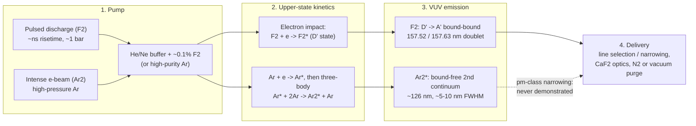

# VUV Excimer Sources (F₂ 157.63 nm / Ar₂ 126 nm)

**Status:** ✅ Implemented — the F₂ line shape, pupil fill, pulse-metadata power arithmetic and derived photon budget are live and test-pinned; the Ar₂ 126 nm preset is a 🧪 hypothetical (126 nm lithography never progressed beyond laboratory discussion and a pm-class line-narrowed Ar₂ laser has never been built), and excimer coherence/dose jitter keep the trait defaults (0).

## Overview

VUV lithography (120–160 nm) is the deepest optical regime reachable with
refractive projection optics, and it is the framework's founding use case. The
F₂ molecular fluorine laser at 157.63 nm was the industry's post-193 nm
candidate until 2003, when water-immersion ArF displaced it; the Ar₂ excimer at
126 nm marks the practical short end of transmissive optics — as a what-if
only: 126 nm lithography never progressed beyond laboratory discussion. The
longer-wavelength heritage sources that share this source model (mercury
g/h/i lamp lines, KrF 248 nm, ArF 193 nm) are documented on
[duv-heritage.md](./duv-heritage.md). Why the VUV regime is hard — and why the
simulator must treat it specially:

- **CaF₂-only optics** — at 157 nm every lens element is CaF₂ (at 193 nm only
  a small fraction is), no second lens material exists for achromatization,
  so laser bandwidth turns directly into axial chromatic blur. Polychromatic
  simulation is not optional at 157 nm; it is the point. CaF₂ also turned out
  to be intrinsically birefringent at 157 nm (Burnett, Levine & Shirley,
  *Phys. Rev. B* **64**, 241102(R) (2001)) — a problem the lens makers solved
  by combining ⟨100⟩- and ⟨111⟩-oriented elements, at the cost of what was
  reported as a year's delay.
- **Vacuum / purge environment** — O₂ (and H₂O) absorb strongly at 157 nm
  (the O₂ Schumann–Runge continuum lies below ~185 nm), so every beam path
  needs vacuum or N₂ purge, and no organic pellicle proved workable (hard
  fused-silica pellicles were pursued instead).
- **Fluoropolymer resists** — conventional 193/248 nm resists are opaque at
  157 nm; fluorinated backbones with very low Dill A and moderate Dill B are
  required.
- **7.9 eV photon energy** — photochemistry differs qualitatively from
  6.4 eV at 193 nm: more bond-scission channels, different PAG behavior.
- **Steep CaF₂ dispersion** — dn/dλ grows rapidly near the absorption edge,
  making chromatic effects severe even at pm-class bandwidths.

## Generation physics

Both lasers are pulsed gas-discharge devices, but the emitting species differ:
F₂ lases on a **bound–bound** molecular transition (a narrow doublet), while
Ar₂* is a true excimer whose ground state is repulsive (a broad continuum).



Photon energy follows directly from the wavelength:

```math
E_\gamma = \frac{hc}{\lambda} = \frac{1239.84\ \text{eV·nm}}{157.63\ \text{nm}} = 7.87\ \text{eV},
\qquad
\frac{1239.84}{126.0} = 9.84\ \text{eV}
```

The Ar₂* channel relies on three-body excimer formation,
$\mathrm{Ar}^* + 2 \mathrm{Ar} \rightarrow \mathrm{Ar}_2^* + \mathrm{Ar}$,
followed by radiative decay onto the repulsive ground state — population
inversion is automatic because the lower state dissociates in ~ps, but the
emission is a broad continuum (~5–10 nm FWHM), unlike the F₂ doublet.

### Why the Ar₂ preset is hypothetical

No lithography use of 126 nm light has been found: the Ar₂ route never
progressed beyond laboratory discussion. Laser action on the Ar₂* second
continuum has only been demonstrated with intense relativistic electron-beam
pumping of high-pressure argon, as a broad, low-repetition-rate emitter. Discharge- and barrier-pumped Ar₂* sources are
incoherent excimer *lamps*. A kHz, mJ-class Ar₂ laser line-narrowed from a
~5–10 nm continuum to **5 pm** (the `ar2_laser` preset) — a narrowing factor
of order 10³ — has never been built. The preset is therefore a what-if for
imaging studies at 126 nm, and the model says so: its `relative_bandwidth`
derived quantity carries that caveat, and it reports `demonstrated = 0`. The
F₂ preset, by contrast, describes a real line-selected lithography laser.

### History (verified)

- **Excimer lasers.** The first excimer laser was Xe₂ (e-beam-excited liquid
  Xe, ~172–176 nm; Lebedev Institute, 1970; Basov, Danilychev & Popov,
  *Sov. J. Quantum Electron.* **1**, 18 (1971)). KrF first lased on
  5 June 1975 (Ewing & Brau, *Appl. Phys. Lett.* **27**, 350 (1975), with XeCl);
  ArF laser action at 193 nm followed in 1976 (Hoffman, Hays & Tisone,
  *Appl. Phys. Lett.* **28**, 538 (1976)).
- **Excimer lithography.** First proposed and demonstrated by Jain, Willson &
  Lin, *IEEE Electron Device Lett.* **3**, 53 (1982) (XeCl 308 nm and KrF
  248 nm, about 100× faster than lamp exposure). The KrF and ArF generations
  that followed are summarized on [duv-heritage.md](./duv-heritage.md).
- **157 nm.** MIT Lincoln Laboratory demonstrated 157 nm F₂-laser lithography
  with features down to 80 nm (Bloomstein et al., *J. Vac. Sci. Technol. B*
  **15**, 2112 (1997)). The industry program that followed in the late 1990s
  (targeting ~65 nm, per Ronse's review) reached step-and-scan hardware — Bruning's history lists
  an F₂ Micrascan VII at NA 0.75 (2003) — but Intel dropped 157 nm from its
  roadmap in May 2003, TSMC cancelled its 157 nm orders on 14 October 2003
  and backed water immersion, and 157 nm work stopped in 2004 (Ronse, 2006).
  Water (n ≈ 1.44) gives 193 nm light an effective wavelength of ~134 nm
  (immersion analysis: Switkes & Rothschild, *J. Vac. Sci. Technol. B* **19**,
  2353 (2001)).

## Real-machine parameters

| Parameter | F₂ (lithography-class; preset) | Ar₂* (as demonstrated) | Ar₂ preset (🧪 hypothetical) |
|-----------|--------------------------------|------------------------|------------------------------|
| Wavelength | 157.63 nm (strong line of the 157.52/157.63 nm doublet) [1] | ~126 nm second-continuum center [3] | 126.0 nm |
| Photon energy | 7.87 eV | 9.84 eV | 9.84 eV |
| Bandwidth | ~1 pm (single line, line-selected); preset 1.1 pm | ~5–10 nm continuum | 5 pm (never demonstrated) |
| Pumping | pulsed electric discharge | intense e-beam (lasing); discharge / DBD (lamps) | assumed discharge-class |
| Pulse energy × rep rate | preset 10 mJ × 4 kHz | — (no rep-rated laser) | preset 5 mJ × 1 kHz |
| Average power | preset 40 W | — | preset 5 W |
| Coherence | Low (highly multimode) | Low | Low |

[1] T. M. Bloomstein, M. W. Horn, M. Rothschild, R. R. Kunz, S. T. Palmacci,
R. B. Goodman, "Lithography with 157 nm lasers," *J. Vac. Sci. Technol. B* **15**,
2112 (1997), doi:10.1116/1.589230. [2] V. N. Ishchenko, S. A. Kochubei, A. M. Razhev, "High-power
efficient vacuum ultraviolet F₂ laser," *Sov. J. Quantum Electron.* (1986).
[3] U. Kogelschatz, "Dielectric-barrier discharges," *Plasma Chem. Plasma
Process.* **23**, 1 (2003) (rare-gas excimer continua).

## Simulation model

`VuvSource` in [`crates/highuvlith-core/src/source.rs`](../../crates/highuvlith-core/src/source.rs):

```rust
pub struct VuvSource {
    pub wavelength_nm: f64,        // 157.63 (F2) or 126.0 (Ar2, hypothetical)
    pub bandwidth_pm: f64,         // FWHM; 1.1 pm F2 preset, 5.0 pm Ar2 preset
    pub spectral_samples: usize,   // polychromatic sampling points
    pub spectral_shape: SpectralShape, // Lorentzian (default) | Gaussian | Tabulated | SincSquared
    pub pulse_energy_mj: f64,
    pub rep_rate_hz: f64,
    pub illumination: IlluminationShape, // Conventional | Annular | Quadrupole | Dipole | CoherentGaussian
}
```

`VuvSource` deliberately gained **no new fields** in the source-physics
overhaul: struct literals in the CLI, GUI, Python bindings and imaging tests
construct it directly, so everything new is *derived* from the existing
fields (see [Derived quantities](#derived-quantities)).

Factories: `VuvSource::f2_laser(sigma)` (157.63 nm, 1.1 pm, 10 mJ, 4 kHz) and
`VuvSource::ar2_laser(sigma)` (126.0 nm, 5.0 pm, 5 mJ, 1 kHz — hypothetical,
see above); both validate σ ∈ (0, 1]. The same struct also carries the
heritage presets `arf_laser`, `krf_laser`, `hg_i_line`, `hg_h_line` and
`hg_g_line` ([duv-heritage.md](./duv-heritage.md)).

**Continuous-wave convention.** `rep_rate_hz = 0` marks a CW source (the
mercury-lamp presets): `pulse_energy_j()` and `rep_rate_hz()` then return
`None`, so `average_power_w()` is `None` and no pulse-derived quantities are
reported. Pulsed configurations (F₂, Ar₂, KrF, ArF) behave exactly as before.

**How it satisfies `LithographySource`.** Spectral weights come from the shared
`evaluate_spectral_weights` helper: N samples over λ₀ ± 2.5 Δλ_FWHM weighted by
the line shape and normalized to sum to 1. The Lorentzian default matches
excimer line profiles:

```math
w(\lambda) \;\propto\; \frac{\gamma^2}{(\lambda-\lambda_0)^2 + \gamma^2},
\qquad \gamma = \tfrac{1}{2}\,\Delta\lambda_{\mathrm{FWHM}}
```

`intensity_at` delegates to the shared `evaluate_illumination` — binary
(top-hat) fills for conventional/annular/quadrupole/dipole shapes.
`pulse_energy_j` and `rep_rate_hz` feed the trait's `average_power_w`
(10 mJ × 4 kHz = 40 W for the F₂ preset — live arithmetic), which is also the
input of the dose-limited throughput model (`source_models::throughput`).

**Assumptions (stated honestly):**

- Excimer beams are highly multimode, so `transverse_coherence()` keeps the
  trait default 0 — correct physics, represented by a wide binary pupil fill
  (σ is your model choice, typically 0.5–0.8).
- `shot_to_shot_rms()` also keeps the default 0: real excimer dose jitter
  (~1 %) is **not** modeled. Set `StochasticParams::dose_jitter_rms` manually
  if you need it.
- The Ar₂ preset's 5 pm bandwidth represents a **hypothetical line-narrowed**
  beam, not the real ~5–10 nm second continuum. Use `SpectralShape::Tabulated`
  with a measured spectrum to model a broadband Ar₂* lamp (and expect severe
  chromatic blur through CaF₂).
- Only the 157.63 nm line of the F₂ doublet is modeled (single-line source).
- Imaging is scalar by default (vector TE/TM imaging is available, see
  [vector-imaging.md](../vector-imaging.md)); the narrow-band polychromatic path
  shifts focus per spectral sample with the kernels built at the center
  wavelength — honest at Δλ/λ ≈ 7×10⁻⁶ (F₂), where only the chromatic focus
  term matters (`compute_multiwavelength` is the exact per-wavelength sum).

## Derived quantities

`derived_quantities()` (Rust trait method; Python
`SourceConfig.derived_quantities()` / `derived_quantity(name)`; printed by
`highuvlith simulate`) reports physics computed from the stored fields. These
values are informational — the imaging pipeline never reads them.

| Name | Unit | Meaning | F₂ preset | Ar₂ preset |
|------|------|---------|-----------|------------|
| `photon_energy` | eV | hc/λ (the note names the line) | 7.866 | 9.840 |
| `relative_bandwidth` | — | Δλ_FWHM/λ (Ar₂ band: carries the "never demonstrated" caveat) | 6.98×10⁻⁶ | 3.97×10⁻⁵ |
| `e95_bandwidth` | pm | width holding 95 % of the line energy for the configured shape (the vendor convention) | 13.98 | 63.5 |
| `coherence_length` | µm | longitudinal coherence length λ²/Δλ | 22 588 (2.26 cm) | 3 175 |
| `photons_per_mj` | photons | 1 mJ / (hc/λ) | 7.935×10¹⁴ | 6.343×10¹⁴ |
| `photon_density_per_dose` | photons/nm² per mJ/cm² | incident photons per nm² at 1 mJ/cm² | 7.935 | 6.343 |
| `photons_vs_13nm5` | — | photons per unit dose relative to 13.5 nm EUV (λ/13.5 nm) | 11.68 | 9.33 |
| `photons_per_pulse` | photons | pulse energy / photon energy | 7.94×10¹⁵ | 3.17×10¹⁵ |
| `average_power` | W | pulse energy × rep rate (laser output) | 40 | 5 |
| `photon_rate` | photons/s | average power / photon energy | 3.17×10¹⁹ | 3.17×10¹⁸ |
| `demonstrated` | bool | only in the Ar₂* band (120–132 nm): 0 = no line-narrowed Ar₂ lithography laser exists | — | 0 |
| `continuous_wave` | bool | only for CW sources (`rep_rate_hz = 0`, the Hg lamps); replaces the pulse rows | — | — |

The F₂ and Ar₂ presets keep the legacy **Lorentzian** line, whose heavy tails
make E95 = 12.7 × FWHM (13.98 pm for the 1.1 pm F₂ line); real line-narrowed
spectra fall between a Gaussian (E95 = 1.66 × FWHM) and a Lorentzian, which is
why the ArF/KrF heritage presets use a Gaussian line.

**Throughput context.** `SourceConfig.wafer_throughput(...)` turns
`average_power_w` into a first-order dose-limited wafers/hour figure (🔶; all
scanner numbers are illustrative assumptions). For the F₂ preset through a
refractive-like scanner (`optics_transmission=0.30, mask_efficiency=0.90,
slit_height_mm=8.0`) at 30 mJ/cm²: 10.8 W reach the wafer, the dose-limited
scan speed is 1.38 m/s (faster than real stages — pass `max_scan_speed_mm_s`
to cap it), the model gives ~172 wafers/h (overhead-dominated), each exposure
point integrates ~23 pulses, and a (45 nm)² area receives ~4.8×10⁵ photons
(0.14 % shot noise).

## Model coverage

| Field | Unit | Consumed by | Status |
|-------|------|-------------|--------|
| `wavelength_nm` | nm | TCC pupil scaling, photon energy/density, resist exposure, derived photon budget | live |
| `bandwidth_pm` | pm FWHM | Polychromatic sampling range; chromatic defocus span; `relative_bandwidth`, `coherence_length` | live |
| `spectral_samples` | count | Number of polychromatic samples | live |
| `spectral_shape` | enum | Line-shape weighting (Lorentzian/Gaussian/Tabulated/SincSquared) | live |
| `pulse_energy_mj` | mJ | `pulse_energy_j()` → `average_power_w()` → throughput; `photons_per_pulse` | live |
| `rep_rate_hz` | Hz | `average_power_w()`; throughput pulses per exposure point; `0` marks a CW source (pulse metadata `None`) | live |
| `illumination` | enum | Pupil `intensity_at` during TCC construction | live |
| — coherence / jitter | — | Trait defaults (0); excimer jitter model | planned |
| — Ar₂ continuum / line-narrowing physics | — | not modeled (preset is a hypothetical narrow line) | planned |

## Usage

Python ([factory names from `py_config.rs`](../../crates/highuvlith-py/src/py_config.rs)):

<!-- verify-example -->
```python
import highuvlith as huv

f2  = huv.SourceConfig.f2_laser(sigma=0.7)     # 157.63 nm preset
ar2 = huv.SourceConfig.ar2_laser(sigma=0.7)    # 126.0 nm preset (hypothetical)
# Custom VUV source (constructor defaults to the F2 parameter set):
custom = huv.SourceConfig(wavelength_nm=146.9, sigma_outer=0.6,
                          bandwidth_pm=2.0, spectral_samples=7)
print(f2.kind, f2.wavelength_nm, f2.average_power_w)  # vuv 157.63 40.0

print(f2.derived_quantity("photons_per_pulse"))   # 7.94e15
print(ar2.derived_quantity("demonstrated"))       # 0.0
for name, value, unit, note in f2.derived_quantities():
    print(f"{name:20s} {value:12.4g} {unit}")

tp = f2.wafer_throughput(dose_mj_cm2=30.0, optics_transmission=0.30,
                         mask_efficiency=0.90, slit_height_mm=8.0, cd_nm=45.0)
print(tp["wafers_per_hour"], tp["pulses_per_point"])   # ~172, ~23
```

??? success "Output"

    ```text
    vuv 157.63 40.0
    7935278293155081.0
    0.0
    photon_energy               7.866 eV
    relative_bandwidth      6.978e-06 -
    e95_bandwidth               13.98 pm
    coherence_length        2.259e+04 um
    photons_per_mj          7.935e+14 photons
    photon_density_per_dose        7.935 photons/nm^2 per mJ/cm^2
    photons_vs_13nm5            11.68 -
    photons_per_pulse       7.935e+15 photons
    average_power                  40 W
    photon_rate             3.174e+19 photons/s
    172.35326034917495 23.111111111111107
    ```

TOML ([field names from `highuvlith-cli/src/config.rs`](../../crates/highuvlith-cli/src/config.rs)) —
omitting `type` defaults to `"vuv"` for back-compat with pre-LPA-FEL configs:

```toml
[source]
# type = "vuv"        # optional; absent tag means VUV
wavelength_nm = 157.63
sigma = 0.7
bandwidth_pm = 1.1
rep_rate_hz = 4000.0  # optional; pulse energy is fixed at the 10 mJ preset
```

Without `preset`, the CLI arm consumes `wavelength_nm`, `sigma`,
`bandwidth_pm`, and `rep_rate_hz`; `spectral_samples` (5) and
`pulse_energy_mj` (10) are fixed (the legacy explicit-wavelength source,
unchanged). With `preset = "f2" | "ar2" | "arf" | "krf" | "hg_i" | "hg_h" |
"hg_g"` the preset is built and explicit `wavelength_nm` / `bandwidth_pm` /
`rep_rate_hz` override it:

```toml
[source]
type   = "vuv"
preset = "f2"          # the F2 preset; "ar2" is the hypothetical 126 nm laser
sigma  = 0.7
```

`highuvlith simulate` prints the derived quantities above (and writes them
into its JSON output).

## Validation

`#[test]` functions in `source.rs` that pin this model:

- `test_f2_laser_wavelength`, `test_ar2_laser_wavelength` — preset wavelengths.
- `test_photon_energy_ev` — F₂ photon energy ≈ 7.9 eV via hc/λ.
- `test_spectral_weights_sum_to_one`, `test_spectral_weights_centered` —
  normalization and peak-at-center of the Lorentzian sampling.
- `test_conventional_source_inside`, `test_conventional_source_outside` —
  binary pupil fill boundary.
- `test_invalid_sigma_rejected` — σ validation (0, negative, NaN).
- `test_pulse_metadata_live_through_trait` — 10 mJ × 4 kHz → 40 W, coherence 0.
- `test_vuv_derived_quantities` — photons per pulse (7.935×10¹⁵, scipy
  fixture), photon rate, coherence length 22 588 µm, and the Ar₂
  `demonstrated = 0` flag with its bandwidth caveat (absent for F₂).
- `test_e95_bandwidth_conventions` — E95/FWHM = 1.6646 (Gaussian),
  12.706 (Lorentzian), 4.680 (sinc²) and a tabulated spectrum;
  `test_hg_lamps_are_cw_single_sample` — the `rep_rate_hz = 0` CW convention
  (pulse metadata and average power `None`, pulsed F₂ unaffected);
  `test_heritage_presets_photon_budget` — the heritage presets sharing this
  struct.
- `test_every_family_reports_derived_quantities` — every family (incl. VUV)
  reports finite, documented quantities and `photon_energy` = hc/λ.
- `test_source_kind_trait_dispatch`, `test_source_kind_toml_roundtrip` —
  type-erased dispatch and `type = "vuv"` serde tag.

Also: `source_models::throughput` tests (`test_photons_per_square_fixture`,
`test_throughput_scaling_limits`) pin the throughput/shot-noise helpers;
Python `tests/python/test_sources_physics.py::TestVuv` checks the photon
budget and the Ar₂ flag through the bindings. CLI-side:
`test_toml_back_compat_without_type_tag` (absent tag → VUV) and
`test_vuv_heritage_presets` (the `preset` field, overrides, and the unchanged
legacy no-preset path).

## References

1. T. M. Bloomstein et al., "Lithography with 157 nm lasers," *J. Vac. Sci.
   Technol. B* **15**, 2112 (1997), doi:10.1116/1.589230.
2. V. N. Ishchenko, S. A. Kochubei, A. M. Razhev, "High-power efficient vacuum
   ultraviolet F₂ laser," *Sov. J. Quantum Electron.* (1986).
3. U. Kogelschatz, "Dielectric-barrier discharges: their history, discharge
   physics, and industrial applications," *Plasma Chem. Plasma Process.* **23**,
   1 (2003) — rare-gas excimer emission.
4. Basov, Danilychev & Popov, *Sov. J. Quantum Electron.* **1**, 18 (1971),
   doi:10.1070/QE1971v001n01ABEH003011 — the Xe₂ excimer laser.
5. Ewing & Brau, *Appl. Phys. Lett.* **27**, 350 (1975) — KrF and XeCl lasers;
   Hoffman, Hays & Tisone, *Appl. Phys. Lett.* **28**, 538 (1976) — ArF.
6. Jain, Willson & Lin, *IEEE Electron Device Lett.* **3**, 53 (1982),
   doi:10.1109/EDL.1982.25476 — excimer-laser lithography.
7. Burnett, Levine & Shirley, *Phys. Rev. B* **64**, 241102(R) (2001),
   doi:10.1103/PhysRevB.64.241102 — intrinsic birefringence of CaF₂.
8. Switkes & Rothschild, *J. Vac. Sci. Technol. B* **19**, 2353 (2001),
   doi:10.1116/1.1412895 — immersion lithography.
9. Ronse, *C. R. Physique* **7**, 844 (2006), doi:10.1016/j.crhy.2006.10.007 —
   review of optical lithography including the end of 157 nm (open access).
10. J. H. Bruning, "Optical Lithography … 40 years and holding," *Proc. SPIE*
    **6520**, 652004 (2007).
11. Materials context: [../capability-matrix.md](../capability-matrix.md) —
    the VUV tabulated n,k database (126–160 nm) is the mature part of the
    materials layer. Heritage sources: [duv-heritage.md](./duv-heritage.md).
