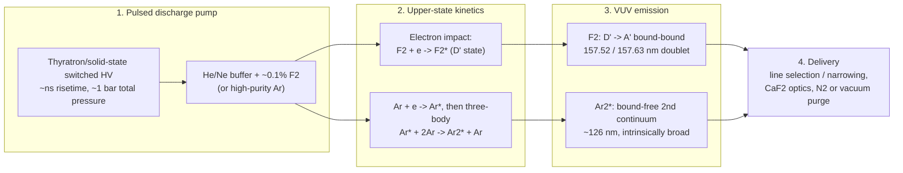

# VUV Excimer Sources (F₂ 157.63 nm / Ar₂ 126 nm)

**Status:** ✅ Implemented — spectral line shape, pupil fill, and pulse-metadata power arithmetic are live and test-pinned; coherence and shot-to-shot jitter use the trait defaults (0), i.e. excimer multimode incoherence is represented, excimer dose jitter is not modeled.

## Overview

VUV lithography (120–160 nm) is the deepest optical regime reachable with
refractive projection optics, and it is the framework's founding use case. The
F₂ molecular fluorine laser at 157.63 nm was the industry's post-193 nm
candidate before EUV won; the Ar₂ excimer at 126 nm marks the practical short
end of transmissive optics. Why the regime is hard — and why the simulator
must treat it specially:

- **CaF₂-only optics** — no second lens material exists for achromatization,
  so laser bandwidth turns directly into axial chromatic blur. Polychromatic
  simulation is not optional at 157 nm; it is the point.
- **Vacuum / purge environment** — O₂ absorbs strongly below 185 nm
  (Schumann–Runge continuum), so every beam path needs vacuum or N₂ purge, and
  no organic pellicle survives.
- **Fluoropolymer resists** — conventional 193/248 nm resists are opaque at
  157 nm; fluorinated backbones with very low Dill A and moderate Dill B are
  required.
- **7.9 eV photon energy** — photochemistry differs qualitatively from
  6.4 eV at 193 nm: more bond-scission channels, different PAG behavior.
- **Steep CaF₂ dispersion** — dn/dλ grows rapidly near the absorption edge,
  making chromatic effects severe even at pm-class bandwidths.

## Generation physics

Both lasers are pulsed gas-discharge devices, but the emitting species differ:
F₂ lases on a **bound–bound** molecular transition (a narrow doublet), while
Ar₂* is a true excimer whose ground state is repulsive (a broad continuum).



Photon energy follows directly from the wavelength:

$$
E_\gamma = \frac{hc}{\lambda} = \frac{1239.84\ \text{eV·nm}}{157.63\ \text{nm}} = 7.87\ \text{eV},
\qquad
\frac{1239.84}{126.0} = 9.84\ \text{eV}
$$

The Ar₂* channel relies on three-body excimer formation,
$\mathrm{Ar}^* + 2\,\mathrm{Ar} \rightarrow \mathrm{Ar}_2^* + \mathrm{Ar}$,
followed by radiative decay onto the repulsive ground state — population
inversion is automatic because the lower state dissociates in ~ps, but the
emission is a broad continuum (several nm FWHM), unlike the F₂ doublet.

## Real-machine parameters

| Parameter | F₂ (lithography-class) | Ar₂ (research-class) | Citation |
|-----------|------------------------|----------------------|----------|
| Wavelength | 157.63 nm (strong line of the 157.52/157.63 doublet) | ~126 nm (second-continuum center) | [1], [3] |
| Photon energy | 7.87 eV | 9.84 eV | hc/λ |
| Bandwidth | ~1 pm line-narrowed (litho); ~1 nm free-running | ~5–10 nm raw continuum | [1], [2] |
| Pulse energy | ~10 mJ | ~mJ (e-beam / discharge pumped) | [2] |
| Rep rate | 1–4 kHz | ≲1 kHz | [2] |
| Pulse duration | ~20 ns | ~10 ns | [2] |
| Average power | 10–40 W | ~W | E × f |
| Coherence | Low (highly multimode) | Low | [2] |

[1] T. M. Bloomstein, M. W. Horn, M. Rothschild, R. R. Kunz, S. T. Palmacci,
R. B. Goodman, "Lithography with 157 nm lasers," *J. Vac. Sci. Technol. B* **15**,
2112 (1997). [2] V. N. Ishchenko, S. A. Kochubei, A. M. Razhev, "High-power
efficient vacuum ultraviolet F₂ laser," *Sov. J. Quantum Electron.* **16**, 707
(1986). [3] U. Kogelschatz, "Dielectric-barrier discharges," *Plasma Chem.
Plasma Process.* **23**, 1 (2003) (rare-gas excimer continua).

## Simulation model

`VuvSource` in [`crates/highuvlith-core/src/source.rs`](../../crates/highuvlith-core/src/source.rs):

```rust
pub struct VuvSource {
    pub wavelength_nm: f64,        // 157.63 (F2) or 126.0 (Ar2)
    pub bandwidth_pm: f64,         // FWHM; 1.1 pm F2 preset, 5.0 pm Ar2 preset
    pub spectral_samples: usize,   // polychromatic sampling points
    pub spectral_shape: SpectralShape, // Lorentzian (default) | Gaussian | Tabulated
    pub pulse_energy_mj: f64,
    pub rep_rate_hz: f64,
    pub illumination: IlluminationShape, // Conventional | Annular | Quadrupole | Dipole | CoherentGaussian
}
```

Factories: `VuvSource::f2_laser(sigma)` (157.63 nm, 1.1 pm, 10 mJ, 4 kHz) and
`VuvSource::ar2_laser(sigma)` (126.0 nm, 5.0 pm, 5 mJ, 1 kHz); both validate
σ ∈ (0, 1].

**How it satisfies `LithographySource`.** Spectral weights come from the shared
`evaluate_spectral_weights` helper: N samples over λ₀ ± 2.5 Δλ_FWHM weighted by
the line shape and normalized to sum to 1. The Lorentzian default matches
excimer line profiles:

$$
w(\lambda) \;\propto\; \frac{\gamma^2}{(\lambda-\lambda_0)^2 + \gamma^2},
\qquad \gamma = \tfrac{1}{2}\,\Delta\lambda_{\mathrm{FWHM}}
$$

`intensity_at` delegates to the shared `evaluate_illumination` — binary
(top-hat) fills for conventional/annular/quadrupole/dipole shapes.
`pulse_energy_j` and `rep_rate_hz` feed the trait's `average_power_w`
(10 mJ × 4 kHz = 40 W for the F₂ preset — live arithmetic).

**Assumptions (stated honestly):**

- Excimer beams are highly multimode, so `transverse_coherence()` keeps the
  trait default 0 — correct physics, represented by a wide binary pupil fill
  (σ is your model choice, typically 0.5–0.8).
- `shot_to_shot_rms()` also keeps the default 0: real excimer dose jitter
  (~1 %) is **not** modeled. Set `StochasticParams::dose_jitter_rms` manually
  if you need it.
- The Ar₂ preset's 5 pm bandwidth represents a **line-narrowed/monochromatized
  beam**, not the raw ~nm-wide second continuum. Use
  `SpectralShape::Tabulated` with a measured spectrum for a broadband lamp.
- Only the 157.63 nm line of the F₂ doublet is modeled (single-line source).
- Imaging is scalar diffraction; polychromatic imaging shifts focus per
  spectral sample with the TCC built at the center wavelength — honest at
  Δλ/λ ≈ 7×10⁻⁶ (F₂), where only the chromatic focus term matters.

## Model coverage

| Field | Unit | Consumed by | Status |
|-------|------|-------------|--------|
| `wavelength_nm` | nm | TCC pupil scaling, photon energy/density, resist exposure | live |
| `bandwidth_pm` | pm FWHM | Polychromatic sampling range; chromatic defocus span | live |
| `spectral_samples` | count | Number of polychromatic samples | live |
| `spectral_shape` | enum | Line-shape weighting (Lorentzian/Gaussian/Tabulated) | live |
| `pulse_energy_mj` | mJ | `pulse_energy_j()` → `average_power_w()` | live |
| `rep_rate_hz` | Hz | `average_power_w()` | live |
| `illumination` | enum | Pupil `intensity_at` during TCC construction | live |
| — coherence / jitter | — | Trait defaults (0); excimer jitter model | planned |

## Usage

Python ([factory names from `py_config.rs`](../../crates/highuvlith-py/src/py_config.rs)):

```python
import highuvlith as huv

f2  = huv.SourceConfig.f2_laser(sigma=0.7)     # 157.63 nm preset
ar2 = huv.SourceConfig.ar2_laser(sigma=0.7)    # 126.0 nm preset
# Custom VUV source (constructor defaults to the F2 parameter set):
custom = huv.SourceConfig(wavelength_nm=146.9, sigma_outer=0.6,
                          bandwidth_pm=2.0, spectral_samples=7)
print(f2.kind, f2.wavelength_nm, f2.average_power_w)  # vuv 157.63 40.0
```

TOML ([field names from `highuvlith-cli/src/config.rs`](../../crates/highuvlith-cli/src/config.rs)) —
omitting `type` defaults to `"vuv"` for back-compat with pre-LPA-FEL configs:

```toml
[source]
# type = "vuv"        # optional; absent tag means VUV
wavelength_nm = 157.63
sigma = 0.7
bandwidth_pm = 1.1
rep_rate_hz = 4000.0  # optional; pulse energy is fixed at the 10 mJ preset
```

Note: the CLI arm consumes `wavelength_nm`, `sigma`, `bandwidth_pm`, and
`rep_rate_hz`; `spectral_samples` (5) and `pulse_energy_mj` (10) are fixed at
preset values from TOML.

## Validation

`#[test]` functions in `source.rs` that pin this model:

- `test_f2_laser_wavelength`, `test_ar2_laser_wavelength` — preset wavelengths.
- `test_photon_energy_ev` — F₂ photon energy ≈ 7.9 eV via hc/λ.
- `test_spectral_weights_sum_to_one`, `test_spectral_weights_centered` —
  normalization and peak-at-center of the Lorentzian sampling.
- `test_conventional_source_inside`, `test_conventional_source_outside` —
  binary pupil fill boundary.
- `test_invalid_sigma_rejected` — σ validation (0, negative, NaN).
- `test_pulse_metadata_live_through_trait` — 10 mJ × 4 kHz → 40 W, coherence 0.
- `test_source_kind_trait_dispatch`, `test_source_kind_toml_roundtrip` —
  type-erased dispatch and `type = "vuv"` serde tag.

CLI-side: `test_toml_back_compat_without_type_tag` (absent tag → VUV).

## References

1. T. M. Bloomstein et al., "Lithography with 157 nm lasers," *J. Vac. Sci.
   Technol. B* **15**, 2112 (1997).
2. R. R. Kunz et al., "Outlook for 157-nm resist design," *J. Vac. Sci.
   Technol. B* **17**, 3267 (1999) — fluoropolymer resist constraints.
3. V. N. Ishchenko, S. A. Kochubei, A. M. Razhev, "High-power efficient vacuum
   ultraviolet F₂ laser," *Sov. J. Quantum Electron.* **16**, 707 (1986).
4. U. Kogelschatz, "Dielectric-barrier discharges: their history, discharge
   physics, and industrial applications," *Plasma Chem. Plasma Process.* **23**,
   1 (2003) — rare-gas excimer emission.
5. Materials context: [../capability-matrix.md](../capability-matrix.md) —
   the VUV tabulated n,k database (126–160 nm) is the mature part of the
   materials layer.
