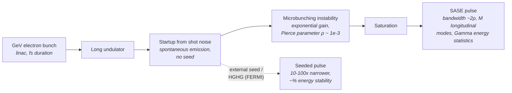

# X-ray Free-Electron Laser (XFEL: SASE / Seeded)

**Status:** ✅ Implemented — SASE bandwidth, longitudinal-mode statistics, and the resulting shot-to-shot dose jitter are live physics; the default spectrum is the ensemble average, honest for multi-shot exposures (see [../capability-matrix.md](../capability-matrix.md)).

## Overview

Linac-driven free-electron lasers (FLASH, FERMI, LCLS, European XFEL, SwissFEL)
deliver femtosecond pulses of extreme peak power from the EUV to hard X-rays. For
lithography their interest is twofold: single-shot full-field exposure studies
(one µJ-class pulse can expose a field), and — the part highuvlith models
end-to-end — **statistics**. A SASE FEL starts from electron shot noise, so both
its spectrum and its pulse energy fluctuate shot to shot; that pulse-energy jitter
propagates directly into dose jitter and hence LER/LWR. `XfelSource` computes the
fluctuation magnitude from first principles and feeds it to the stochastic module,
making it the live counterexample to sources whose pulse metadata is merely stored.

Deliberate contrast with [./synchrotron.md](./synchrotron.md): XFEL undulators are
gap-tunable and operators dial a photon energy, so `wavelength_nm` here is an
honest **set-point**, not a derived quantity.

## Generation physics



SASE (self-amplified spontaneous emission) amplifies the noise within the FEL gain
bandwidth, set by the Pierce parameter $\rho$:

$$\frac{\Delta\lambda}{\lambda} \simeq 2\rho$$

The pulse is a train of temporally coherent spikes of duration
$t_{\mathrm{coh}}$; a pulse of duration $T$ contains

$$t_{\mathrm{coh}} = \frac{\lambda^2}{c\,\Delta\lambda}, \qquad M = \max\!\left(1,\ \frac{T}{t_{\mathrm{coh}}}\right)$$

independent longitudinal modes. Each mode's energy is exponentially distributed,
so the total pulse energy follows a **Gamma distribution of order M**
(Saldin/Schneidmiller/Yurkov; Schmüser/Dohlus/Rossbach textbook treatment):

$$p(E) = \frac{M^M}{\Gamma(M)} \left(\frac{E}{\langle E\rangle}\right)^{M-1} \frac{e^{-M E/\langle E\rangle}}{\langle E\rangle}, \qquad \frac{\sigma_E}{\langle E\rangle} = \frac{1}{\sqrt{M}}$$

Seeding (self-seeding at LCLS/EuXFEL, HGHG cascade at FERMI) replaces the noise
start with a coherent seed: bandwidth narrows 10–100×, energy stabilizes to the
percent level.

Worked FLASH-preset numbers ($\lambda$ = 13.5 nm, $\rho = 3\times10^{-3}$, T = 30 fs):
$\Delta\lambda = 2\rho\lambda = 81$ pm, $t_{\mathrm{coh}} = 7.5$ fs, $M \approx 4$,
$\sigma_E/\langle E\rangle \approx 50\,\%$.

## Real-machine parameters

| Machine | λ range | Mode | Pulse energy / duration | Rep rate | Citation |
|---------|---------|------|-------------------------|----------|----------|
| FLASH (DESY) | 4.2–52 nm | SASE | 10–500 µJ / 30–200 fs | 10 Hz bursts (up to ~5 kHz in-burst) | Ackermann et al., *Nat. Photon.* **1**, 336 (2007) |
| FERMI (Trieste) | 100–4 nm | HGHG seeded | 10–100 µJ / 20–100 fs | 10–50 Hz | Allaria et al., *Nat. Photon.* **6**, 699 (2012) |
| LCLS (SLAC) | 0.13–4.4 nm | SASE / self-seeded | mJ-class / fs–100 fs | 120 Hz | Emma et al., *Nat. Photon.* **4**, 641 (2010) |
| European XFEL | 0.05–4.7 nm | SASE | mJ-class / fs–100 fs | 27 kHz effective (10 Hz × 2700-pulse bursts) | Decking et al., *Nat. Photon.* **14**, 391 (2020) |
| SwissFEL (PSI) | 0.1–5 nm (Athos soft branch) | SASE / advanced modes | 100 µJ–mJ / fs | 100 Hz | Prat et al., *Nat. Photon.* **14**, 748 (2020) |

## Simulation model

[`XfelSource`](../../crates/highuvlith-core/src/source_models/xfel.rs) stores an
`XfelMode` (`Sase { pierce_parameter }` or `SelfSeeded { rel_bandwidth }`), the
wavelength set-point, pulse metadata (`pulse_energy_uj`, `pulse_duration_fs`,
`rep_rate_hz`), `transverse_coherence_fraction`, `spectral_samples`,
`illumination`, and `sase_spike_seed`.

- **Wavelength:** a stored set-point (gap-tunable undulators); no derivation, no
  cross-check — this is by design and documented in the module.
- **Bandwidth:** SASE mode computes $\Delta\lambda = 2\rho\lambda$ via
  [`physics::sase_bandwidth_pm`](../../crates/highuvlith-core/src/source_models/physics.rs);
  seeded mode applies the imposed relative bandwidth.
- **Statistics → LIVE dose jitter:** `longitudinal_modes()` evaluates
  $M = \max(1, T/t_{\mathrm{coh}})$ from the pulse duration and bandwidth, and
  `shot_to_shot_rms()` returns $1/\sqrt{M}$ (SASE) or a residual 2 % (seeded).
  [`StochasticParams::from_source`](../../crates/highuvlith-core/src/stochastic.rs)
  copies this into `dose_jitter_rms`, and the LER/LWR Monte Carlo multiplies each
  realization's dose by a Gamma$(k, 1/k)$ factor with $k = 1/\mathrm{rms}^2$ —
  exactly the Gamma-of-order-M statistic above. Longer pulses → more modes →
  measurably lower simulated LWR.
- **Spectrum, two modes:**
  - **Ensemble average (default):** a smooth Gaussian envelope of the SASE (or
    seeded) bandwidth via `evaluate_spectral_weights` — honest for multi-shot
    exposures, where the spiky structure averages out.
  - **Spike realization (`sase_spike_seed = Some(seed)`), research mode:** one
    deterministic spiky spectrum — $M$ spikes at random positions under the
    Gaussian envelope with Exp(1)-distributed amplitudes (Gamma with M = 1 per
    spike), normalized to unit weight. Same seed, same spectrum; different seed,
    different realization. This models a *single shot* and is Rust-API-only: the
    PyO3 factories and CLI TOML do not expose the seed yet.
- **Imaging caveat:** the polychromatic loop shifts focus per spectral sample with
  the TCC built at the center wavelength — fine at SASE's ~0.6 % bandwidth and
  trivially fine seeded, but scalar diffraction with no vector high-NA effects, as
  everywhere in the aerial engine (`MAX_PUPIL_SAMPLES` guard applies).
- **Pupil:** near-diffraction-limited beams; coherence (0.85 SASE / 0.95 seeded)
  maps to a tight `CoherentGaussian` pupil via the Gaussian–Schell heuristic
  `sigma_from_coherence` (approximate, documented).
- **Presets:** `flash_13nm5()` (SASE, ρ = 3×10⁻³ → 81 pm, 100 µJ, 30 fs, 1 kHz
  effective → 0.1 W average, live arithmetic) and `fermi_seeded_13nm5()` (HGHG,
  Δλ/λ = 5×10⁻⁵, 50 µJ, 50 fs, 50 Hz).

## Model coverage

| Field | Unit | Consumed by | Status |
|-------|------|-------------|--------|
| `mode::Sase.pierce_parameter` | — | bandwidth $2\rho\lambda$ → spectral weights, $M$, `shot_to_shot_rms()` | live |
| `mode::SelfSeeded.rel_bandwidth` | — | seeded bandwidth → spectral weights; 2 % residual jitter | live |
| `wavelength_nm` | nm | imaging wavelength, photon energy, $t_{\mathrm{coh}}$ | live (set-point) |
| `pulse_energy_uj` | µJ | `pulse_energy_j()` → `average_power_w()` | live |
| `pulse_duration_fs` | fs | $M = T/t_{\mathrm{coh}}$ → `shot_to_shot_rms()` → Gamma dose jitter in `stochastic.rs` | live |
| `rep_rate_hz` | Hz | `average_power_w()` | live |
| `transverse_coherence_fraction` | — | pupil σ at construction via `sigma_from_coherence`; reported via trait | live (construction-time) |
| `spectral_samples` | — | sample count for the ensemble spectrum | live |
| `illumination` | — | `intensity_at()` pupil weighting in the TCC | live |
| `sase_spike_seed` | — | replaces `spectral_weights()` with one deterministic spike realization | live (Rust API only) |

## Usage

Python (factories in [`py_config.rs`](../../crates/highuvlith-py/src/py_config.rs)):

```python
from highuvlith import SourceConfig

sase = SourceConfig.xfel_flash_13nm5()
print(sase.bandwidth_pm)       # 81.0  (2 rho lambda)
print(sase.shot_to_shot_rms)   # ~0.5  (M ~ 4 modes -> 1/sqrt(M))
print(sase.average_power_w)    # 0.1   (100 uJ x 1 kHz)

seeded = SourceConfig.xfel_fermi_seeded()
print(seeded.bandwidth_pm)     # 0.675 (rel bandwidth 5e-5)
print(seeded.shot_to_shot_rms) # 0.02
```

TOML (`[source]` fields from [`config.rs`](../../crates/highuvlith-cli/src/config.rs)):

```toml
[source]
type = "xfel"
mode = "sase"             # default "sase"; or "seeded" / "self_seeded"
pierce_parameter = 3e-3   # SASE only; default 3e-3
# rel_bandwidth = 5e-5    # seeded only; default 5e-5
wavelength_nm = 13.5      # set-point (gap-tunable); no derivation cross-check
pulse_energy_uj = 100.0
pulse_duration_fs = 30.0  # feeds M and hence the live dose jitter
rep_rate_hz = 1000.0
# sase_spike_seed is not exposed in TOML; use the Rust API for single-shot studies
```

## Validation

In [`xfel.rs`](../../crates/highuvlith-core/src/source_models/xfel.rs):
`test_sase_bandwidth_is_two_rho` (81 pm exactly),
`test_seeded_much_narrower_than_sase` (> 50× narrower),
`test_sase_jitter_from_mode_count` (rms = $1/\sqrt{M}$; longer pulse → lower
jitter; seeded pinned at 2 %),
`test_spike_realization_deterministic_and_normalized` (same seed reproduces the
spectrum bit-for-bit, weights sum to 1, different seed differs),
`test_ensemble_weights_sum_to_one`, `test_pulse_metadata_live` (0.1 W average
power, 91.84 eV photon energy). In
[`physics.rs`](../../crates/highuvlith-core/src/source_models/physics.rs):
`test_sase_bandwidth_fixture`. The jitter-consumption path is pinned in
[`stochastic.rs`](../../crates/highuvlith-core/src/stochastic.rs) by
`test_from_source_pulls_dose_jitter` and `test_dose_jitter_increases_lwr`
(10 % dose jitter measurably raises LWR).

## References

1. E. L. Saldin, E. A. Schneidmiller, M. V. Yurkov, *The Physics of Free Electron Lasers* (Springer, 2000) — SASE statistics, Gamma distribution of order M.
2. P. Schmüser, M. Dohlus, J. Rossbach, C. Behrens, *Free-Electron Lasers in the Ultraviolet and X-Ray Regime*, 2nd ed. (Springer, 2014).
3. W. Ackermann et al., "Operation of a free-electron laser from the extreme ultraviolet to the water window," *Nat. Photon.* **1**, 336 (2007) — FLASH.
4. E. Allaria et al., "Highly coherent and stable pulses from the FERMI seeded free-electron laser," *Nat. Photon.* **6**, 699 (2012) — HGHG seeding.
5. P. Emma et al., "First lasing and operation of an ångström-wavelength free-electron laser," *Nat. Photon.* **4**, 641 (2010) — LCLS.
6. W. Decking et al., "A MHz-repetition-rate hard X-ray free-electron laser driven by a superconducting linear accelerator," *Nat. Photon.* **14**, 391 (2020) — European XFEL.
7. E. Prat et al., "A compact and cost-effective hard X-ray free-electron laser driven by a high-brightness and low-energy electron beam," *Nat. Photon.* **14**, 748 (2020) — SwissFEL.
