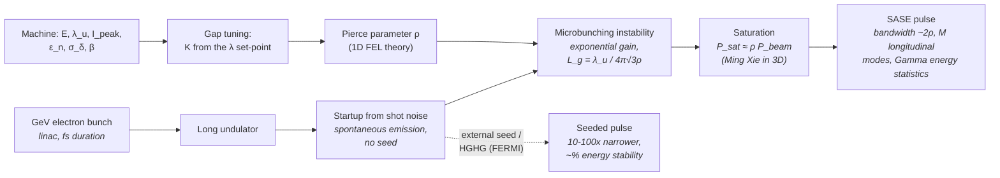

# X-ray Free-Electron Laser (XFEL: SASE / Seeded)

**Status:** ✅ Implemented — SASE bandwidth (with the Pierce parameter derived from the machine), longitudinal-mode statistics and the resulting shot-to-shot dose jitter are live physics; gain length and saturation are 1D + Ming-Xie estimates (🔶), and the CW-SC and ERL presets are 🧪 design projections.

## Overview

Linac-driven free-electron lasers (FLASH, FERMI, LCLS, European XFEL,
SwissFEL) deliver femtosecond pulses of extreme peak power from the EUV to hard
X-rays. For lithography their interest is threefold: single-shot full-field
exposure studies (one µJ-class pulse can expose a field); **statistics** — a
SASE FEL starts from electron shot noise, so its spectrum and pulse energy
fluctuate shot to shot, and that jitter propagates into dose jitter and hence
LER/LWR; and **average power** — superconducting CW linacs and energy-recovery
linacs (ERLs) push the repetition rate to the MHz–100 MHz range, the route by
which FEL-based EUV sources are proposed to reach the kW class.

`XfelSource` computes the fluctuation magnitude from first principles and feeds
it to the stochastic module. With machine parameters attached (all presets),
the undulator K is **derived** from the wavelength set-point (gap tuning) and
the Pierce parameter ρ is **derived** from the electron beam, so the SASE
bandwidth, mode count and jitter all follow from the machine.

Deliberate contrast with [./synchrotron.md](./synchrotron.md): XFEL undulators
are gap-tunable and operators dial a photon energy, so `wavelength_nm` here is
an honest **set-point** and the undulator K follows from it (inverse
resonance), whereas a storage-ring undulator's wavelength follows from its
fixed K.

## Generation physics



SASE (self-amplified spontaneous emission) amplifies the noise within the FEL
gain bandwidth, set by the Pierce parameter $\rho$:

```math
\frac{\Delta\lambda}{\lambda} \simeq 2\rho
```

The pulse is a train of temporally coherent spikes of duration
$t_{\mathrm{coh}}$; a pulse of duration $T$ contains

```math
t_{\mathrm{coh}} = \frac{\lambda^2}{c\,\Delta\lambda}, \qquad M = \max\!\left(1,\ \frac{T}{t_{\mathrm{coh}}}\right)
```

independent longitudinal modes. Each mode's energy is exponentially distributed,
so the total pulse energy follows a **Gamma distribution of order M**
(Saldin/Schneidmiller/Yurkov; Schmüser/Dohlus/Rossbach textbook treatment):

```math
p(E) = \frac{M^M}{\Gamma(M)} \left(\frac{E}{\langle E\rangle}\right)^{M-1} \frac{e^{-M E/\langle E\rangle}}{\langle E\rangle}, \qquad \frac{\sigma_E}{\langle E\rangle} = \frac{1}{\sqrt{M}}
```

Seeding (self-seeding at LCLS/EuXFEL, HGHG cascade at FERMI) replaces the noise
start with a coherent seed: bandwidth narrows 10–100×, energy stabilizes to the
percent level.

### Key equations

**Gap tuning (inverse resonance).** For an undulator of period $\lambda_u$ and
a beam of Lorentz factor $\gamma = 1 + E_\mathrm{kin}/m_ec^2$, the K that puts
the fundamental at the set-point $\lambda$ is

```math
K = \sqrt{2\left(\frac{2\gamma^2\lambda}{\lambda_u} - 1\right)}
```

(unreachable — `undulator_k()` returns `None`, the CLI errors — when $\lambda$
is shorter than the $K = 0$ limit $\lambda_u/2\gamma^2$).

**1D FEL theory** (planar undulator, $[JJ] = J_0(\xi) - J_1(\xi)$,
$\xi = K^2/(4+2K^2)$, $I_A = 17 045$ A, $k_u = 2\pi/\lambda_u$,
$\sigma_x = \sqrt{\varepsilon_n\beta/\gamma}$):

```math
\rho = \left[\frac{1}{16}\,\frac{I}{I_A}\,\frac{K^2[JJ]^2}{\gamma^3\sigma_x^2k_u^2}\right]^{1/3},
\qquad
L_g = \frac{\lambda_u}{4\pi\sqrt3\,\rho},
\qquad
P_\mathrm{sat} \approx \rho\,\frac{\gamma m_ec^2 I}{e},
\qquad
L_\mathrm{sat} \approx \frac{\lambda_u}{\rho}
```

**Ming Xie 3D fit** (M. Xie, Proc. 1995 Particle Accelerator Conference,
PAC'95): with the scaled parameters
$\eta_d = L_g/(2k\sigma_x^2)$ (diffraction),
$\eta_\varepsilon = (L_g/\beta)(4\pi\varepsilon/\lambda)$ (emittance) and
$\eta_\gamma = 4\pi(L_g/\lambda_u) \sigma_\gamma/\gamma$ (energy spread),

```math
\Lambda = a_1\eta_d^{a_2} + a_3\eta_\varepsilon^{a_4} + a_5\eta_\gamma^{a_6}
+ a_7\eta_\varepsilon^{a_8}\eta_\gamma^{a_9} + a_{10}\eta_d^{a_{11}}\eta_\gamma^{a_{12}}
+ a_{13}\eta_d^{a_{14}}\eta_\varepsilon^{a_{15}} + a_{16}\eta_d^{a_{17}}\eta_\varepsilon^{a_{18}}\eta_\gamma^{a_{19}}
```

```math
L_{g,3D} = L_g(1+\Lambda), \qquad P_\mathrm{sat,3D} \approx 1.6\,\rho\left(\frac{L_g}{L_{g,3D}}\right)^2 P_\mathrm{beam}
```

| a₁ | a₂ | a₃ | a₄ | a₅ | a₆ | a₇ | a₈ | a₉ | a₁₀ | a₁₁ | a₁₂ | a₁₃ | a₁₄ | a₁₅ | a₁₆ | a₁₇ | a₁₈ | a₁₉ |
|----|----|----|----|----|----|----|----|----|-----|-----|-----|-----|-----|-----|-----|-----|-----|-----|
| 0.45 | 0.57 | 0.55 | 1.6 | 3 | 2 | 0.35 | 2.9 | 2.4 | 51 | 0.95 | 3 | 5.4 | 0.7 | 1.9 | 1140 | 2.2 | 2.9 | 3.2 |

The fit is empirical (≈ 10–20 % inside its fitted range of order-unity
scaled parameters); Λ ≳ 5 only means "no practical gain".

**Worked FLASH-like numbers** ($\lambda$ = 13.5 nm, illustrative 680 MeV /
31.4 mm / 2.5 kA / 1.5 µm / β = 6 m beam, T = 30 fs): K = 1.025,
ρ = 2.31×10⁻³ (derived), $\Delta\lambda = 2\rho\lambda$ = 62.5 pm,
$t_{\mathrm{coh}}$ = 9.73 fs, $M$ ≈ 3.1, $\sigma_E/\langle E\rangle$ ≈ 57 %.

## Real-machine parameters

| Machine | λ range | Mode | Pulse energy / duration | Rep rate | Citation |
|---------|---------|------|-------------------------|----------|----------|
| FLASH (DESY) | 4.2–52 nm | SASE | 10–500 µJ / 30–200 fs | 10 Hz bursts (up to ~5 kHz in-burst) | Ackermann et al., *Nat. Photon.* **1**, 336 (2007) |
| FERMI (Trieste) | 100–4 nm | HGHG seeded | FEL-2: 10–30 µJ at 10–20 nm / 20–100 fs | 10 or 50 Hz | Allaria et al., *Nat. Photon.* **6**, 699 (2012); Elettra FEL-2 parameter page |
| LCLS (SLAC) | 0.13–4.4 nm | SASE / self-seeded | mJ-class / fs–100 fs | 120 Hz | Emma et al., *Nat. Photon.* **4**, 641 (2010) |
| European XFEL | 0.05–4.7 nm | SASE | mJ-class / fs–100 fs | 27 kHz effective (10 Hz × 2700-pulse bursts) | Decking et al., *Nat. Photon.* **14**, 391 (2020) |
| SwissFEL (PSI) | 0.1–5 nm (Athos soft branch) | SASE / advanced modes | 100 µJ–mJ / fs | 100 Hz | Prat et al., *Nat. Photon.* **14**, 748 (2020) |
| CW superconducting linacs (LCLS-II architecture) | soft/hard X-ray | SASE | µJ–mJ / fs | MHz-class | architecture class; the `cw_sc` preset is a 13.5 nm projection |
| ERL-driven FELs for EUV lithography | 13.5 nm | SASE | tens of µJ / 100s fs | ~100 MHz CW | KEK design (Nakamura et al., ERL2015); the `erl` preset follows it |

**Measured average powers near 13.5 nm** (what linac FELs have actually
delivered): FLASH reported 20 mW at 13.7 nm in 2007 (Ackermann et al.; note the
paper's 20 mW sits below its own 70 µJ × 700 pulses/s ≈ 49 mW) and 0.35 W at
18.2 nm in 2015 (80 µJ × 4300 pulses/s; Schreiber & Faatz, *High Power Laser
Sci. Eng.* **3**, e20 (2015)); FERMI FEL-2 delivers 10–30 µJ at 10 or 50 Hz,
i.e. ~0.1–1.5 mW (derived).

**Designs and proposals for lithography-scale FEL power** (none built):

| Concept | Output | Status | Source |
|---|---|---|---|
| KEK ERL EUV-FEL | 800 MeV, 60 pC, 9.75 mA → 9–13.7 kW at 13.5 nm (9–11 kW at 162.5 MHz) | DESIGN | Nakamura et al., ERL2015, doi:10.18429/JACoW-ERL2015-MOPCTH010 — its test machine cERL has run ~1 mA and its FEL lased at 20 µm (2021) |
| DESY FLASH-technology EUV FEL | 1.7 kW | DESIGN (2011) | Schneidmiller et al., 2011 EUVL Workshop |
| Fab-scale FEL (one FEL for a fab) | 500–1000 W needed per scanner | PROPOSED | Hosler et al., *Proc. SPIE* **9422**, 94220D (2015) |
| xLight | 120 kW FEL output → 38 kW at the scanner inputs for 16 scanners; prototype at Albany targeted for 2028 | ANNOUNCED | company announcements |

For comparison, the HVM requirement band at intermediate focus is ~250 W
(NXE:3400B) rising to ~1 kW (a 1 kW tin source was demonstrated in 2025; see
[lpp.md](./lpp.md)).

The machine parameters inside the presets below are **illustrative** values in
the class of each machine — **not** FLASH, FERMI, LCLS-II or KEK
specifications (the ERL preset's energy, charge and repetition rate do follow
the KEK design).

## Simulation model

[`XfelSource`](../../crates/highuvlith-core/src/source_models/xfel.rs) stores an
`XfelMode` (`Sase { pierce_parameter }` or `SelfSeeded { rel_bandwidth }`), the
wavelength set-point, pulse metadata (`pulse_energy_uj`, `pulse_duration_fs`,
`rep_rate_hz`), `transverse_coherence_fraction`, `spectral_samples`,
`illumination`, `sase_spike_seed`, and — new, `#[serde(default)]` — an optional
`machine: FelMachine { electron_energy_mev, undulator_period_mm,
undulator_length_m, beam: ElectronBeamParams { peak_current_a,
norm_emittance_um, energy_spread_rel, beta_m } }`.

- **Wavelength:** a stored set-point (gap-tunable undulators). With a machine,
  `undulator_k()` derives the gap-tuned K by inverse resonance; changing the
  set-point re-derives K and ρ (live).
- **Pierce parameter:** `pierce_parameter()` returns the value **derived** from
  the machine (1D theory, `physics::fel_estimate`); without a machine the
  stored `Sase { pierce_parameter }` is used. The presets store the derived ρ
  as the fallback, so both agree at construction.
- **Bandwidth:** SASE mode computes $\Delta\lambda = 2\rho\lambda$ via
  [`physics::sase_bandwidth_pm`](../../crates/highuvlith-core/src/source_models/physics.rs)
  with that ρ; seeded mode applies the imposed relative bandwidth.
- **Statistics → LIVE dose jitter:** `longitudinal_modes()` evaluates
  $M = \max(1, T/t_{\mathrm{coh}})$ from the pulse duration and bandwidth, and
  `shot_to_shot_rms()` returns $1/\sqrt{M}$ (SASE) or a residual 2 % (seeded).
  [`StochasticParams::from_source`](../../crates/highuvlith-core/src/stochastic.rs)
  copies this into `dose_jitter_rms` (single-shot exposure), and
  `StochasticParams::from_source_multi_pulse(source, n)` divides it by √n for
  an exposure integrating n pulses — use the throughput model's
  `pulses_per_point` for n. The LER/LWR Monte Carlo multiplies each
  realization's dose by a Gamma$(k, 1/k)$ factor with $k = 1/\mathrm{rms}^2$.
- **Spectrum, two modes:** the **ensemble average (default)** is a smooth
  Gaussian envelope of the SASE (or seeded) bandwidth — honest for multi-shot
  exposures; the **spike realization** (`sase_spike_seed = Some(seed)`,
  research mode, Rust API only) draws $M$ spikes with Exp(1) amplitudes under
  the envelope, deterministic per seed.
- **Pulse energy:** `pulse_energy_uj` is stored. The FLASH and FERMI presets
  keep measured-class values (100 / 20 µJ) and report the ratio to the derived
  saturation estimate; the CW-SC and ERL presets initialize it **from** the
  derived Ming-Xie saturation power × pulse duration. **Machine overrides
  re-derive it:** when a TOML config changes the machine, the wavelength
  set-point or `pulse_duration_fs` of a preset and does not give
  `pulse_energy_uj`, the CLI calls `XfelSource::rescale_pulse_energy_from(&preset)`,
  which keeps the preset's `pulse_energy_over_saturation` ratio:
  $E = E_{\mathrm{preset}} E_{\mathrm{sat}}(\mathrm{new}) / E_{\mathrm{sat}}(\mathrm{preset})$.
  For CW-SC / ERL that is the new saturation estimate itself (ERL with
  `peak_current_a = 600`: 195 µJ, 31.7 kW instead of the preset's 10.5 kW);
  FLASH / FERMI keep their 0.86 / 0.24 calibration. An explicit
  `pulse_energy_uj` always wins, and an explicit `pierce_parameter` drops the
  machine, so the stored energy is kept.
- **Imaging caveat:** the narrow-band path (`compute_polychromatic`) shifts
  focus per spectral sample with the kernels built at the center wavelength —
  fine at SASE's ~0.5 % bandwidth; `compute_multiwavelength` is the exact
  per-wavelength alternative. Imaging is scalar by default; vector imaging
  (`ImagingModel::Vector`, Python `SimulationEngine(vector=VectorSettings(...))`,
  CLI `[imaging.vector]`; see [vector-imaging.md](../vector-imaging.md)) is
  available. The engine's memory guard (`LithographyError::PupilSamplingTooDense`, raised when the factorized TCC matrix would exceed ~1 GiB; see [pipeline.md](../pipeline.md)) applies.
- **Pupil:** near-diffraction-limited beams; coherence (0.85 SASE / 0.95 seeded)
  maps to a tight `CoherentGaussian` pupil via the Gaussian–Schell heuristic
  `sigma_from_coherence` (approximate, documented).

### Presets

| Preset (Rust / Python / TOML `xfel_preset`) | Machine (illustrative) | Mode | Pulse, rate | Derived |
|------|------|------|------|------|
| `flash_13nm5()` / `xfel_flash_13nm5()` / `flash` | 680 MeV, λ_u 31.4 mm, 30 m; 2.5 kA, 1.5 µm, σ_δ 7×10⁻⁴, β 6 m | SASE | 100 µJ (stored), 30 fs, 1 kHz → 0.1 W | ρ = 2.31×10⁻³, Δλ = 62.5 pm (was 81 pm with the old stored ρ = 3×10⁻³), M ≈ 3.1, jitter 57 % |
| `fermi_seeded_13nm5()` / `xfel_fermi_seeded()` / `fermi` | 1.2 GeV, λ_u 35 mm, 15 m; 700 A, 1 µm, σ_δ 1.25×10⁻⁴, β 10 m | seeded (Δλ/λ = 5×10⁻⁵) | 20 µJ (stored; FEL-2 delivers 10–30 µJ), 50 fs, 50 Hz → 1 mW | ρ = 1.78×10⁻³, 0.675 pm, jitter 2 % |
| `cw_sc_13nm5()` / `xfel_cw_sc_13nm5()` / `cw_sc` — 🧪 projection | 1 GeV, λ_u 39 mm, 30 m; 1 kA, 0.5 µm, σ_δ 10⁻⁴, β 10 m | SASE | 135 µJ (derived), 50 fs, 1 MHz → **135 W** | ρ = 2.54×10⁻³, L_sat,3D = 18.8 m, 50 kW beam power |
| `erl_13nm5()` / `xfel_erl_13nm5()` / `erl` — 🧪 projection | 800 MeV, λ_u 28 mm, 30 m; 300 A (60 pC, 200 fs), 0.6 µm, σ_δ 5×10⁻⁴, β 5 m | SASE | 64.8 µJ (derived), 200 fs, 162.5 MHz → **10.5 kW** | ρ = 1.78×10⁻³, L_sat,3D = 22.8 m, **7.8 MW** beam power to recover |

The CW-SC preset scales the LCLS-II CW superconducting-linac architecture to
13.5 nm; the ERL preset follows the KEK ERL EUV-FEL design (800 MeV, 60 pC,
162.5 MHz; its derived 10.5 kW falls inside KEK's 9–13.7 kW). **No 13.5 nm
machine of either kind exists** — both are research
projections of what the FEL physics allows for these beam parameters. The
model does not cover energy-recovery stability, beam loss, the 7.8 MW of beam
power the ERL must recover, or the 50 kW beam dump of the CW-SC case.

## Derived quantities

Reported by `derived_quantities()` (Python `derived_quantities()` /
`derived_quantity(name)`; printed by `highuvlith simulate`). Informational —
the imaging pipeline reads only the bandwidth/jitter consequences described
above.

| Name | Unit | Meaning | FLASH-like | FERMI-like | CW-SC | ERL |
|------|------|---------|-----------|------------|-------|-----|
| `photon_energy` | eV | hc/λ | 91.84 | 91.84 | 91.84 | 91.84 |
| `average_power` | W | pulse energy × rep rate | 0.1 | 0.001 | 135.0 | 10 537 |
| `photon_rate` | photons/s | power / photon energy | 6.8×10¹⁵ | 6.8×10¹³ | 9.2×10¹⁸ | 7.2×10²⁰ |
| `hvm_power_ratio` | — | power / 250 W (13.5 nm HVM at IF) | 4×10⁻⁴ | 4×10⁻⁶ | 0.54 | 42.1 |
| `coherence_time` | fs | λ²/(cΔλ) | 9.73 | 901 | 8.85 | 12.6 |
| `longitudinal_modes` | — | M = T/t_coh | 3.08 | 1 | 5.65 | 15.8 |
| `electron_gamma` | — | 1 + E_kin/m_ec² | 1332 | 2349 | 1958 | 1567 |
| `undulator_k` | — | gap-tuned K (or `wavelength_reachable = 0`) | 1.025 | 2.553 | 1.819 | 1.653 |
| `pierce_parameter_1d` | — | 1D ρ | 2.31×10⁻³ | 1.78×10⁻³ | 2.54×10⁻³ | 1.78×10⁻³ |
| `beam_size_rms` | µm | √(ε_nβ/γ) | 82.2 | 65.2 | 50.5 | 43.8 |
| `gain_length_1d` | m | λ_u/(4π√3ρ) | 0.624 | 0.902 | 0.704 | 0.721 |
| `ming_xie_lambda` | — | 3D degradation Λ | 0.274 | 0.205 | 0.228 | 0.454 |
| `gain_length_3d` | m | L_g(1+Λ) | 0.794 | 1.088 | 0.865 | 1.049 |
| `energy_spread_over_rho` | — | σ_γ/(γρ) (< 1 required) | 0.30 | 0.07 | 0.04 | 0.28 |
| `emittance_over_photon_emittance` | — | ε/(λ/4π) | 1.05 | 0.40 | 0.24 | 0.36 |
| `beam_power_peak` | W | γm_ec²I/e | 1.70×10¹² | 8.4×10¹¹ | 1.0×10¹² | 2.4×10¹¹ |
| `saturation_power_1d` | W | ρ P_beam | 3.94×10⁹ | 1.50×10⁹ | 2.55×10⁹ | 4.28×10⁸ |
| `saturation_power_3d` | W | Ming Xie | 3.88×10⁹ | 1.65×10⁹ | 2.70×10⁹ | 3.24×10⁸ |
| `saturation_pulse_energy_3d` | J | P_sat,3D × T | 1.16×10⁻⁴ | 8.2×10⁻⁵ | 1.35×10⁻⁴ | 6.48×10⁻⁵ |
| `saturation_length_3d` | m | (λ_u/ρ)(1+Λ) | 17.3 | 23.7 | 18.8 | 22.8 |
| `undulator_over_saturation_length` | — | ≥ 1: saturates in the undulator | 1.73 | 0.63¹ | 1.59 | 1.31 |
| `sase_bandwidth_from_rho` | pm | 2ρλ | 62.5 | 48.1¹ | 68.7 | 48.2 |
| `pulse_energy_over_saturation` | — | stored / Ming-Xie estimate | 0.86 | 0.24 | 1 | 1 |
| `beam_power_average` | W | E_kin × (I_peak T) × f_rep | 51 | 2.1 | 5.0×10⁴ | 7.8×10⁶ |
| `fel_efficiency` | — | FEL power / beam power (~ρ) | 2.0×10⁻³ | 4.8×10⁻⁴ | 2.7×10⁻³ | 1.4×10⁻³ |

¹ Seeded start-up: the SASE saturation length and 2ρλ bandwidth are upper
bounds (flagged by a `seeded_note` quantity); imaging uses the imposed seed
bandwidth.

**Power and throughput context.** In the simplified dose-limited scanner model
(`SourceConfig.wafer_throughput`, EUV-like optics, 30 mJ/cm², illustrative
overheads) the CW-SC preset gives ~130 wafers/h and the ERL ~194 wafers/h —
the ERL's 42× power over the 250 W LPP preset buys only ~26 % more wafers per hour (194 vs 154)
because per-field and per-wafer overheads dominate (ceiling ≈ 196 wafers/h).
Each ERL exposure point integrates ~1.3×10⁴ pulses, so its 25 % single-pulse
SASE jitter averages to ~0.2 % in dose (`from_source_multi_pulse`).

## Model coverage

| Field | Unit | Consumed by | Status |
|-------|------|-------------|--------|
| `mode::Sase.pierce_parameter` | — | bandwidth $2\rho\lambda$ → spectral weights, $M$, `shot_to_shot_rms()` — **only without a machine** (fallback) | live (fallback) |
| `mode::SelfSeeded.rel_bandwidth` | — | seeded bandwidth → spectral weights; 2 % residual jitter | live |
| `wavelength_nm` | nm | imaging wavelength, photon energy, $t_{\mathrm{coh}}$; gap-tuned K | live (set-point) |
| `pulse_energy_uj` | µJ | `pulse_energy_j()` → `average_power_w()` → throughput (initialized from the saturation estimate for CW-SC/ERL; re-derived at the preset's ratio when TOML machine overrides are given without it) | live |
| `pulse_duration_fs` | fs | $M = T/t_{\mathrm{coh}}$ → `shot_to_shot_rms()` → Gamma dose jitter; saturation pulse energy | live |
| `rep_rate_hz` | Hz | `average_power_w()`; throughput pulses per point | live |
| `transverse_coherence_fraction` | — | pupil σ at construction via `sigma_from_coherence`; reported via trait | live (construction-time) |
| `spectral_samples` | — | sample count for the ensemble spectrum | live |
| `illumination` | — | `intensity_at()` pupil weighting in the TCC | live |
| `sase_spike_seed` | — | replaces `spectral_weights()` with one deterministic spike realization | live (Rust API only) |
| `machine.electron_energy_mev` | MeV | γ → gap-tuned K, ρ, saturation, beam power | live |
| `machine.undulator_period_mm` | mm | K (inverse resonance), k_u in ρ, L_g | live |
| `machine.undulator_length_m` | m | undulator / saturation-length ratio | live (derived quantities) |
| `machine.beam` (`peak_current_a`, `norm_emittance_um`, `energy_spread_rel`, `beta_m`) | A, µm, —, m | ρ (→ SASE bandwidth → M → jitter), Ming Xie Λ, saturation | live |
| Time-domain pulse structure, slippage, start-up noise beyond the Gamma statistic | — | — | planned |

## Usage

Python (factories in [`py_config.rs`](../../crates/highuvlith-py/src/py_config.rs)):

<!-- verify-example -->
```python
from highuvlith import SourceConfig

sase = SourceConfig.xfel_flash_13nm5()
print(sase.bandwidth_pm)       # 62.47 (2 rho lambda, rho derived = 2.31e-3)
print(sase.shot_to_shot_rms)   # ~0.57 (M ~ 3.1 modes -> 1/sqrt(M))
print(sase.average_power_w)    # 0.1   (100 uJ x 1 kHz)
print(sase.derived_quantity("gain_length_3d"))  # 0.794 m

seeded = SourceConfig.xfel_fermi_seeded()
print(seeded.bandwidth_pm)     # 0.675 (rel bandwidth 5e-5)
print(seeded.shot_to_shot_rms) # 0.02

erl = SourceConfig.xfel_erl_13nm5()      # PROJECTION
print(erl.average_power_w)               # ~10.5 kW (derived saturation estimate)
print(erl.derived_quantity("beam_power_average"))  # 7.8e6 W to energy-recover
cw = SourceConfig.xfel_cw_sc_13nm5()     # PROJECTION
print(cw.average_power_w, cw.electron_energy_mev)  # ~135 W, 1000 MeV

tp = erl.wafer_throughput(dose_mj_cm2=30.0)       # simplified dose-limited model
print(tp["wafers_per_hour"], tp["pulses_per_point"])  # ~194, ~1.3e4
```

??? success "Output"

    ```text
    62.46913428520347
    0.5695476260007923
    0.09999999999999999
    0.7944114324296586
    0.675
    0.02
    10536.562378888832
    7800000.0
    134.95478010504775 1000.0
    194.39981944970032 13103.438184701015
    ```

TOML (`[source]` fields from [`config.rs`](../../crates/highuvlith-cli/src/config.rs)):

```toml
[source]
type = "xfel"
xfel_preset = "flash"     # flash (default) | fermi | cw_sc | erl
mode = "sase"             # optional; overrides the preset's mode ("sase" | "seeded")
wavelength_nm = 13.5      # set-point; K is gap-tuned to it (error if unreachable)
pulse_duration_fs = 30.0  # feeds M and hence the live dose jitter
# pulse_energy_uj = 100.0 # explicit value wins; otherwise machine / set-point /
#                         # duration overrides rescale it at the preset's
#                         # pulse_energy_over_saturation ratio
# rep_rate_hz = 1000.0
# Machine overrides (re-derive K, rho, bandwidth, saturation, pulse energy):
# electron_energy_mev = 680.0
# period_mm = 31.4
# undulator_length_m = 30.0
# peak_current_a = 2500.0
# norm_emittance_um = 1.5
# beta_m = 6.0
# electron_energy_spread_rel = 7.0e-4
# pierce_parameter = 3e-3 # an explicit rho DISABLES the machine derivation
#                         # (legacy configs keep their 2 rho lambda bandwidth)
# rel_bandwidth = 5e-5    # seeded mode
# sase_spike_seed is not exposed in TOML; use the Rust API for single-shot studies
```

Ready-made configs: `examples/sim_xfel.toml` (FLASH-like SASE),
`examples/sim_xfel_cw_sc.toml` and `examples/sim_xfel_erl.toml` (the two
projections). `highuvlith simulate` prints the derived quantities above.

## Validation

In [`xfel.rs`](../../crates/highuvlith-core/src/source_models/xfel.rs):
`test_sase_bandwidth_is_two_rho` (derived ρ = 2.3137×10⁻³ against a scipy
fixture, Δλ = 2ρλ = 62.47 pm; 81 pm with the stored ρ = 3×10⁻³ when no machine
is attached), `test_gap_tuning_rederives_rho` (K = 1.0247; a longer set-point
opens K and changes ρ; sub-K=0 set-points are unreachable),
`test_seeded_much_narrower_than_sase` (> 50× narrower),
`test_sase_jitter_from_mode_count` (M = 3.083 fixture; rms = $1/\sqrt{M}$;
longer pulse → lower jitter; seeded pinned at 2 %),
`test_spike_realization_deterministic_and_normalized`,
`test_ensemble_weights_sum_to_one` (all four presets),
`test_pulse_metadata_live` (0.1 W, 91.84 eV, 116 µJ saturation fixture),
`test_machine_class_presets` (CW-SC 135 µJ / 135 W, ERL 64.8 µJ / 10.5 kW and
7.8 MW beam power, both saturate within 30 m),
`test_legacy_toml_without_machine_parses`.
In [`physics.rs`](../../crates/highuvlith-core/src/source_models/physics.rs):
`test_sase_bandwidth_fixture`, `test_undulator_k_inverse_resonance`,
`test_pierce_parameter_fixture_and_scaling`, `test_ming_xie_fixture_and_limits`,
`test_fel_estimate_saturation_consistency`,
`test_undulator_harmonic_functions_fixture` (the `[JJ]` Bessel factor).
The jitter-consumption path is pinned in
[`stochastic.rs`](../../crates/highuvlith-core/src/stochastic.rs) by
`test_from_source_pulls_dose_jitter`, `test_multi_pulse_jitter_averages_down`
(100 pulses → jitter / 10) and `test_dose_jitter_increases_lwr`. CLI:
`test_xfel_presets_and_machine_fields`,
`test_legacy_family_tomls_unchanged_by_new_fields` (explicit ρ → 81 pm),
`test_family_example_tomls_validate`. Python:
`tests/python/test_sources_physics.py::TestXfel`,
`tests/python/test_sources.py::TestXfelSource`.

## References

1. E. L. Saldin, E. A. Schneidmiller, M. V. Yurkov, *The Physics of Free Electron Lasers* (Springer, 2000) — SASE statistics, Gamma distribution of order M.
2. P. Schmüser, M. Dohlus, J. Rossbach, C. Behrens, *Free-Electron Lasers in the Ultraviolet and X-Ray Regime*, 2nd ed. (Springer, 2014).
3. Z. Huang, K.-J. Kim, "Review of x-ray free-electron laser theory," *Phys. Rev. ST Accel. Beams* **10**, 034801 (2007) — 1D Pierce parameter, gain length, saturation.
4. M. Xie, "Design optimization for an X-ray free electron laser driven by SLAC linac," *Proc. 1995 Particle Accelerator Conference* (PAC'95) — 3D gain-length fit.
5. W. Ackermann et al., "Operation of a free-electron laser from the extreme ultraviolet to the water window," *Nat. Photon.* **1**, 336 (2007) — FLASH.
6. E. Allaria et al., "Highly coherent and stable pulses from the FERMI seeded free-electron laser," *Nat. Photon.* **6**, 699 (2012) — HGHG seeding.
7. P. Emma et al., "First lasing and operation of an ångström-wavelength free-electron laser," *Nat. Photon.* **4**, 641 (2010) — LCLS.
8. W. Decking et al., "A MHz-repetition-rate hard X-ray free-electron laser driven by a superconducting linear accelerator," *Nat. Photon.* **14**, 391 (2020) — European XFEL.
9. E. Prat et al., "A compact and cost-effective hard X-ray free-electron laser driven by a high-brightness and low-energy electron beam," *Nat. Photon.* **14**, 748 (2020) — SwissFEL.
10. S. Schreiber, B. Faatz, *High Power Laser Sci. Eng.* **3**, e20 (2015) — FLASH average SASE power (0.35 W at 18.2 nm).
11. N. Nakamura et al., ERL2015 (JACoW), doi:10.18429/JACoW-ERL2015-MOPCTH010 — KEK ERL EUV-FEL design (9–13.7 kW at 13.5 nm).
12. E. Hosler et al., *Proc. SPIE* **9422**, 94220D (2015) — FEL-based EUV lithography sources (500–1000 W per scanner).
