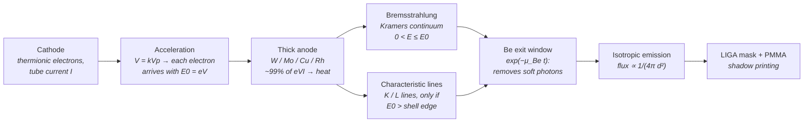

# Hard X-ray Tube (Bremsstrahlung + Characteristic Lines)

**Status:** 🔶 Simplified for the continuum shape and everything derived from it (spectral moments, absolute flux): Kramers' thick-target approximation without anode self-absorption, the heel effect or electron backscatter, an empirical η = 1.1×10⁻⁹ Z V efficiency and an explicitly empirical characteristic-line law / ✅ Implemented for the line energies and excitation edges (with overvoltage gating), the Duane–Hunt cutoff and the Be-window filtration (NIST data), fixture-tested against an independent re-implementation; the beam is broadband, so this is a LIGA / proximity-printing source, not a projection-imaging one.

## Overview

LIGA deep X-ray lithography normally needs a synchrotron bending magnet: hundreds of µm of PMMA are only penetrated by a hard (few-keV to tens-of-keV) white beam. A laboratory X-ray tube produces the same kind of radiation — a broad continuum plus a few strong lines — from a kW-class electron beam stopped in a metal anode, and is the obvious route to **lab-scale LIGA without a synchrotron** (a long-standing roadmap item). The price is flux: a tube is an isotropic point source with ~1% conversion efficiency, orders of magnitude weaker per unit area at the mask than a bending-magnet beamline, so exposures of thick resist take days rather than hours.

`XrayTubeSource` in [source_models/xray_tube.rs](../../crates/highuvlith-core/src/source_models/xray_tube.rs) computes the filtered photon spectrum from the tube's operating point (anode, kVp, mA, Be window) and offers it to the [LIGA module](../processes/liga-deep-xray.md) in two forms (contract C5):

- `xray_spectrum(n_bins)` — the **relative** spectrum (`XraySpectrum::Tabulated`). This is what `highuvlith deep` uses automatically for a `[source] type = "xray_tube"`: depth dose and dose ratios, but no exposure time.
- `spectral_flux_density(distance_mm, n_bins)` — the **absolute** spectral photon flux density at the mask plane. It is exposed but **not consumed automatically**: pass it yourself as `[deep] flux_density` (CLI), `simulate_liga(flux_density=...)` (Python) or `XraySpectrum::from_flux_density` (Rust) to get an absolute exposure time.

## Generation physics



**Continuum (Kramers' law).** For a thick target the energy spectrum is linear, $I(E) \propto Z (E_0 - E)$, so the photon-number spectrum per electron is

```math
\frac{dn}{dE} = \frac{2\eta}{E_0}\left(\frac{E_0}{E} - 1\right), \qquad 0 < E \le E_0 = eV,
```

normalized so that the energy spectrum integrates to $\eta E_0$. The code integrates it exactly over each energy bin, $\int_a^b (E_0/E - 1) dE = E_0 \ln(b/a) - (b-a)$.

**Efficiency.** The empirical thick-target conversion efficiency (bremsstrahlung power / beam power) is

```math
\eta \approx 1.1\times10^{-9}\, Z\, V[\mathrm{V}],
```

e.g. 0.49 % for W at 60 kV and 0.81 % for W at 100 kV; textbook values of the constant differ by ~20 %. The generated bremsstrahlung power is $P = \eta V I$ into 4π.

**Duane–Hunt limit.** No photon can exceed the electron energy: $\lambda_\text{min}[\mathrm{nm}] = 1.23984/V[\mathrm{kV}]$.

**Characteristic lines (explicitly empirical).** A line appears only when $E_0$ exceeds the binding energy of the shell whose vacancy it fills (overvoltage $U = E_0/E_\text{edge} > 1$). Its thick-target photon yield per electron is modelled with the long-standing empirical power law

```math
n_\text{line} = k\, M_s\, \omega_s\, \frac{r_\text{line}}{\sum_s r}\,(U - 1)^{1.67},
```

with $k = 7\times10^{-4}$, the fluorescence yield $\omega_s$ of the series, an L/K multiplicity $M_L = 2$ ($M_K = 1$), and relative line intensities $r$ within the series. The normalization $k$ agrees within about a factor of two with a non-relativistic Bethe-cross-section / Bethe-stopping thick-target estimate for Cu, Mo and Rh K lines (that estimate is about 2× lower for W K lines near threshold). Absolute K-line intensities are therefore uncertain by **±×2** (a factor of two), W L-line intensities by ±×3.

**Filtration and flux density.** The Be exit window transmits $T(E) = \exp[-\mu_\text{Be}(E) t]$ (NIST mass-attenuation data from [materials/attenuation.rs](../../crates/highuvlith-core/src/materials/attenuation.rs), tabulated over the whole 1 keV – kVp grid); at distance $d$ from an isotropic point focus in vacuum,

```math
\Phi(E) = \frac{I}{e}\,\frac{dn}{dE}\,\frac{T(E)}{4\pi d^2}\quad[\text{photons s}^{-1}\,\text{mm}^{-2}\,\text{keV}^{-1}].
```

**What is missing (why the continuum is 🔶).** Photons are generated up to a few µm below the anode surface and are attenuated in the anode on the way out (**self-absorption**, which also produces the **heel effect** across the beam). In a real tube this removes much of the soft continuum, so real spectra are *harder* than the unabsorbed moments computed here, by an amount that depends on the take-off angle and is not quantified. Tens of percent of the electrons also **backscatter** out of a high-Z anode before radiating fully, and Kramers' law itself is a thick-target approximation valid in the diagnostic range (≲150 kV).

### Line energies and excitation edges (keV)

Values from the X-ray Data Booklet (Tables 1-1 and 1-2), which compile Bearden (1967) and Bearden & Burr (1967).

| Anode (Z) | Lines modelled | Edge(s) | ω (fluorescence yield) |
|---|---|---|---|
| W (74) | Kα1 59.318, Kα2 57.982, Kβ 67.244; Lα1 8.398, Lα2 8.335, Lβ1 9.672, Lβ2 9.962, Lγ1 11.286 | K 69.525; L3 10.207, L2 11.544 | ω_K 0.96, ω_L ≈ 0.26 |
| Mo (42) | Kα1 17.479, Kα2 17.374, Kβ 19.608 | K 20.000 | ω_K 0.76 |
| Cu (29) | Kα1 8.048 (1.5406 Å), Kα2 8.028, Kβ 8.905 | K 8.979 | ω_K 0.44 |
| Rh (45) | Kα1 20.216, Kα2 20.074, Kβ 22.724 | K 23.220 | ω_K 0.81 |

The Kβ group is one line at the Kβ1 energy carrying the whole Kβ-group intensity: Kβ3 lies a few tens of eV below Kβ1 for Mo and Rh (unresolved for Cu) but ~0.29 keV below it for W, and Kβ2 lies above Kβ1 (~1.8 keV above for W) — negligible for the moments and the LIGA dose, since the W K lines carry <1 % of the photons even at 100 kV. Mo and Rh L lines (2.3 / 2.7 keV; weak, ω_L ≲ 0.1, and strongly absorbed by the Be window) and Cu L lines (0.93 keV, fully absorbed) are omitted.

## Real-machine parameters

| Tube class | Typical anodes | Voltage | Beam power | Provenance |
|---|---|---|---|---|
| Sealed diffraction (XRD) tube | Cu (also Mo, Co, ...) | ~30–60 kV; 40 kV × 40 mA is a common operating point | ~1–3 kW | typical ratings (order of magnitude) |
| Rotating-anode generator | Cu, Mo, W | ~40–60 kV | ~10 kW class | order of magnitude |
| Microfocus tube | W, Cu, Mo | ~20–150 kV | ~1–100 W (µm-scale spot) | order of magnitude |
| Exit window | Be | — | — | ~100–500 µm class (order of magnitude) |

Computed by the model for its presets (250 µm Be, photons with E ≥ 1 keV, 4π-equivalent; the moments are **unabsorbed-anode** values, 🔶):

| Preset | η | Brems. power (generated) | X-ray power after window | Photons/s | Mean E | Mean λ | Line fraction | Flux at 100 mm |
|---|---|---|---|---|---|---|---|---|
| `w_60kv` (60 kV, 30 mA) | 4.88×10⁻³ | 8.79 W | 8.86 W | 4.28×10¹⁵ | 12.9 keV | 0.153 nm | 0.20 (W L) | 3.4×10¹⁰ ph s⁻¹ mm⁻² (7.1 mW cm⁻²) |
| `cu_40kv` (40 kV, 40 mA) | 1.28×10⁻³ | 2.04 W | 2.41 W | 1.54×10¹⁵ | 9.8 keV | 0.167 nm | 0.38 (Cu K) | 1.2×10¹⁰ ph s⁻¹ mm⁻² (1.9 mW cm⁻²) |
| `mo_50kv` (50 kV, 40 mA) | 2.31×10⁻³ | 4.62 W | 4.64 W | 2.22×10¹⁵ | 13.0 keV | 0.154 nm | 0.12 (Mo K) | 1.8×10¹⁰ ph s⁻¹ mm⁻² (3.7 mW cm⁻²) |
| `rh_50kv` (50 kV, 40 mA) | 2.48×10⁻³ | 4.95 W | 4.76 W | 2.28×10¹⁵ | 13.0 keV | 0.157 nm | 0.08 (Rh K) | 1.8×10¹⁰ ph s⁻¹ mm⁻² (3.8 mW cm⁻²) |

The "after window" power can exceed the generated bremsstrahlung power because it includes the characteristic lines. More than 99 % of the beam power heats the anode — the thermal limit that caps tubes at the kW (sealed) to ~10 kW (rotating) class.

**LIGA reality check** ([examples/sim_xray_tube.toml](../../examples/sim_xray_tube.toml): W 60 kV / 30 mA, 200 µm PMMA, 20 µm Au absorber on 2 µm Ti, bottom clearing dose 3 kJ cm⁻³). The relative CLI run gives a top/bottom dose ratio of 2.22 (top 6.65 kJ cm⁻³), with dose-weighted mean photon energies of 5.77 keV at the top and 8.13 keV at the bottom. Feeding the absolute flux density at 100 mm from the focal spot gives an exposure time of ≈52 h (≈13 h at 50 mm) — model output with the 🔶 caveats above.

## Simulation model

`XrayTubeSource` implements `LithographySource`:

- **Spectrum** — `binned_photon_rate(n)` returns filtered photons/s on `n` equal-width bins over [1 keV, kVp]: exact Kramers bin integrals times the window transmission at the bin centre, plus each excited line deposited in the bin containing its energy. The 1 keV floor is below anything a practical Be window transmits.
- **Contract C5** — `xray_spectrum(n_bins)` gives `XraySpectrum::Tabulated` with photons per bin normalized to 1; the LIGA sampler uses the table's own energy range (within the 0.03 keV – 20 MeV attenuation data), so the whole spectrum up to kVp reaches the depth-dose model. `spectral_flux_density(distance_mm, n_bins)` gives `(E_keV, photons s⁻¹ mm⁻² keV⁻¹)` on equal-width bins (the histogram semantics of `XraySpectrum::FluxDensity`), including only the tube's own Be window; it is *not* consumed automatically (see Overview).
- **Trait mapping** — `wavelength_nm()` is the photon-number-weighted **mean photon wavelength** of the filtered spectrum; `bandwidth_pm()` is a Gaussian-equivalent FWHM (2.3548 × the rms wavelength spread); `spectral_weights()` is the filtered spectrum on `spectral_samples` (default 16) equal-energy bins; `average_power_w()` is the filtered X-ray power (continuous source: no pulse metadata); `photon_energy_ev()` and `photon_density_per_mj_cm2()` use the mean photon *energy* (the trait defaults would use hc/λ̄, the harmonic-mean energy, and overcount photons per unit dose by ≈1.6 for the W preset). These are bookkeeping values: the per-sample-focus polychromatic imaging path is not valid for Δλ/λ ~ 1, and the source is spatially incoherent (`transverse_coherence() = 0`).
- **Derived quantities** — beam power, η, generated bremsstrahlung power, filtered X-ray power, anode heat load, photon rate, characteristic-photon fraction, mean photon energy and wavelength, Duane–Hunt wavelength, flux and power density at 100 mm, and the K-shell overvoltage.
- **Presets** — `XrayTubeSource::w_60kv()`, `cu_40kv()`, `mo_50kv()`, `rh_50kv()`, `preset(anode)`, and `new(anode, kvp, current_ma)` (250 µm Be window).

Not modelled (stated, not hidden): anode self-absorption and the heel effect, electron backscatter losses, focal-spot size and off-axis intensity variation, air attenuation (vacuum/He path assumed), relativistic corrections to Kramers' law, and filters other than the tube's Be window (add LIGA beam filters in the LIGA module).

<figure markdown="span">


<figcaption>Hard X-ray spectra of the LIGA-class presets from <code>spectral_flux_density(100 mm)</code>. (a) X-ray tubes: Kramers bremsstrahlung ending at the Duane–Hunt limit (eV<sub>tube</sub>), anode K/L lines gated by their edges, 250 µm Be window — line energies, edges, Duane–Hunt limit and Be filtration ✅; continuum shape and absolute flux 🔶 (Kramers thick target, no self-absorption, heel effect or backscatter; empirical line yields ±×2). (b) Laser-wakefield betatron: synchrotron-like spectrum from the critical energy E<sub>c</sub> of a single-energy, single-amplitude bunch, flat-top cone — 🧪.</figcaption>
</figure>

## Model coverage

| Field | Unit | Consumed by | Status |
|---|---|---|---|
| `anode` | enum (`W`/`Mo`/`Cu`/`Rh`) | Z → η and Kramers amplitude; line table and edges | live |
| `kvp` | kV | E0: continuum cutoff, η, line overvoltage | live |
| `current_ma` | mA | absolute photon rate I/e | live |
| `be_window_um` | µm | window transmission of continuum and lines | live |
| `spectral_samples` | count | bins of `spectral_weights()` | live |
| `illumination` | enum | `intensity_at()` (only if forced through projection imaging) | live |
| anode take-off angle / self-absorption / heel effect | — | — | planned |
| electron backscatter, focal-spot size | — | — | planned |

## Usage

Python (factory from [py_config.rs](../../crates/highuvlith-py/src/py_config.rs); `kvp`/`current_ma` default to the anode preset):

<!-- verify-example -->
```python
import highuvlith as huv

tube = huv.SourceConfig.xray_tube(anode="W", kvp=60.0, current_ma=30.0, be_window_um=250.0)
print(tube.wavelength_nm)          # 0.1526 nm: mean photon wavelength (bookkeeping)
print(tube.average_power_w)        # 8.86 W after the Be window
for name, value, unit, note in tube.derived_quantities():
    print(f"{name:32s} {value:12.4g} {unit}")

spectrum = tube.xray_spectrum(n_bins=200)             # [(E_keV, photon fraction)], sums to 1
flux = tube.spectral_flux_density(100.0, n_bins=200)  # [(E_keV, photons/s/mm^2/keV)] at 100 mm

# Absolute LIGA exposure: hand the flux density over explicitly.
result = huv.simulate_liga(flux_density=flux, resist_thickness_um=200.0)
print(result.exposure_time_s / 3600.0)                # hours
```

??? success "Output"

    ```text
    0.1525607831339526
    8.85992047821735
    beam_power_w                             1800 W
    bremsstrahlung_efficiency            0.004884 -
    bremsstrahlung_power_w                  8.791 W
    xray_power_w                             8.86 W
    anode_heat_load_w                        1791 W
    photon_rate                          4.28e+15 photons/s
    characteristic_photon_fraction         0.1999 -
    mean_photon_energy_kev                  12.92 keV
    mean_photon_wavelength_nm              0.1526 nm
    duane_hunt_min_wavelength_nm          0.02066 nm
    photon_flux_density_at_100mm        3.406e+10 photons/s/mm^2
    power_density_at_100mm                  7.051 mW/cm^2
    k_shell_overvoltage                     0.863 -
    52.33565739102829
    ```

TOML (field names from [config.rs](../../crates/highuvlith-cli/src/config.rs); see [examples/sim_xray_tube.toml](../../examples/sim_xray_tube.toml)):

```toml
[source]
type         = "xray_tube"
anode        = "w"        # "w" | "mo" | "cu" | "rh"
kvp          = 60.0
current_ma   = 30.0       # alias: tube_current_ma
be_window_um = 250.0

[deep]
mode = "liga"             # relative spectrum: dose ratios, no exposure time
resist_thickness_um = 200.0
# For an absolute exposure time give the flux density at the mask instead:
# flux_density = [[E_keV, photons_per_s_mm2_kev], ...]   (e.g. from spectral_flux_density)
```

A given `wavelength_nm` is cross-checked against the derived mean wavelength (5 %) and rejected if inconsistent.

## Validation

Rust unit tests in [xray_tube.rs](../../crates/highuvlith-core/src/source_models/xray_tube.rs), with fixture numbers from an independent NumPy re-implementation (NIST Be μ/ρ nodes, log-log interpolation, exact Kramers bin integrals):

- `test_bremsstrahlung_efficiency_fixture` — η = 4.884×10⁻³ and P = 8.7912 W for W at 60 kV / 30 mA.
- `test_efficiency_scales_with_z_and_voltage` — η ∝ Z V; P ∝ V² at fixed current.
- `test_kramers_continuum_fixture_and_energy_normalization` — exact bin integral; the energy spectrum integrates to the η V I fraction of the window.
- `test_duane_hunt_limit` — λ_min = 1.23984/60 nm; no photons above E0; linear vanishing at E0.
- `test_characteristic_lines_gated_by_edges` — no W K lines below 69.5 kV; Mo K absent at 19 kV, present at 21 kV; W Lβ1 (L2 edge) absent at 11 kV while Lα1 (L3) is present.
- `test_line_energies_fixture` — Cu Kα1 = 1.54060 Å, Mo Kα1 = 0.70932 Å; every line below its edge.
- `test_line_yield_overvoltage_scaling` — (U−1)^1.67 scaling and absolute per-electron yields.
- `test_be_window_transmission_fixture`, `test_window_hardens_the_spectrum` — window physics.
- `test_moments_fixture_w60`, `test_moments_fixture_cu40` — photon rate 4.2796713×10¹⁵ s⁻¹, line fraction 0.1999, mean energy 12.9214 keV, mean λ 0.1525608 nm, bandwidth, power 8.8599 W (W preset); Cu preset likewise.
- `test_spectral_flux_density_fixture_and_scaling` — 1.85110236×10⁷ ph s⁻¹ mm⁻² keV⁻¹ at 20.5 keV and 500 mm; inverse-square law, linearity in current, energy integral.
- `test_photon_density_uses_mean_photon_energy` — `photon_energy_ev()` = 12 921.38 eV, 4.8304×10⁻³ photons nm⁻² per mJ cm⁻², ⟨E⟩⟨1/E⟩ = 1.5900.
- `test_anode_presets`, `test_xray_spectrum_is_normalized_tabulated`, `test_spectral_weights_sum_to_one`, `test_validation_rejects_bad_parameters`, `test_derived_quantities_cover_key_physics`.

CLI: `test_toml_xray_tube_anode_presets_and_overrides`, `test_lab_compact_key_names_aliases_and_fallbacks` and the LIGA end-to-end `test_liga_from_xray_tube_and_betatron_sources`. Python: `tests/python/test_sources_new.py::TestXrayTube`, including `test_absolute_flux_feeds_liga_manually`.

## References

1. H. A. Kramers, "On the theory of X-ray absorption and of the continuous X-ray spectrum," *Phil. Mag.* **46**, 836 (1923).
2. X-ray Data Booklet, Center for X-ray Optics, Lawrence Berkeley National Laboratory — Tables 1-1 (electron binding energies) and 1-2 (emission-line energies).
3. J. A. Bearden, "X-ray wavelengths," *Rev. Mod. Phys.* **39**, 78 (1967); J. A. Bearden and A. F. Burr, "Reevaluation of X-ray atomic energy levels," *Rev. Mod. Phys.* **39**, 125 (1967).
4. M. O. Krause, "Atomic radiative and radiationless yields for K and L shells," *J. Phys. Chem. Ref. Data* **8**, 307 (1979).
5. J. H. Hubbell and S. M. Seltzer, NIST X-ray mass attenuation coefficients (physics.nist.gov/PhysRefData/XrayMassCoef), as tabulated in [materials/attenuation.rs](../../crates/highuvlith-core/src/materials/attenuation.rs).
6. Related pages: [LIGA deep X-ray lithography](../processes/liga-deep-xray.md), [synchrotron](./synchrotron.md) (the bending-magnet alternative), [betatron](./betatron.md), [capability matrix](../capability-matrix.md).
