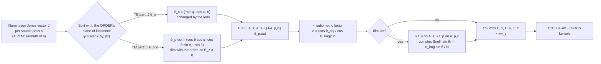

# Vector (Polarized) High-NA Imaging

**Status:** ✅ Implemented — the TE/TM vector pupil is computed by `optics/vector.rs` and validated against closed-form two-beam, Fresnel, and energy-conservation results. It covers polarization rotation per diffraction order, the radiometric obliquity factor, the immersion index, and film-entrance Fresnel transmission. Its approximations are stated below: thin-mask object, ideal non-birefringent lens, no multiple film reflections.

## Overview

A scalar imaging model lets every pair of diffraction orders interfere fully. Real light is a transverse vector wave. Each plane-wave order reaching the wafer at angle θ carries an electric field perpendicular to its own direction of travel, and two orders interfere only through the field components they share.

- The **TE (s) component** is perpendicular to the plane of incidence. It stays parallel for any pair of orders in the same plane, so its interference is complete.
- The **TM (p) component** tilts with the order and acquires a longitudinal `E_z`. Two TM orders at ±θ overlap only by `cos 2θ`.

Scalar theory therefore **overstates image contrast** once orders travel at large angles. The effect grows at NA ≳ 0.8, and inside a resist it depends on the resist index.

[`crates/highuvlith-core/src/optics/vector.rs`](../crates/highuvlith-core/src/optics/vector.rs) computes the image-side field `(E_x, E_y, E_z)` of one order at a time. The aerial-image engine selects it with `ImagingModel::Vector(VectorSettings { .. })` and builds the transmission cross-coefficient as `TCC = A·Aᴴ`. Each source point contributes `columns_per_source_point(&settings)` columns: 3 field components × the number of mutually incoherent polarization states. Column entries are `field_columns(...)` at the shifted pupil coordinate `p = (f + s)/(NA/λ)`, times `√w_s`. The product `A·Aᴴ` then sums `|E_x|² + |E_y|² + |E_z|²` over states automatically, which is the vector Hopkins/Abbe image.

## Physics & math



### Direction of an order

An order at normalized pupil coordinate $\mathbf p = (p_x, p_y)$ (units of NA) travels in the image medium of index $n_\mathrm{img}$ with direction sines and cosine

```math
(\alpha, \beta) = \frac{\mathrm{NA}}{n_\mathrm{img}}\,(p_x, p_y), \qquad \gamma = \cos\theta = \sqrt{1 - \alpha^2 - \beta^2}.
```

Orders with $|\mathbf p| > 1$ (outside the pupil) or $\alpha^2 + \beta^2 \ge 1$ (evanescent in the image medium) carry zero field.

### TE/TM decomposition (polarization rotation)

The reticle side of a 4× reduction lens is nearly paraxial: its sine is at most NA/R ≤ 0.25 in air. Each order therefore leaves the mask with the illumination Jones vector $J = (J_x, J_y)$ (thin mask). An ideal aplanatic lens keeps the TE component and rotates the TM component so that it stays perpendicular to the ray:

```math
\mathbf E = (J\cdot\hat e_s)\,\hat e_s + (J\cdot\hat e_{p,\mathrm{in}})\,\hat e_{p,\mathrm{out}},\qquad
\hat e_s = (-\sin\varphi, \cos\varphi, 0),\;
\hat e_{p,\mathrm{in}} = (\cos\varphi, \sin\varphi, 0),\;
\hat e_{p,\mathrm{out}} = (\cos\theta\cos\varphi, \cos\theta\sin\varphi, -\sin\theta).
```

Equivalently, $\mathbf E = M J$ with a 3×2 matrix that has no azimuth singularity at $\mathbf p = 0$:

```math
M = \begin{pmatrix} 1 - \dfrac{\alpha^2}{1+\gamma} & -\dfrac{\alpha\beta}{1+\gamma} \\[6pt] -\dfrac{\alpha\beta}{1+\gamma} & 1 - \dfrac{\beta^2}{1+\gamma} \\[6pt] -\alpha & -\beta \end{pmatrix},
\qquad M^\mathsf T M = I_2,\qquad M M^\mathsf T = I_3 - \hat k \hat k^\mathsf T .
```

The columns are orthonormal, so the transfer preserves the norm: $|MJ| = |J|$. The field is transverse to $\hat k = (\alpha, \beta, \gamma)$, and $M = [I_2; 0]$ on axis. Sign convention: an order tilted toward $+x$ carries the TM field $(\cos\theta, 0, -\sin\theta)$.

### Why TM loses contrast: two-beam interference

Two orders at $\pm\theta$ in the $xz$-plane form $I(x) = |\mathbf E_1 e^{iKx} + \mathbf E_2 e^{-iKx}|^2$. For TE ($y$-polarized) $\mathbf E_1 \cdot \mathbf E_2^* = 1$. For TM, $\mathbf E_{1,2} = (\cos\theta, 0, \mp\sin\theta)$, so $\mathbf E_1 \cdot \mathbf E_2^* = \cos 2\theta$. The fringe contrasts are:

| NA (orders at the pupil edge, air) | TE contrast | TM contrast $\lvert\cos 2\theta\rvert$ | Unpolarized $\cos^2\theta$ |
|---|---|---|---|
| 0.30 | 1 | 0.820 | 0.910 |
| 0.80 | 1 | 0.280 (reversed) | 0.360 |
| 0.95 | 1 | 0.805 (reversed) | 0.0975 |

Beyond θ = 45° the TM interference term $\cos 2\theta$ changes sign: the TM fringes are contrast-reversed, and $\lvert\cos 2\theta\rvert$ is not monotonic in NA (0.28 at NA 0.8, back up to 0.805 at NA 0.95). Unpolarized light is the incoherent mean of the two, so its contrast is $\cos^2\theta$. `tests/vector_pupil.rs` pins every number in this table from `field_columns` output.

<figure markdown="span">


<figcaption>Polarization at high NA. (a) Fringe contrast of two diffraction orders at the pupil edge from the vector pupil model: TE stays at 1, TM follows |cos 2θ| and vanishes at NA = 1/√2, unpolarized light gives cos²θ; inside a resist film (n = 1.7) the refracted angle is smaller and TM recovers. (b) Full vector imaging of dense 1:1 lines (193.368 nm, pitch 1.1 λ/NA, conventional σ 0.3) shows the same ordering. Model: vector (TE/TM) imaging ✅ — thin mask, no mask-3D or lens polarization aberrations.</figcaption>
</figure>

### Radiometric (obliquity) factor

Take the reticle side at index $n_o = 1$ and a reduction ratio $R$. The Abbe sine condition $n_\mathrm{img}\sin\theta_\mathrm{img} = R\sin\theta_\mathrm{obj} = \mathrm{NA} |\mathbf p|$ means pupil coordinate $\mathbf p$ labels the same ray bundle on both sides, with a constant pupil-area Jacobian between them. In the angular-spectrum representation, a plane wave carries z-directed power $\propto n|E|^2\cos\theta$ per unit pupil area. A lossless lens conserves the power of every bundle:

```math
n_\mathrm{img}\,|E_\mathrm{img}(\mathbf p)|^2\cos\theta_\mathrm{img} = K\, n_o\,|E_\mathrm{obj}(\mathbf p)|^2 \cos\theta_\mathrm{obj}
\;\;\Rightarrow\;\;
A(\mathbf p) = \left(\frac{\cos\theta_\mathrm{obj}}{\cos\theta_\mathrm{img}}\right)^{1/2}
= \left[\frac{1 - (\mathrm{NA}|\mathbf p|/R)^2}{1 - (\mathrm{NA}|\mathbf p|/n_\mathrm{img})^2}\right]^{1/4}.
```

The pupil-independent constant $K$ is fixed by unit transfer on axis, $A(0) = 1$. The exponent is ½ on the cosine ratio, or ¼ on the ratio of $1-\sin^2$ terms, because the power balance is quadratic in the field. Checks:

- For $R\to\infty$ (object at infinity), $A = 1/\sqrt{\cos\theta}$. This is the Richards–Wolf $\sqrt{\cos\theta}$ aplanatic apodization rewritten from solid angle to transverse frequency, using $d\Omega = d^2(\sin\theta)/\cos\theta$.
- For a symmetric 1:1 system, $A \equiv 1$.
- At NA 0.9 and R = 4 the pupil-edge amplitude is 1.4951.

The tested energy statement is $|\mathbf E(\mathbf p)|^2\cos\theta_\mathrm{img} = |P(\mathbf p)|^2|J|^2\cos\theta_\mathrm{obj}$ at every pupil point (film off).

Because $A > 1$ off axis, a clear mask under off-axis illumination has a raw vector intensity $\sum_s w_s A(s)^2 > 1$. The reference model on a 31×31 source grid at NA 0.9 gives:
- 1.052 for conventional σ 0.5;
- 1.287 for dipole σ 0.7 ± 0.15;
- 1.443 for annular 0.7–0.9.

This excess is physical: a tilted plane wave carries more $|E|^2$ per unit wafer area. By default the aerial engine divides every image, scalar or vector, by its exact clear-field value $\mathrm{TCC}(0,0)$, taken from the zero-frequency row of the imaging matrix. A clear mask therefore still images to 1.0.
- `clear_field_intensity(defocus_nm)` returns the raw value (Python: `SimulationEngine.clear_field_intensity(focus_nm)`).
- `ImageNormalization::Absolute` (Python `normalization="absolute"`) keeps absolute intensities.
- Dark-field configurations, whose clear field is below 1 % of the pupil's peak $|P|^2$, stay absolute, and `KernelDiagnostics.normalized` is then `false`.

With `obliquity = false` and no film, $|MJ| = |J|$ and the raw clear field is exactly 1.

<figure markdown="span">


<figcaption>The vector pupil at NA 0.9 (image in air). (a) For x-polarized illumination the field of each order tilts with its propagation direction: near the pupil edge along x most of the energy is in E<sub>z</sub>, which cannot interfere with the opposite order. (b) The radiometric (obliquity) factor brightens the pupil edge. Computed by the vector pupil model (<code>vector_pupil_map</code>) ✅.</figcaption>
</figure>

### Image medium (immersion)

`image_index` sets $n_\mathrm{img}$, the index of the homogeneous medium the orders travel in: 1.0 for an aerial image in air or vacuum, ≈ 1.44 for water immersion at 193 nm. It enters the direction sines, the obliquity factor, and the incidence side of the film interface. The image-side NA must stay below `image_index`; `VectorSettings::validate(na)` rejects anything else, because edge orders would be evanescent.

In the aerial engine the image-space medium belongs to the optics, because the defocus phase uses it too. Set it there:
- Rust: `ProjectionOptics::immersion(na, n)`, or `ProjectionOptics::immersion_193i()` for NA 1.35 in water, n = 1.437.
- Python: `OpticsConfig.immersion(...)` or `OpticsConfig.immersion_193i()`.

Then leave `image_index` at its default 1.0, and it inherits the optics' `immersion_index()`. The engine rejects an explicit `image_index` that differs from the optics' medium, so the defocus phase and the vector fields always refer to the same medium.

### Film entrance: the image just inside the resist

With `film = Some(FilmInterface { n, k })`, the field is evaluated just below the top surface of a film of complex index $N = n + ik$ ($k \ge 0$ is loss, the same storage convention as [thin-film](./processes/thin-film.md)). The refracted wave follows complex Snell's law, with the branch that decays or propagates into the film:

```math
\sin\theta_2 = \frac{n_\mathrm{img}\sin\theta}{N},\qquad N\cos\theta_2 = \sqrt{N^2 - n_\mathrm{img}^2\sin^2\theta},\ \ \operatorname{Im}(N\cos\theta_2)\ge 0,
```

```math
t_s = \frac{2 n_\mathrm{img}\cos\theta}{n_\mathrm{img}\cos\theta + N\cos\theta_2},\qquad
t_p = \frac{2 n_\mathrm{img}\cos\theta}{N\cos\theta + n_\mathrm{img}\cos\theta_2},
```

```math
\mathbf E_\mathrm{film} = t_s (J\cdot\hat e_s)\,\hat e_s + t_p (J\cdot\hat e_{p,\mathrm{in}})\,\hat e_{p,2},\qquad
\hat e_{p,2} = (\cos\theta_2\cos\varphi, \cos\theta_2\sin\varphi, -\sin\theta_2)\ \text{(complex angle)}.
```

Energy checks: the transmittances are $T_s = \operatorname{Re}(N\cos\theta_2) |t_s|^2/(n_\mathrm{img}\cos\theta)$ and $T_p = \operatorname{Re}(N^*\cos\theta_2) |t_p|^2/(n_\mathrm{img}\cos\theta)$, and $R + T = 1$ is tested for absorbing films. At normal incidence $t = 2n_\mathrm{img}/(n_\mathrm{img} + N)$. At Brewster's angle (real indices) $r_p = 0$ and $t_p = n_\mathrm{img}/n$.

Inside a high-index film the orders travel at smaller angles. The TM interference factor is the cosine of the angle between the two wave vectors, so refraction restores TM contrast whenever that angle is below 90° in the incidence medium. In the reference model, dense 64/128 nm L/S at NA 0.9 with an x-dipole and X-pol illumination goes from 0.211 in air to 0.666 in an n = 1.7 film. For order pairs more than 90° apart in air, the air-side TM fringe is already reversed and the film can lower |contrast|. For example, an edge pair at NA 0.9 has |cos 2θ| = 0.62 in air and |cos 2θ₂| = 0.44 in n = 1.7.

Only the entrance surface is modeled. There are no multiple reflections, standing waves, or substrate reflection; [thin-film](./processes/thin-film.md) owns those. Do **not** multiply a `film`-enabled vector image by the thin-film depth factor $S(z)$ of the [volumetric path](./processes/volumetric-exposure.md): $S(z)$ already contains the top-surface transmission (at normal incidence), so it would be counted twice.

### Illumination polarization states

Each state is a real Jones vector with its incoherent weight folded in as an amplitude.

| `IlluminationPolarization` | TOML `type` | States (Jones vectors) | Columns / source point |
|---|---|---|---|
| `Unpolarized` (default) | `unpolarized` | $(1/\sqrt2, 0)$ and $(0, 1/\sqrt2)$, incoherent (basis-independent, coherency ½·I) | 6 |
| `X` / `Y` | `x` / `y` | $(1, 0)$ / $(0, 1)$ | 3 |
| `Linear { angle_deg }` | `linear` | $(\cos a, \sin a)$ | 3 |
| `Te` (azimuthal) | `te` | $(-\sin\varphi_s, \cos\varphi_s)$, $\varphi_s = \operatorname{atan2}(s_y, s_x)$ per **source point** | 6 |
| `Tm` (radial) | `tm` | $(\cos\varphi_s, \sin\varphi_s)$ | 6 |

**On-axis fallback (TE/TM).** At the on-axis source point ($|s| < 10^{-9}$ σ) the azimuth is undefined. The sample stands for a cell symmetric about the axis, and averaging the TE (or TM) coherency matrix over that cell's azimuths gives exactly ½·I. The point is therefore treated as **unpolarized**: an incoherent X/Y pair. TE and TM thus reserve a second state slot (6 columns). At every off-axis source point that slot is exactly zero, and engines may drop all-zero columns.

## Worked example: what the vector model changes

Setup: dense 64/128 nm lines/spaces at the F2 line (157.63 nm), NA 0.9, x-dipole illumination (σ_c 0.7, radius 0.15), zero flare. The first diffraction order sits at |f|/f_c ≈ 1.37, so each pole images with two beams at sin θ ≈ 0.6 on opposite sides of the axis. Contrasts are from the aerial engine with `ImagingModel::Vector` at its default adaptive source sampling (264 points, 132 per pole). An independent numpy vector-Abbe reference reproduces each within 0.003. A coarse fixed grid, `source_points_per_axis = Some(31)` (about 22 points per pole), lowers the polarized contrasts by up to 0.006; that is a sampling effect, not physics.

| Imaging model | Contrast |
|---|---|
| Scalar | 0.905 |
| Vector, y-polarized (TE for these orders) | 0.896 |
| Vector, azimuthal `Te` | 0.889 |
| Vector, unpolarized | 0.553 |
| Vector, radial `Tm` | 0.218 |
| Vector, x-polarized (TM for these orders) | 0.211 |
| Vector, x-polarized, just inside resist `n = 1.7 + 0.03i` | 0.665 |
| Vector, unpolarized, just inside resist `n = 1.7 + 0.03i` | 0.780 |

Reading the table:
- Scalar theory predicts 0.905 regardless of polarization.
- Unpolarized light loses almost 40 % of that, because the TM half of the light interferes only by cos(θ₁ + θ₂) ≈ cos 76° ≈ 0.24.
- Polarizing along the lines (TE) recovers almost all of the scalar contrast.
- Inside a higher-index resist the orders travel at smaller angles, and the TM penalty shrinks.

<figure markdown="span">


<figcaption>TE keeps its contrast, TM collapses (a still from the demo video, <code>examples/generate_demo.py</code>). ArF 193.368 nm, x-dipole σ_c 0.8, pitch λ/(1.6·NA) so the two orders cross the pupil at sin θ = 0.8·NA. At NA 0.95: TE 0.88, TM 0.14, unpolarized 0.37. TM vanishes where 2θ = 90° (NA ≈ 0.88) and reverses beyond; the dotted curves are TE × |cos 2θ| and TE × |1 + cos 2θ|/2. Model: vector (TE/TM) imaging ✅ — thin mask, no film.</figcaption>
</figure>

## Model coverage (`VectorSettings`)

| Field | Unit | Consumed by | Status |
|-------|------|-------------|--------|
| `polarization` | enum | Illumination Jones states per source point | live |
| `image_index` | — | Direction sines, obliquity factor, film incidence medium. In the aerial engine the default 1.0 inherits the optics' immersion index, and any other value must equal it. | live |
| `obliquity` | bool | Switches the radiometric factor $A(\mathbf p)$ | live |
| `reduction` | × | $\sin\theta_\mathrm{obj} = \mathrm{NA}\lvert\mathbf p\rvert/R$ inside the obliquity factor. Only read when `obliquity = true`. Default 4.0. The aerial engine replaces it with the optics' `reduction()`, so it matters only for direct `field_columns` calls. | live |
| `film.n`, `film.k` | — | Complex Snell refraction, $t_s$, $t_p$, refracted p-vector | live |

All fields have serde defaults, so a partial table parses.

## Usage

Selecting the vector model in the aerial engine (contract C1):

```rust
use highuvlith_core::aerial::{AerialImageEngine, ImagingModel, ImagingSettings};
use highuvlith_core::optics::vector::{FilmInterface, IlluminationPolarization, VectorSettings};

let settings = ImagingSettings {
    imaging_model: ImagingModel::Vector(VectorSettings {
        polarization: IlluminationPolarization::Te,   // azimuthal
        film: Some(FilmInterface { n: 1.7, k: 0.03 }), // image just inside the resist
        ..Default::default()                           // air, obliquity on, R = 4
    }),
    ..Default::default()
};
let engine = AerialImageEngine::with_settings(&source, &optics, grid, settings)?;
let image = engine.compute(&mask, 0.0);          // relative to the clear field (= 1)
```

For water immersion, put the medium on the optics and leave `image_index` at its default:

```rust
let optics = ProjectionOptics::immersion_193i(); // NA 1.35, n = 1.437
// VectorSettings::default() now inherits image_index = 1.437 in with_settings.
```

From Python, pass the settings to the engine:

<!-- verify-example -->
```python
import highuvlith as huv
from highuvlith.api import VectorSettings

source = huv.SourceConfig.arf_laser(sigma=0.9)
mask = huv.MaskConfig.line_space(cd_nm=45.0, pitch_nm=90.0)
engine = huv.SimulationEngine(
    source, huv.OpticsConfig.immersion_193i(), mask, grid=mask.commensurate_grid(128),
    vector=VectorSettings("te", film_n=1.7, film_k=0.03),
)
image = engine.compute_aerial_image(focus_nm=0.0)
```

`VectorSettings` round-trips through TOML (`polarization` is tagged by `type`). Parsing is strict:
- unknown keys are errors, so a misspelled key cannot be silently ignored;
- so are an unknown `type` and `angle_deg` on a non-linear state;
- `azimuthal` and `radial` are accepted as aliases of `te` and `tm`.

```toml
polarization = { type = "linear", angle_deg = 45.0 }   # unpolarized | x | y | te | tm | linear
image_index = 1.0
obliquity = true
reduction = 4.0
film = { n = 1.7, k = 0.03 }                           # omit for the aerial image
```

From the CLI, add an `[imaging.vector]` table to a `simulate` config; its keys are the `VectorSettings` fields above.
- Without the table, imaging is scalar. An empty `[imaging.vector]` table selects unpolarized vector imaging with defaults.
- As in the engine, `reduction` comes from the optics. `image_index` must be left at its default or equal the optics' immersion index.
- A misspelled key or an invalid `type`/`angle_deg` combination aborts with a parse error that names the key and line.
- `simulate` prints the vector settings in use.

```toml
[imaging.vector]
polarization = { type = "te" }
film = { n = 1.7, k = 0.03 }   # optional: image just inside the resist
```

The physics helpers are public in Rust, which is useful for pupil maps and figures:
- `field_columns`: per-order field;
- `polarization_transfer_matrix(α, β)`: the 3×2 matrix $M$;
- `radiometric_factor(NA·|p|, n_img, R)`;
- `FresnelCoefficients::new(n₁, N, sin θ₁)`: $r_{s,p}$, $t_{s,p}$, $R$, $T$, and the complex refraction angle.

**Python.** `highuvlith._native` exposes the following. They evaluate the pupil model directly and do not build an imaging engine.
- The `VectorSettings` class, with the same fields as keyword arguments: `polarization="unpolarized"|"x"|"y"|"te"|"tm"|"linear"`, `angle_deg`, `image_index`, `obliquity`, `reduction`, `film_n`, `film_k`. It also has `validate(na)`.
- `vector_pupil_field` and `vector_pupil_map`, which return complex arrays `(states, 3)` and `(states, 3, n, n)`.
- `radiometric_factor` and `fresnel_coefficients`.

`highuvlith.api` adds `pupil_polarization_map(...)`, which returns the field plus `intensity` and `longitudinal_fraction` maps, and `vector_two_beam_contrast(...)`:

<!-- verify-example -->
```python
from highuvlith.api import pupil_polarization_map, vector_two_beam_contrast

m = pupil_polarization_map(0.9, "x", n=65)      # E_x, E_y, E_z over the pupil
m.longitudinal_fraction.max()                   # sin²θ at the pupil edge = 0.81
vector_two_beam_contrast(0.8, "x")              # TM: |cos 2θ| = 0.28
vector_two_beam_contrast(0.9, "x", film_n=1.7)  # inside the film: 0.4394
```

**Recommended use.**
- Use the vector model for NA ≳ 0.7, for any polarized-illumination study, and for in-resist images.
- At NA 0.3 it differs from scalar by about 0.5 % of peak intensity for 50 % L/S (reference model), and the difference scales as NA².
- Keep `obliquity = true` for physics. Switch it off only to isolate pure polarization effects.
- For immersion, set the medium on the optics and leave `image_index` at its default. Direct `field_columns` callers set `image_index` themselves and should call `validate(na)`.

## Validation

Pure-module tests in `optics/vector.rs`:
- the matrix $M$ matches the explicit $(\theta, \varphi)$ unit-vector form;
- $M^\mathsf TM = I_2$ and $MM^\mathsf T = I_3 - \hat k\hat k^\mathsf T$;
- radiometric-factor fixtures (1.4951 at NA 0.9, R = 4; 1.6447 at NA 1.35 in water) and limits ($R\to\infty$, 1:1);
- Fresnel $t_{s,p}$ against a numerical boundary-condition solve, $R + T = 1$ for absorbing films, normal incidence, Brewster;
- TE/TM illumination bases and the on-axis fallback;
- `validate` rejections.

Integration tests in `crates/highuvlith-core/tests/vector_pupil.rs`:
- two-beam TE = 1, TM = $|\cos 2\theta|$, unpolarized = mean of TE and TM, at NA 0.3, 0.8, 0.95, plus inside a film and in water;
- the low-NA limit, with error $\le \mathrm{NA}^2$ and 100× smaller for 10× smaller NA;
- norm preservation, transversality $\mathbf E\cdot\hat k = 0$ (also for complex in-film angles), no s/p cross-talk, continuity at $\mathbf p \to 0$, and inversion symmetry;
- basis independence of the unpolarized cross-coherency (X/Y, 30°/120°, TE/TM);
- the obliquity energy statement, and film power balance against textbook Fresnel;
- fixtures from an independent numpy reference;
- TOML round trip and strict parsing (unknown keys and invalid `type`/`angle_deg` combinations rejected).

Python tests in `tests/python/test_vector.py` cover the bindings: settings validation, two-beam closed forms at NA 0.3, 0.8, 0.95 and inside a film, pupil-map norm, symmetry and energy statement, the radiometric fixture, and Fresnel fixtures.

A mutation check confirmed that the Rust suite catches each of these errors:
- a flipped $E_z$ sign;
- a wrong obliquity exponent, or the inverse ratio;
- a wrong $t_p$ denominator;
- the incidence angle used in the in-film p-vector;
- swapped TE/TM;
- an X-only on-axis fallback;
- the paraxial $1/(1+\gamma)\to\tfrac12$;
- the wrong complex-Snell branch;
- an ignored `image_index`.

## Limits (not modeled)

- **Mask 3D / EMF.** The object is a thin (Kirchhoff) mask: every order leaves it with the illumination Jones vector. Thick-absorber, polarization-dependent diffraction efficiencies and phases are absent.
- **Lens polarization aberrations.** There is no Jones pupil: no retardance, no diattenuation, and no intrinsic birefringence (relevant for CaF₂ at 157 nm) or coating effects. Scalar aberrations and apodization still enter through the scalar pupil.
- **Paraxial object side.** The p-vector's tilt on the reticle side is neglected. The TM amplitude ambiguity is at most $1-\sqrt{1-(\mathrm{NA}/R)^2}$, which is 2.6 % at the pupil edge for NA 0.9 and R = 4.
- **Film.** Only the entrance transmission is modeled. There are no multiple reflections or standing waves, and no depth-resolved in-film vector image: the field is at $z = 0^+$ below the film surface. Propagation to depth, and defocus inside the film, are not part of this option.
- **Illumination purity.** Polarization states are ideal. A partially polarized source (degree of polarization < 1) is not a built-in state.
- **No dispersion.** `image_index` and the film index `n + ik` are single values, so multi-wavelength imaging uses the same indices at every spectral sample.

## References

- B. Richards and E. Wolf, "Electromagnetic diffraction in optical systems. II. Structure of the image field in an aplanatic system," *Proc. R. Soc. Lond. A* **253**, 358–379 (1959).
- D. G. Flagello, T. Milster, A. E. Rosenbluth, "Theory of high-NA imaging in homogeneous thin films," *J. Opt. Soc. Am. A* **13** (1996).
- M. Born and E. Wolf, *Principles of Optics* (Fresnel formulae).
